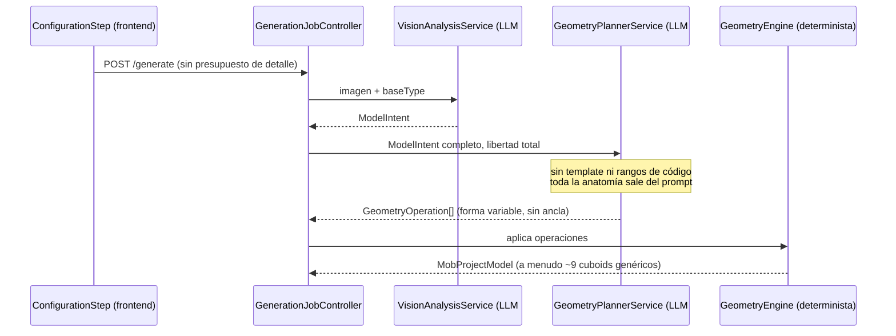
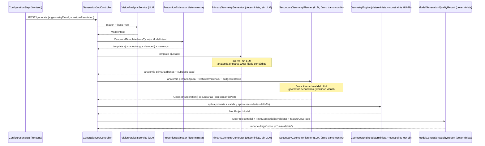
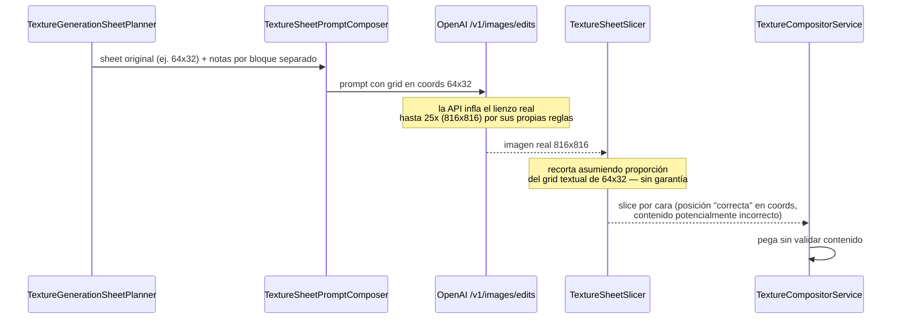
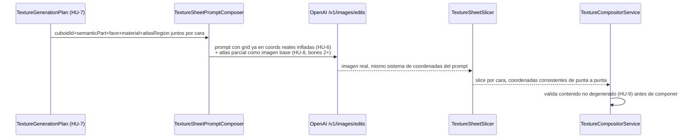
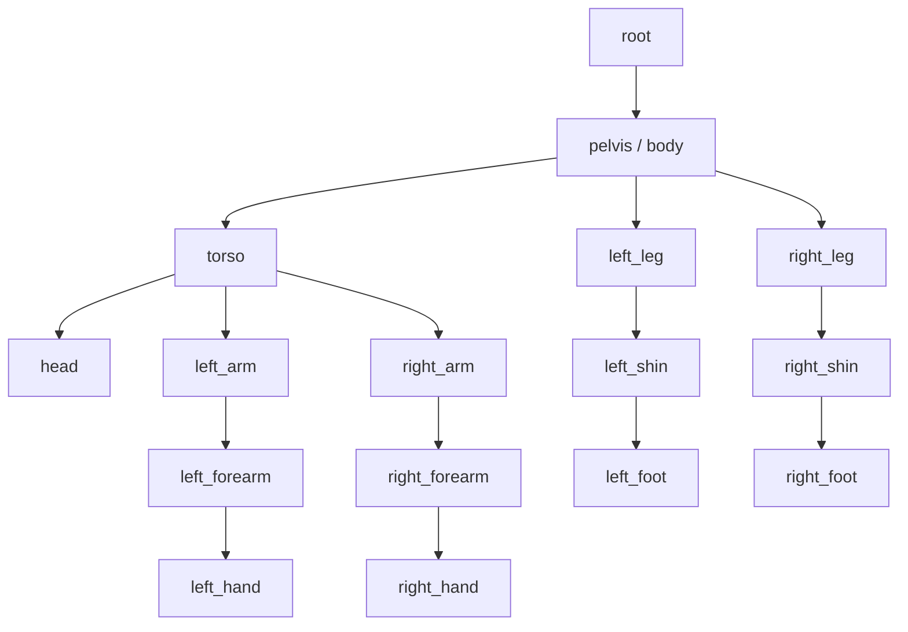

# Definición: Anatomía y textura por capas para la generación de mobs con IA

> **v2** — actualizado tras VoBo condicionado del PO: se incorpora Texture Generation V2 como prioridad equivalente a la geometría, con auditoría de causa raíz del pipeline de textura actual, diseño de geometría primaria 100% determinista (sin confirmación del LLM), constraints deterministas para geometría secundaria, y resolución de textura conectada de verdad. Ver histórico de decisiones al final de cada sección modificada.

## Resumen ejecutivo

Hoy, tanto la geometría como la textura de un mob generado por IA producen resultados genéricos frente a referencias complejas — pero por razones distintas y ambas verificadas en código, no supuestas. En **geometría**, casi toda la anatomía sale de una sola llamada libre al LLM (prompt engineering, sin plantilla estructural en código). En **textura**, el pipeline ya es UV-aware y soporta generación parcial por parte — pero un desalineamiento de coordenadas entre lo que el prompt describe y lo que la API de imagen realmente genera (hasta 25x más grande), sumado a ausencia total de continuidad entre caras y de validación de contenido compuesto, explica exactamente los síntomas reportados (colores en regiones incorrectas, zonas en blanco, cero continuidad). La arquitectura de fondo compartida por ambos —blueprint validado, compilador determinista, proveedores desacoplados, validación FMM real, edición semántica por IA— ya existe y es sólida; este documento cierra los huecos específicos de cada motor, con prioridad equivalente entre geometría y textura, sin tocar lo que ya funciona.

## Objetivo de negocio

Que un usuario que sube una referencia compleja (benchmark: "Carcomido") obtenga un modelo cuya silueta, proporciones y detalles característicos sean reconocibles frente a la referencia — no una interpretación genérica recolorada — sin sacrificar la velocidad de generación ni el flujo UX ya validado por los usuarios.

## Alcance

### Incluye
- Catálogo de templates canónicos por `baseType`, empezando por **humanoid completo**; el resto de tipos (`arachnid`/`quadruped`/`flying`/`custom`) arrancan con un template mínimo genérico y quedan marcados para una iteración 2.
- Estimador de proporciones determinista (`ProportionEstimator`): ajusta el template base según lo que `ModelIntent` (ya existente) reporte, dentro de rangos válidos por template.
- **Generador de anatomía primaria 100% determinista** (`PrimaryGeometryGenerator`): construye la anatomía primaria directamente del template ya ajustado por `ProportionEstimator`, sin ninguna llamada al LLM. El LLM (`SecondaryGeometryPlanner`) concentra toda su libertad en geometría secundaria (ropa, jirones, garras, cuernos, etc.), acotada por presupuesto y guiada por los `features`/`materials` que `ModelIntent` ya detecta hoy.
- Constraints deterministas de validación para geometría secundaria en `GeometryEngine`: bone válido, tamaño máximo razonable, bounding box del personaje, distancia razonable al pivot del bone padre, ausencia de cuboides huérfanos, dimensiones válidas (sin NaN/Infinity/cero).
- Campo `semanticPart` en cada `Cuboid`, propagado desde la generación hasta el modelo persistido (cambio aditivo de schema) — y **propagado también al pipeline de textura**, de modo que cada unidad de generación conozca `cuboidId + semanticPart + face + material + atlasRegion` juntos, no en bloques de texto desacoplados como hoy.
- **Texture Generation V2** (ver sección dedicada): corrección del desalineamiento de coordenadas prompt↔API real, formalización de `TextureGenerationPlan` (reutilizando/extendiendo `TexturePlan` existente) con entradas por cara, mecanismo real de continuidad entre bones vía atlas parcial como contexto, y validación de contenido compuesto antes de pegar en el atlas.
- Conexión funcional de punta a punta del selector "Detalle geométrico" (Simple/Detallado/Alto → `LOW`/`MEDIUM`/`HIGH`) en `ConfigurationStep.vue`, hoy inexistente.
- Conexión funcional de punta a punta del selector "Resolución de textura" (hoy decorativo, nunca viaja al backend) a la `TexelDensity` ya existente en `AtlasResolutionCalculator`.
- `ModelGenerationQualityReport`: reporte diagnóstico interno (no UI-facing en v1) con métricas reales o `unavailable`, nunca inventadas — incluye ahora cobertura de características detectadas en la referencia, no solo complejidad/semántica/compatibilidad.
- Fixture de integración con el benchmark "Carcomido" (o referencia equivalente), **obligatorio como criterio de aceptación de la implementación**, no solo como caso de test opcional.

### No incluye
- Reescribir `MobProjectModel`, `GeometryEngine` (se extiende, no se reescribe), `BBModelExporterV4/V5`, `FmmCompatibilityValidator`, las interfaces de proveedor de IA o `AiEditPanel`/`AiGeometryEditPlannerService` (edición semántica) — la auditoría confirma que ya cumplen el rol que el pipeline objetivo original les pedía.
- Templates canónicos completos para `arachnid`/`quadruped`/`flying` — quedan con template mínimo hasta una iteración futura explícitamente aprobada.
- Segmentación real por máscara bitmap o modelos de imagen con soporte nativo de regiones — la corrección de Texture V2 en esta iteración es de alineamiento de coordenadas y estructura del plan, no un cambio de proveedor de imagen ni de técnica de generación (image-to-image vs. inpainting real por máscara queda para una iteración futura si el resultado de esta corrección no es suficiente).
- Validación runtime de schema en el frontend de producción (Zod/Valibot) — gap real detectado por la auditoría, pero ortogonal a la fidelidad geométrica/textura; se deja como hallazgo para ticket aparte.

## Historias de Usuario

### HU-1: Templates canónicos y esqueleto base determinista
Como sistema de generación, quiero partir de un esqueleto anatómico determinista por `baseType`, para que la jerarquía de bones no dependa enteramente de lo que el LLM decida inventar en cada llamada.

Criterios de aceptación:
- Dado `baseType=humanoid`, cuando se inicia la generación, entonces el sistema parte de un template canónico con la jerarquía de bones (head/torso/pelvis, brazos con antebrazo/mano, piernas con espinilla/pie) definida en código, no en el prompt.
- Dado `baseType` distinto de humanoid, cuando no existe template completo, entonces el sistema usa un template mínimo genérico (root+body) y dejar que el LLM proponga el resto, marcado con `confidence` bajo en `generationWarnings`.
- Dado el catálogo de templates, cuando se agrega uno nuevo, entonces no requiere cambios en `GeometryEngine` (extensible por definición de datos, no por rama de código).

### HU-2: Anatomía primaria determinista + geometría secundaria por IA
Como sistema de generación, quiero que la anatomía primaria se construya sin ninguna llamada al LLM (directamente del template + proporciones ya resueltas), y que el LLM solo decida geometría secundaria, para eliminar la dependencia de que el modelo "confirme" correctamente algo que ya es 100% determinable por código.

Criterios de aceptación:
- Dado un template ya ajustado por `ProportionEstimator`, cuando se ejecuta `PrimaryGeometryGenerator`, entonces produce la anatomía primaria completa (bones + cuboides base) **sin ninguna llamada de red ni al LLM** — es una función pura, testeable sin mocks de IA.
- Dado que la anatomía primaria ya existe de forma determinista, cuando se invoca `SecondaryGeometryPlanner` (LLM), entonces recibe explícitamente los `features`/`materials` detectados por vision y el presupuesto restante, y solo puede emitir operaciones para geometría secundaria (nunca redefinir o eliminar cuboides de la anatomía primaria).
- Dado el modelo resultante, cuando se inspecciona cualquier cuboid (primario o secundario), entonces tiene un `semanticPart` no vacío persistido.
- Dado un `SecondaryGeometryPlanner` que devuelve una operación que intenta modificar un cuboid primario, cuando `GeometryEngine` la procesa, entonces la rechaza (ver HU-2b) en vez de aplicarla silenciosamente.

### HU-2b: Constraints deterministas para geometría secundaria
Como sistema de generación, quiero validar de forma dura la geometría secundaria que propone el LLM, para que un elemento mal formado (huérfano, desproporcionado, fuera de rango) no llegue nunca al modelo final.

Criterios de aceptación:
- Dado un cuboid secundario propuesto, cuando se valida, entonces se rechaza si: referencia un `boneId` inexistente, excede un tamaño máximo razonable relativo al template, cae fuera del bounding box del personaje, está a una distancia irrazonable del pivot de su bone padre, o tiene dimensiones inválidas (cero, negativas, NaN, Infinity).
- Dado un cuboid secundario sin ningún bone válido al que asociarse (huérfano), cuando se valida, entonces se rechaza explícitamente, nunca se descarta en silencio ni se cuelga de un bone arbitrario.
- Dado que una o más operaciones secundarias son rechazadas, cuando termina la generación, entonces el job no falla completo — se aplican las operaciones válidas y se registra un `generationWarning` por cada rechazo, con la razón concreta.

### HU-2c: Invariantes y tests del `PrimaryGeometryGenerator`
Como sistema de generación, quiero que la anatomía primaria determinista tenga invariantes verificadas por tests reales (no solo confiar en que "es código, luego es correcto"), porque es la base sobre la que se apoya todo lo demás — un bug aquí rompe cada generación, no un caso aislado.

Criterios de aceptación:
- Dado cualquier template canónico soportado, cuando `PrimaryGeometryGenerator` construye la anatomía, entonces **todas las partes obligatorias del template** (definidas en el propio template, ej. head/torso/pelvis/brazos/piernas para humanoide) están presentes — un test falla explícitamente si falta alguna.
- Dado el árbol de bones resultante, cuando se valida, entonces la jerarquía es válida: sin ciclos, cada `parentId` referencia un bone existente, y coincide exactamente con la jerarquía declarada en el template (HU-1).
- Dado cada bone con pivote, cuando se valida, entonces el pivote es coherente con la regla anatómica del template (ej. `head`→pivote en el cuello, `forearm`→pivote en el codo, igual que el sistema de coordenadas canónico ya documentado en `coordinateSystem.ts`/ADR 0001) — no se calculan pivotes ad hoc.
- Dado cada cuboid generado, cuando se valida, entonces su tamaño es estrictamente mayor a cero en cada eje, sus coordenadas (`from`/`to`/`origin`/`rotation`) son todas finitas (sin NaN/Infinity), y su bounding box individual cae dentro de un envelope razonable para su bone (mismo tipo de chequeo que HU-2b, aplicado aquí en su origen determinista).
- Dado el conjunto completo de cuboides primarios, cuando se valida, entonces el bounding box del personaje completo es razonable (proporciones plausibles para el template, sin partes fuera de rango) — mismo criterio que se reutiliza luego para validar geometría secundaria.
- Estos tests corren sin red y sin mocks de IA (es la ventaja directa de que este generador sea 100% determinista) y forman parte de la suite estándar, no de un caso manual.

### HU-3: Estimación de proporciones dentro de rangos válidos
Como sistema de generación, quiero ajustar las proporciones del template base según lo que la referencia indique, dentro de rangos anatómicos válidos, para evitar tanto un "Steve" rígido como estructuras imposibles.

Criterios de aceptación:
- Dado un `ModelIntent` con proporciones relativas (ej. cabeza 20% más grande, brazos más largos), cuando se aplican al template, entonces las dimensiones resultantes respetan los rangos mín/máx por template — sin cuboids de tamaño cero/negativo ni colisiones evidentes.
- Dado un valor de proporción fuera de rango, cuando se aplica, entonces se clampa al límite válido y se registra en `generationWarnings` (nunca se descarta el intent completo en silencio).

### HU-4: Presupuesto de geometría conectado de punta a punta
Como usuario, quiero elegir el nivel de detalle geométrico (Simple/Detallado/Alto) en Configuración, para que el modelo generado tenga más o menos cuboides según lo que necesito — a diferencia de "resolución de textura" hoy, que no tiene ningún efecto real.

Criterios de aceptación:
- Dado que selecciono "Alto" en Configuración, cuando genero, entonces el presupuesto de cuboides (35–80) llega al backend y condiciona cuántos elementos de geometría secundaria propone el LLM.
- Dado un resultado generado, cuando reviso la pantalla de Resultado, entonces veo el conteo real de cuboides generados (dato real, no mock).
- Dado que el LLM propone muy por debajo o por encima del presupuesto, cuando termina la generación, entonces el job no falla — se registra como `generationWarning` informativo (presupuesto, no cuota rígida).

### HU-5: Reporte interno de calidad de generación (benchmark Carcomido)
Como equipo de producto, quiero un reporte diagnóstico interno tras cada generación, para medir objetivamente si personajes complejos mejoran de forma verificable, no solo a ojo.

Criterios de aceptación:
- Dado un modelo generado, cuando termina el pipeline, entonces se calcula un `ModelGenerationQualityReport` con al menos `semanticCoverage` (proporción de cuboids con `semanticPart` no genérico), `geometryComplexity` (conteo real vs. presupuesto) y `fmmCompatibility` (ya existente); cualquier métrica no calculable se marca `unavailable`, nunca se inventa.
- Dado el fixture "Carcomido" como caso de integración, cuando se corre el pipeline completo contra su referencia real, entonces el reporte de calidad queda adjunto a los resultados del test como evidencia versionada, **y su ejecución en verde es criterio de aceptación de la implementación**, no un test opcional.

### HU-5b: Cobertura de características detectadas en la referencia
Como equipo de producto, quiero saber qué proporción de las características que `ModelIntent` detectó en la imagen (garras, cuernos, jirones, protrusiones, etc.) terminaron representadas en el modelo final, para diagnosticar objetivamente pérdida de detalle — no solo medir complejidad total de cuboides.

Criterios de aceptación:
- Dado un catálogo cerrado `SemanticPartCategory` (enum compartido backend/frontend/contracts — ej. `CLAW`, `HORN`, `JAW`, `TORN_CLOTH`, `LOINCLOTH`, `EMISSIVE_CRACK`, `GENERIC`, extensible por template), cuando `ModelIntent` detecta una feature, entonces se le asigna una categoría de ese catálogo (además de su descripción libre para contexto humano) — no se compara texto libre contra texto libre.
- Dado que `Cuboid.semanticPart` toma valores del mismo `SemanticPartCategory`, cuando se calcula `featureCoverage`, entonces la cobertura se determina por igualdad de categoría enum, nunca por comparación difusa de strings.
- Dado un `ModelIntent` con features categorizadas, cuando termina la generación, entonces `ModelGenerationQualityReport` incluye `featureCoverage`: proporción de esas categorías detectadas que tienen al menos un cuboid secundario con `semanticPart` de esa misma categoría.
- Dado que una categoría detectada no tiene ningún cuboid asociado, cuando se calcula el reporte, entonces queda listada explícitamente (no solo como número agregado), para poder inspeccionar cuáles se perdieron y por qué (presupuesto agotado, rechazada por constraints, etc.).
- Dado que vision detecta una característica que no encaja en ninguna categoría existente del catálogo, cuando se registra, entonces se usa `GENERIC` y se deja evidencia (no se fuerza a una categoría incorrecta ni se descarta la feature).

## Texture Generation V2

### Diagnóstico — causa raíz por síntoma (auditoría de código, no suposición)

La auditoría profunda del pipeline real (`TextureSheetPromptComposer`, `OpenAiImageProvider`, `TextureSheetSlicer`, `TextureCompositorService`, `TexturePlanService`) confirma que el pipeline **ya es UV-aware y soporta generación parcial real** — pero eso no implica que el resultado sea correcto. Causa raíz concreta por cada síntoma reportado:

| Síntoma reportado | Causa raíz en código |
|---|---|
| Mala correspondencia semántica cara→parte | No existe máscara/segmentación real — la correspondencia es puramente textual. El grid de coordenadas (`appendPlacementLine`) no lleva adjunta la nota de material de esa cara específica; vive en un bloque de texto separado (`appendHeader`), obligando al modelo a cruzar referencias sin ancla visual. |
| Colores en regiones incorrectas | El prompt describe coordenadas para el tamaño **original** del sheet (ej. 64×32), pero `OpenAiImageProvider` infla la imagen real pedida a la API hasta **25x más grande** por restricciones técnicas (múltiplo de 16, aspect ratio, pixel budget mínimo). El modelo no tiene forma de reconciliar el grid textual descrito con el lienzo real que está generando. |
| Zonas blancas/grises sin información | Bug documentado por el propio equipo (ticket 065, `TextureSheetSlicer`): el recorte del resultado asumía el tamaño original, corregido con un escalado proporcional que **asume** que el modelo distribuyó el contenido exactamente según el grid textual — sin ninguna garantía estructural de eso. `TextureCompositorService` compone sin validar si el contenido resultante es blanco/vacío. |
| Mala continuidad entre caras | No existe ningún mecanismo de continuidad. Intra-sheet está **activamente evitada** por diseño (gutter de 2px, ticket 053). Inter-bone: cada llamada usa siempre la imagen de referencia original completa — nunca el atlas parcialmente compuesto hasta ese momento (`currentAtlas` existe en memoria pero nunca se pasa al proveedor de imagen). |
| Detalles característicos perdidos | `TextureDetailLevel` son 3 instrucciones de texto casi genéricas sin ningún parámetro no-textual real (paleta, densidad, sampling). Combinado con la inflación de tamaño (arriba), cualquier intención de micro-detalle para un área pequeña se diluye en un lienzo hasta 25x mayor. |
| "Rellena el atlas pero no reconstruye al personaje" | Cada bone se genera aislado, sin contexto del resto del personaje ya generado ni verificación de coherencia global — el diseño actual (ticket 053) optimiza por "las piezas no se pisan entre sí", nunca por "juntas reconstruyen al personaje". |

`semanticPart` tampoco existe hoy en el dominio persistido: la única semántica real de origen es el nombre libre de bone que el LLM de geometría eligió: `TexturePlanService` reinterpreta ese string en cada corrida de textura (LLM adicional), sin persistir nada estable entre corridas.

Dato relevante para el alcance: el control de "resolución de textura" **no es estructuralmente difícil de conectar** — simplemente nunca fue cableado (`ConfigurationStep.vue` crea el `ref` y lo liga al selector, pero `confirm()` nunca lo incluye en el payload). Conectarlo es plomería, no un refactor de arquitectura.

### Decisiones de rediseño

**Decisión T1 — Alinear coordenadas del prompt con el tamaño real pedido a la API.** `TextureSheetPromptComposer` debe describir el grid usando las mismas dimensiones infladas que `OpenAiImageProvider` va a solicitar realmente (no el tamaño original del sheet), y `TextureSheetSlicer` debe recortar usando ese mismo sistema de coordenadas consistente de punta a punta — elimina la causa raíz común a "colores en regiones incorrectas" y "zonas en blanco". Esto reduce, pero no puede eliminar del todo, el riesgo de que el modelo de imagen no respete el grid exactamente (ver Riesgos) — es una corrección de plomería determinista, no una garantía absoluta sin máscara real.

**Decisión T2 — Formalizar `TextureGenerationPlan` extendiendo `TexturePlan`.** En vez de un nuevo tipo paralelo, `TexturePlan`/`BoneSemanticLabel` (hoy efímero y regenerado en cada corrida a partir del nombre libre de bone) se extiende para: (a) anclarse al `semanticPart` persistido de HU-2 en vez de reinferir desde el nombre del bone, (b) mantener entradas por (cuboidId, face) que agrupan **en un solo lugar** `semanticPart + material + atlasRegion` (hoy repartidos entre bloque de header y líneas de grid separadas), (c) declarar explícitamente grupos de continuidad (caras que deben compartir un patrón/color) para consumo del compositor.

**Decisión T3 — Continuidad real vía atlas parcial como contexto.** Para llamadas de `/v1/images/edits` posteriores a la primera dentro del mismo job, pasar como imagen base el **atlas parcialmente compuesto hasta ese momento** (`currentAtlas`, ya existe en memoria, nunca se usa hoy) en vez de siempre la referencia original completa — le da al modelo contexto real de lo ya generado en partes vecinas. Es una corrección acotada (cambiar qué imagen se pasa), no un mecanismo nuevo de IA.

**Decisión T4 — Validación de contenido compuesto.** `TextureCompositorService` valida que el slice recortado no sea degenerado (uniforme/blanco/vacío) antes de componerlo sobre el atlas; si lo es, se registra `generationWarning` en vez de pegarlo en silencio — consistente con la regla de no producir resultados que "técnicamente rellenan pero no reconstruyen".

**Decisión T5 — Resolución de textura conectada de verdad.** `textureResolution` de `ConfigurationStep.vue` viaja en el payload de generación y se usa como `TexelDensity` real en el cálculo de atlas (`AtlasResolutionCalculator`, ya existente) — sin inventar mecanismo nuevo, solo cerrando el cable que falta.

### HU-6: Alineamiento de coordenadas prompt↔API real
Como sistema de generación de textura, quiero que el grid descrito en el prompt corresponda exactamente al tamaño real de imagen que se pide a la API, para que el modelo pueda respetar las regiones solicitadas.

Criterios de aceptación:
- Dado un sheet cuyo tamaño original difiere del tamaño real inflado para la API, cuando se compone el prompt, entonces el grid describe coordenadas en el sistema de la imagen real solicitada, no del sheet original.
- Dado el resultado de la API, cuando se recorta cada cara, entonces se usa el mismo sistema de coordenadas descrito en el prompt — sin doble conversión ni escalado "a ojo".
- Dado este cambio, cuando se corre la suite existente de tests de `TextureSheetSlicer`/`OpenAiImageProvider`, entonces sigue en verde (no se rompe compatibilidad de formato de sheet).

### HU-7: `TextureGenerationPlan` con entradas por cara
Como sistema de generación de textura, quiero un plan estructurado por (cuboidId, face) que una `semanticPart + material + atlasRegion` en un solo lugar, para que el modelo no tenga que cruzar referencias entre bloques de texto separados.

Criterios de aceptación:
- Dado un modelo con `semanticPart` ya persistido (HU-2), cuando se arma el plan de textura, entonces cada entrada por cara incluye `cuboidId`, `semanticPart`, `face`, nota de material y región de atlas juntos.
- Dado el plan, cuando se compone el prompt de una sheet, entonces cada línea de coordenadas lleva adjunta su propia nota de material — no un bloque separado al inicio del prompt.
- Dado que dos caras pertenecen al mismo grupo de continuidad declarado en el plan, cuando se generan, entonces el prompt lo indica explícitamente (ver HU-8).

### HU-8: Continuidad entre bones vía atlas parcial, sin perder la referencia artística
Como sistema de generación de textura, quiero que las llamadas de generación posteriores a la primera vean el atlas ya compuesto hasta ese momento, para que un patrón o color pueda continuar entre partes vecinas del personaje — sin perder la fidelidad a la imagen de referencia original como fuente artística.

Criterios de aceptación:
- Dado que el proveedor de imagen soporta múltiples imágenes de entrada en una misma llamada, cuando se genera el segundo bone en adelante, entonces se envían **ambas**: el atlas parcial compuesto (continuidad) y la referencia original (fidelidad artística) — no se sacrifica una por la otra si la API lo permite.
- Dado que el proveedor solo admite una imagen de entrada por llamada, cuando se decide cuál usar, entonces la elección (atlas parcial vs. referencia original) se valida empíricamente contra **al menos dos fixtures reales** (el Carcomido + otro personaje con geometría/textura distinta) comparando ambas estrategias antes de fijar el comportamiento por defecto — no se asume por diseño cuál ayuda más.
- Dado el resultado de esa validación, cuando se documenta la decisión final, entonces queda registrada en el código (comentario/ADR) con evidencia concreta de qué estrategia ganó y en qué casos, siguiendo el mismo patrón ya usado en el proyecto para hallazgos verificados en vivo.
- Dado que ninguna estrategia mejora el resultado respecto al comportamiento actual, cuando se concluye la validación, entonces se documenta como limitación conocida y se revierte a usar solo la referencia original — no se fuerza un cambio sin evidencia de mejora.

### HU-9: Validación de contenido compuesto
Como sistema de generación de textura, quiero detectar cuando el resultado recortado de una cara tiene señales concretas de estar mal formado antes de componerlo, para no rellenar el atlas en silencio con contenido sin información o inconsistente con lo esperado.

Criterios de aceptación:
- Dado un slice recortado cuya varianza de color es prácticamente nula (blanco/uniforme/vacío), cuando se compone, entonces se registra `generationWarning` explícito en vez de pegarlo sin más.
- Dado un slice recortado, cuando se valida, entonces también se chequea **alpha coverage** (proporción de píxeles no transparentes razonable para una cara que se esperaba pintada) — una cara casi 100% transparente cuando se pidió contenido se marca como sospechosa.
- Dado un slice recortado, cuando se valida, entonces se calcula **contraste/varianza** más allá del caso extremo "uniforme" — un resultado de contraste anormalmente bajo respecto a lo esperado para el nivel de detalle (`TextureDetailLevel`) solicitado también se marca, no solo el caso 100% plano.
- Dado que el plan de textura (HU-7) declara una paleta o material esperado para esa cara, cuando existe esa información, entonces se compara opcionalmente el resultado contra esa expectativa (ej. distancia de color dominante) y se registra advertencia si diverge fuertemente — este chequeo es best-effort: si no hay paleta/material declarado para esa cara, se omite sin fallar nada.
- Dado cualquiera de estos chequeos, cuando corre contra fixtures reales ya existentes con contenido válido, entonces no genera falsos positivos que bloqueen el flujo normal — todos son `generationWarning`, ninguno hace fallar el job.

### HU-10: Resolución de textura conectada de punta a punta
Como usuario, quiero que mi elección de resolución de textura en Configuración realmente determine el tamaño del atlas, en vez de no tener ningún efecto como hoy.

Criterios de aceptación:
- Dado que selecciono una resolución en Configuración, cuando genero, entonces ese valor viaja en el request y se usa como `TexelDensity` real en `AtlasResolutionCalculator`.
- Dado el atlas resultante, cuando lo inspecciono, entonces su tamaño corresponde a la resolución elegida (dentro de las mismas reglas de potencia-de-2 ya existentes).

## Diseño técnico

**Decisión 1 — No crear un nuevo "blueprint".** `MobProjectModel` (backend Java + espejo TypeScript, validado por `contracts/schemas/mob-project-model.schema.json`) ya cumple el rol que la propuesta original llamaba `GalgothModelBlueprint`: es la representación intermedia tipada y validada, y el LLM ya nunca escribe `.bbmodel` directamente — pasa por `GeometryOperation[]` → `GeometryEngine` (determinista) → `BBModelExporterV4/V5` (determinista). Introducir un segundo tipo paralelo duplicaría el contrato existente sin necesidad. Se extiende `Cuboid` con `semanticPart` (campo aditivo).

**Decisión 2 — El template canónico vive en dominio, no en el prompt.** Nuevo paquete `domain/template/` (backend): `CanonicalTemplate` (bone hierarchy + rangos de proporción por bone + cuboides base) por `baseType`, cargado como catálogo estático versionado en código — no generado ni interpretado por IA.

**Decisión 3 (revisada) — La anatomía primaria deja de pasar por el LLM.** La secuencia de llamadas IA (`VisionAnalysisService` para vision) se mantiene, pero `GeometryPlannerService` se divide en dos componentes con responsabilidades distintas, no en dos fases de una misma conversación con el LLM: `PrimaryGeometryGenerator` (nuevo, 100% determinista, sin red) construye la anatomía primaria directamente del template ya ajustado por `ProportionEstimator` — no hay ninguna llamada al LLM que la "confirme" o pueda desviarla. `SecondaryGeometryPlanner` (la única llamada IA que queda en este tramo del pipeline) recibe la anatomía primaria ya fijada + `features`/`materials` de `ModelIntent` + presupuesto restante, y solo puede emitir operaciones de geometría secundaria — reutiliza el mismo mecanismo de streaming/whitelist de operaciones ya existente, pero con su alcance reducido y validado por los constraints deterministas de HU-2b antes de llegar a `GeometryEngine`.

**Decisión 4 — `geometryDetail` viaja en el request ya existente.** Se añade como campo al DTO de generación (`ConfigurationStep.vue` → API de `POST /api/mobs/{mobId}/generate`), y se traduce a instrucciones concretas de presupuesto en el prompt de `GeometryPlannerService` — no solo un ajuste de texto cosmético (mandato explícito del PO: cambiar parámetros reales del pipeline, no solo el prompt).

**Decisión 5b — Taxonomía semántica cerrada, no strings libres.** `SemanticPartCategory` es un enum compartido (backend Java, TypeScript, y listado en `contracts/schemas/`) que tanto `Cuboid.semanticPart` como las `features` de `ModelIntent` usan como categoría — la comparación de cobertura (HU-5b) es igualdad de enum, nunca *fuzzy matching* de texto. El catálogo inicial cubre las categorías del benchmark Carcomido (garras, cuernos/protrusiones, ropa desgarrada, mandíbula, grietas emisivas, etc.) más un valor `GENERIC` de escape — extensible sin romper compatibilidad (agregar una categoría es aditivo).

**Decisión 5 — `ModelGenerationQualityReport` es puramente diagnóstico y determinista.** Se calcula sobre el `MobProjectModel` ya generado y el resultado de `FmmCompatibilityValidator` ya existente; no llama IA, no bloquea el job, no se expone necesariamente en UI v1.

## Diagramas

*Pipeline actual: la única barrera entre "imagen" y "geometría final" es un prompt de texto libre — de ahí el resultado tipo Steve genérico.*

*Pipeline de geometría propuesto: la anatomía primaria ya no pasa por el LLM en absoluto — el LLM solo decide geometría secundaria, validada con constraints duros antes de aplicarse.*

*Pipeline de textura actual: el prompt describe un sistema de coordenadas que la API real no respeta — de ahí colores en la región equivocada y zonas en blanco, no un problema de "falta más contexto para la IA".*

*Pipeline de textura propuesto: mismo proveedor, mismo mecanismo de generación por parte — la corrección es de consistencia de coordenadas y estructura del plan, no de "más IA".*

*Jerarquía del `CanonicalTemplate` humanoide (HU-1) — vive en código de dominio, no depende de lo que el LLM decida en cada corrida.*

## Riesgos y preguntas abiertas

- **Cambio de schema compartido.** `semanticPart` en `Cuboid` toca `contracts/schemas/mob-project-model.schema.json`, consumido tanto por validadores backend como por tests AJV del frontend. Es aditivo (no rompe consumidores existentes), pero por regla del equipo (#9) se señala explícitamente aquí en vez de ir "de paso".
- **Alcance de templates iniciales — resuelto.** Confirmado por el PO: humanoide completo en v1, resto con template mínimo hasta iteración 2 explícitamente aprobada.
- **Resolución de textura — resuelto.** Confirmado por el PO: se conecta de verdad (HU-10), no se retira. La auditoría confirma que es plomería, no un refactor de arquitectura.
- **HU-6 (alineamiento de coordenadas) reduce pero no garantiza eliminar el desalineamiento.** Corrige la causa raíz determinista (mismatch de sistemas de coordenadas), pero no hay máscara/segmentación real — el modelo de imagen podría seguir sin respetar el grid con exactitud píxel a píxel. Se valida empíricamente contra el fixture Carcomido (HU-5) antes de considerar la corrección suficiente; si no lo es, el siguiente paso sería segmentación real por máscara — explícitamente fuera de alcance de esta iteración.
- **HU-8 (continuidad vía atlas parcial) es una apuesta de diseño, no una garantía.** Pasarle al modelo el atlas parcial en vez de la referencia original podría ayudar a la continuidad o podría confundirlo (menos contexto del personaje completo). Su propio criterio de aceptación exige validación en vivo contra casos reales antes de darla por definitiva — si el resultado empeora, se revierte a usar la referencia original y se documenta como limitación conocida.
- **Visibilidad del `ModelGenerationQualityReport`.** Se mantiene como diagnóstico interno en v1 (no UI) — confirmar si el PO quiere alguna métrica adicional visible al usuario desde ya (el conteo de cuboides ya es visible vía HU-4).
- **Fixture real del Carcomido.** Ahora es benchmark obligatorio (HU-5, HU-8) — se necesita confirmar si la imagen de referencia real ya existe en el proyecto (mencionada en conversaciones previas) o si hay que aportarla antes de poder cerrar esos criterios de aceptación.

## Impacto estimado

1. Backend — `domain/template/`: catálogo `CanonicalTemplate` + `ProportionEstimator` (template humanoide completo, tests unitarios de rangos/clamping).
2. Backend — `PrimaryGeometryGenerator` (determinista, sin LLM) + `SecondaryGeometryPlanner` (reemplaza el alcance actual de `GeometryPlannerService`) + constraints deterministas HU-2b en `GeometryEngine`; extender `Cuboid`/schema con `semanticPart`.
3. Backend — `ModelGenerationQualityReport` con `featureCoverage` + fixture/test de integración Carcomido obligatorio.
4. Frontend — `ConfigurationStep.vue`: selectores funcionales de detalle geométrico y resolución de textura conectados al request real; `ResultStep.vue` muestra conteo real de cuboides y advertencias.
5. Backend — Texture V2: alineamiento de coordenadas (HU-6), `TextureGenerationPlan` estructurado (HU-7), continuidad vía atlas parcial (HU-8, con validación en vivo), validación de contenido compuesto (HU-9).
6. Iteración 2 (fuera de esta epic salvo VoBo distinto): templates canónicos completos para arachnid/quadruped/flying; segmentación real por máscara si HU-6 resulta insuficiente contra el benchmark.
