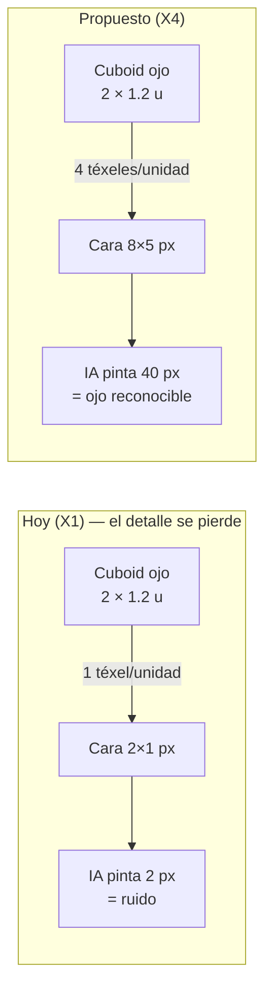
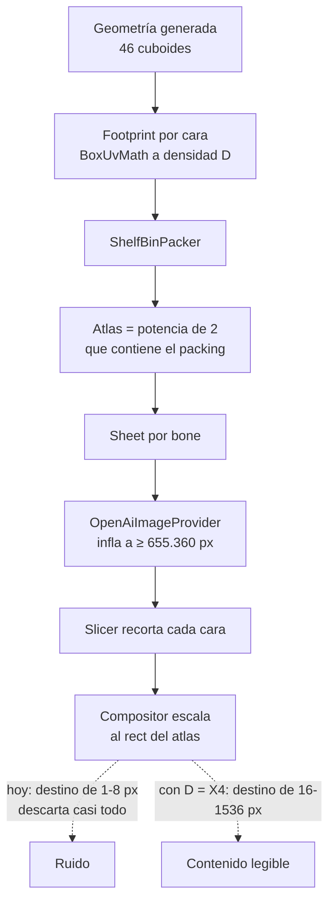

# Definición: densidad de téxel y resolución real de textura

## Resumen ejecutivo
La epic de anatomía por capas (097-105) mejoró la geometría de forma medible, pero dejó la textura peor de lo esperado por una razón que no es de calidad de IA: **la UV asigna téxeles proporcionales al tamaño físico de cada cuboid**, y la identidad del personaje ahora vive en cuboides chiquitos (grietas, ojos, colmillos, jirones). Medido sobre `Carcomido v2`: 178 de 276 caras tienen menos de 16 px², con mediana de 8 px². Una cara de 1-4 píxeles no puede contener un ojo ni una grieta, así que la IA solo puede devolver ruido con la paleta correcta.

Este cambio sube la densidad de téxel de forma global y deja que el atlas crezca según el packing, sin tope (decisión del PO). No cambia la política de geometría ni el estilo de prompt: cambia cuántos píxeles recibe cada cara.

## Objetivo de negocio
Que la textura generada sea legible como personaje — que un ojo se vea como un ojo y una grieta como una grieta — para que el resultado de "Crear con IA" sea usable sin repintar a mano. Hoy el modelado convence y la textura obliga a descartar el resultado, que es exactamente la mitad que bloquea el valor del producto.

## Alcance

### Incluye
- Subir la densidad de téxel usada por `AtlasResolutionCalculator`/`BoxUvMath` para el flujo de generación por IA, de forma **global** (todas las caras), no selectiva por categoría semántica.
- Extender `TexelDensity` con los valores que hagan falta (hoy solo existen `X1`/`X2`; los números de abajo requieren `X4`).
- Dejar que el atlas resultante sea consecuencia del packing **sin tope** — se elimina la semántica de tope introducida en el ticket 103.
- Resolver qué pasa con el selector "Resolución de textura" de Configuración, que con "sin tope" se queda sin significado (ver Decisión 3).
- Verificar el efecto con el benchmark Carcomido ya existente (ticket 105) y con una corrida real contra `studio-dev`.

### No incluye
- Cambiar la política de geometría secundaria (cantidad/tamaño de cuboides de detalle). Evaluado y descartado por el PO en esta iteración.
- Pintar caras chicas con color plano en vez de mandarlas a la IA. Evaluado y descartado por el PO en esta iteración; queda como alternativa si la densidad sola no alcanza.
- Cambiar el proveedor de imagen, el estilo de prompt o la estrategia de continuidad (ticket 102, ya verificada en vivo).

## Historias de Usuario

### HU-1: Densidad de téxel suficiente para el detalle modelado
Como usuario que generó un mob con rasgos chicos (garras, grietas, ojos), quiero que esos rasgos reciban píxeles suficientes para tener contenido reconocible, para que la textura no se vea como ruido.

Criterios de aceptación:
- Dado un cuboid de 1×1 unidades, cuando se calcula su UV, entonces su cara recibe al menos 4×4 téxeles.
- Dado el modelo `Carcomido v2` (46 cuboides, 276 caras), cuando se recalcula el atlas con la densidad nueva, entonces **ninguna cara no degenerada** queda por debajo de 16 px².
- Dado que una cara es degenerada (área cero, hallazgo real del ticket 064), cuando se calcula el atlas, entonces se sigue omitiendo como hoy — este cambio no la resucita.

### HU-2: El atlas es consecuencia del packing, sin tope
Como Product Owner, quiero que el tamaño del atlas lo determine el packing a la densidad vigente y no un tope configurable, para volver a la regla simple del Diseño técnico §7 sin la capa de "tope" que resultó inerte.

Criterios de aceptación:
- Dado cualquier modelo, cuando se calcula el atlas, entonces su tamaño es la potencia de 2 que contiene el footprint empaquetado a la densidad vigente — sin recortes ni topes.
- Dado un modelo con mucha geometría, cuando el atlas resultante es grande, entonces se genera igual y se registra su tamaño para diagnóstico; nunca se degrada la densidad para "que entre".

### HU-3: El control de la UI dice la verdad
Como usuario, quiero que el control de resolución de textura refleje lo que realmente hace el motor, para no elegir algo que no tiene efecto.

Criterios de aceptación:
- Dado que el atlas ya no se acota por tope, cuando abro Configuración, entonces el control expone la decisión real que existe (la densidad) o no existe — nunca una opción que no cambia nada.
- Dado que elijo una opción, cuando termina la generación, entonces el atlas resultante difiere de forma observable respecto de las otras opciones.

### HU-4: Evidencia medida, no impresión
Como equipo, queremos comparar antes/después con números sobre el mismo fixture, para no repetir "se ve mejor" sin respaldo.

Criterios de aceptación:
- Dado el benchmark Carcomido, cuando corre el pipeline, entonces el reporte incluye la distribución de área por cara (mínimo, mediana, percentiles) además de `featureCoverage`.
- Dado el resultado, cuando se compara con la corrida previa a este cambio, entonces la mediana de área por cara y el porcentaje de caras bajo 16 px² quedan registrados en el ticket.

## Diseño técnico

**Decisión 1 — Densidad global, no por categoría.** Se sube `TexelDensity` para todas las caras. La alternativa (densidad alta solo en caras grandes + color plano en las chicas) fue evaluada y descartada por el PO: es más barata en API pero introduce dos caminos de pintado distintos y una heurística de umbral que hay que mantener. Tradeoff aceptado: se gastan téxeles en caras que casi no se ven (caras internas, traseras de cuboides ocultos).

**Decisión 2 — `X4` como densidad objetivo.** Con los tamaños reales del `Carcomido v2`:

| Pieza | Tamaño (unidades) | Cara a X1 (hoy) | Cara a X4 |
|---|---|---|---|
| Torso | 8 × 12 × 4 | 8×12 = 96 px² | 32×48 = 1536 px² |
| Cabeza | 8.4 × 8.4 × 8.4 | ~34 px² | ~1130 px² |
| Ojo (`EYE`) | 2 × 1.2 × 0.5 | 2×1 = 2 px² | 8×5 = 40 px² |
| Colmillo (`JAW`) | 1 × 1 × 0.4 | 1 px² | 4×4 = 16 px² |

El atlas de este mob pasaría de 32×256 a ~128×1024. `X2` deja los colmillos en 2×2 y los ojos en 4×2: insuficiente para el objetivo de HU-1, por eso el salto es a `X4` y no al valor que ya existe.

**Decisión 3 — El tope del ticket 103 se elimina, y con él la semántica del selector.** `TextureResolution` se introdujo hace horas como TOPE (decisión del PO en ese momento). Con "sin tope" queda como código muerto. Además se descubrió que era inerte justo donde importaba: el atlas de `Carcomido v2` a X1 ya mide 256 de alto, así que superaba el tope de 128 y la lógica caía siempre a X1 — el control daba más densidad a los mobs simples y ninguna a los complejos, al revés de lo necesario. **Este es un cambio de contrato de API** (`textureResolution` en `POST /generate`) y se señala explícitamente. Dos caminos posibles, a decidir en el VoBo:
- (a) El selector pasa a elegir densidad directamente (`X1`/`X2`/`X4` con etiquetas de usuario), manteniendo el campo del request con otro significado.
- (b) Se elimina el selector y el campo; la densidad es una constante del motor.

**Decisión 4 — Costo de API: sin cambio.** `OpenAiImageProvider` ya infla cada sheet hasta `MIN_PIXEL_BUDGET` = 655.360 px por llamada (tickets 059-063). Hoy pedimos ~655k píxeles por bone y conservamos unas decenas al recortar contra un atlas de 32 px de ancho: **la mayoría de los píxeles que ya pagamos se descartan**. Subir la densidad aprovecha píxeles ya comprados; el costo por llamada solo sube si el sheet supera ese piso, lo que a X4 recién ocurre en bones grandes.

**Decisión 5 — Sin migración de modelos existentes.** Los mobs ya generados conservan su atlas actual; la densidad nueva aplica a generaciones nuevas. Re-texturizar un mob viejo implicaría recalcular su UV y descartar lo pintado a mano, que es justo lo que `UvPaintOrigin` (ticket 037) existe para no hacer en silencio.

## Diagramas

*El cambio es de asignación de téxeles, no de prompt ni de proveedor: la misma llamada de imagen, recortada sobre una celda UV utilizable.*

*El cuello de botella es el último paso: el destino en el atlas, no la generación.*

## Riesgos y preguntas abiertas
- **Atlas grandes sin tope.** A X4 un mob complejo puede llegar a ~128×1024 o más. No lo bloquea `FmmCompatibilityValidator` (solo exige que las UV caigan dentro de la textura, verificado leyendo el validador), pero se aleja del tamaño típico de un resource pack. Riesgo asumido por decisión explícita del PO.
- **Caras invisibles pagan téxeles.** La densidad global gasta atlas en caras internas/traseras. Es el tradeoff aceptado al descartar la variante selectiva.
- **El selector de la UI queda sin definición hasta el VoBo** (Decisión 3, opciones a/b). Es un cambio de contrato de API, no solo de UI.
- **Pregunta abierta**: ¿`X4` fijo, o el motor elige la densidad más baja que garantice el mínimo de 4×4 téxeles por cara no degenerada? La segunda es adaptativa y evita atlas innecesariamente grandes en mobs simples, pero agrega una regla más al cálculo.
- **No verificado todavía**: que a X4 la IA efectivamente produzca contenido estructurado y no ruido a mayor resolución. La hipótesis es sólida (hoy el límite es el destino, no la fuente), pero solo una corrida real contra `studio-dev` lo confirma — mismo criterio que los tickets 059-065.

## Impacto estimado
Tickets probables a partir de esta definición:
1. `TexelDensity.X4` + densidad configurable del motor; `AtlasResolutionCalculator` sin tope (elimina la lógica de `TextureResolution` del 103).
2. Resolución del selector de UI y su campo de request según lo que se decida en Decisión 3 (cambio de contrato, requiere su propio VoBo).
3. Métrica de área por cara en `ModelGenerationQualityReport` + assertions en el benchmark Carcomido (HU-4).
4. Verificación en vivo contra `studio-dev` con el mismo mob, comparando antes/después con números.
