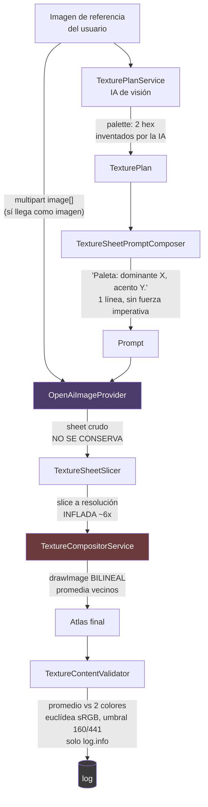
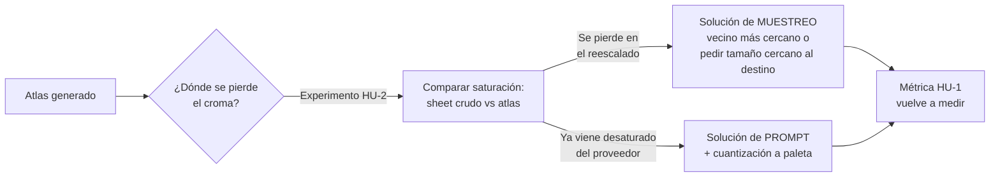

# Definición: Fidelidad de color en la generación de texturas

## Resumen ejecutivo

El Product Owner reportó durante varios tickets que la paleta generada "sale más oscura" que la imagen de referencia. **Al medirla, no sale más oscura: sale desaturada.** La luminancia media del atlas generado coincide casi exactamente con la de la referencia (60,4 contra 59,7), pero la saturación cae un 40 % (0,31 contra 0,513), y los violetas saturados que dominan la referencia se convierten en grises neutros.

Este documento define qué significa "fidelidad de color" como requisito verificable, qué hay que medir para saber si mejoramos, y por dónde atacarlo. Deliberadamente **no** propone todavía una solución única: la causa raíz no está confirmada y el documento incluye los experimentos que la confirmarían.

## Objetivo de negocio

Un usuario sube una referencia y espera reconocerla en su mob. Hoy, con el estilo **Fiel a la referencia**, el mob resultante pierde la identidad cromática del original: lo que era un zombie con grietas violetas luminosas termina en escala de grises verdosos. Eso ataca directamente la propuesta de valor del producto — "convertí tu idea en un mob" — porque la idea llega descolorida.

Los otros tres estilos (Minecraft Vanilla, Pixel Art, Realista) tienen licencia artística para apartarse de la referencia. **Fiel a la referencia es el único donde la fidelidad de color es un requisito duro**, y es el default del flujo.

## Alcance

### Incluye
- Definir **fidelidad de color como métrica objetiva** sobre el atlas generado, no como impresión visual.
- Instrumentar el pipeline para poder localizar **dónde** se pierde el croma (hoy no se puede: el sheet crudo que devuelve el proveedor no se conserva en ningún lado).
- Hacer que la paleta del `TexturePlan` deje de ser decorativa: hoy es una línea de texto sin peso en el prompt y nadie la hace cumplir.
- Definir el comportamiento por estilo: qué significa fidelidad de color en cada uno de los cuatro.
- Que la métrica quede visible (reporte de calidad o warnings), para detectar si el proveedor de imágenes se degrada con el tiempo.

### No incluye
- El preview 3D que no muestra la textura (`pending/117`). **Es un prerrequisito de diagnóstico, no parte de este alcance**: mientras el render se vea negro, ninguna evaluación visual de color es confiable.
- La geometría más fina que un téxel (`pending/121`).
- Cambiar de proveedor de imágenes.
- Rediseñar el editor de textura o el flujo de UI.

## Evidencia medida (punto de partida, no supuestos)

Todo lo de abajo está medido en vivo contra `studio-dev` en esta sesión, sobre `Carcomido v4` (mob generado desde la misma referencia que el v3).

**1. El problema es de croma, no de luminancia.** Comparando la región central de la referencia (el personaje, acotado para reducir el fondo) contra el atlas generado:

| | referencia (personaje) | atlas generado |
|---|---|---|
| Luminancia media | 59,7 | **60,4** |
| Saturación media | 0,513 | **0,31** |
| Colores dominantes | negros; **violeta `#5030 90` 12,3 %**; violeta claro 8,5 % | negros; **gris `#303030` 13,8 %**; gris `#505050` 11,4 % |

**2. La pérdida de saturación es pareja entre bones**, no concentrada en las piezas chicas:

| bone | área media de cara | saturación |
|---|---|---|
| body | 104 | 0,468 |
| leftHand / rightHand | 119 | 0,317 / 0,274 |
| pies | 171 | ~0,33 |
| torso | 209 | 0,306 |
| piernas | 210-242 | ~0,29 |

**3. Predicción fallida, anotada a propósito.** Se predijo que si el culpable fuera el reescalado bilineal del compositor, los bones más chicos (que se inflan más y por lo tanto se reducen más) estarían más desaturados. **No se cumple**: `body` tiene las caras más chicas y la saturación más alta. El reescalado sigue siendo un mecanismo plausible, pero este test no lo confirma.

## Auditoría del pipeline actual

Hallazgos concretos, con archivo y línea, sobre el código tal como está hoy:

**La paleta es de dos colores y es global.** `TexturePalette` (`domain/model/TexturePalette.java:13`) es un record con `dominantColorHex` y `accentColorHex`, y nada más — sin nombre, sin rol semántico, sin entrada por bone o material. Dos colores para todo el mob.

**La paleta la inventa la IA de visión, no se extrae de la imagen.** `TexturePlanService.java:66-69` se la pide a Claude en el prompt. **No existe** ningún código que muestree los píxeles de la referencia para derivar colores.

**En el prompt de generación, la paleta es decorativa.** `TextureSheetPromptComposer.java:73-86` la emite como una sola línea — `Paleta: dominante #4A3B2C, acento #8FA05B.` — en la **primera** línea del prompt, sin ningún lenguaje imperativo. En el mismo prompt, las instrucciones sobre llenar los rectángulos sí gritan en mayúsculas ("Pintá CADA región COMPLETA... NO dibujes marcos"). La paleta no tiene ni un "usá exclusivamente estos colores".

**Nadie hace cumplir la paleta.** `TextureContentValidator` compara contra ella, pero: usa el **promedio aritmético** de los píxeles pintados (`:137`, `:223-226`) en vez del color dominante — una cara mitad roja y mitad verde promedia a un oliva que puede pasar el chequeo aunque ningún píxel real lo tenga; mide con **distancia euclídea en sRGB crudo** (`:182-185`), no perceptual; con un umbral de **160 sobre un rango de 441** (`:69-77`), tan laxo que casi cualquier color pasa; y cuando falla **solo hace `log.info`** (`TextureGenerationService.java:445-453`).

**No existe ningún post-proceso de color.** Ni cuantización a paleta, ni corrección de gamma, ni conversión de espacio. Verificado por ausencia total de `ColorConvertOp`, `ColorSpace`, `ICC_Profile`, `RescaleOp`, `LookupOp`, `IndexColorModel`. El stage SSE `LIMPIANDO_PIXELES` es un **no-op deliberado y documentado** (`TextureGenerationService.java:276-285`): emite el evento y no toca un píxel.

**La referencia sí llega como imagen real al proveedor.** `OpenAiImageProvider.java:89-117` manda la referencia (y desde la segunda sheet, el atlas parcial) como `image[]` multipart a `/v1/images/edits`. El problema de color no es que el modelo no vea la referencia.

**Dos lugares donde el color se altera sin que nadie lo decida:**
- **Reescalado bilineal** (`TextureCompositorService.java:50`, `:68`): cada slice llega a resolución inflada (~6×) y se colapsa al rect del atlas promediando vecinos. Promediar **conserva la media y destruye la varianza** — es decir, mantiene la luminancia y baja la saturación, exactamente el patrón medido. Corre siempre, en los cuatro estilos, y es lo contrario de lo que quiere el pixel-art.
- **`TYPE_INT_ARGB` forzado sin gestión de ICC** en cuatro puntos (`TextureSheetSlicer.java:120`, `TextureCompositorService.java:83`, `TextureGenerationService.java:533` y `:630`), más un re-encode final (`project/texture/TextureService.java:149-168`) que descarta perfiles ICC y chunks `gAMA`/`cHRM`. Si el PNG del proveedor viene con perfil embebido, los valores quedan mal interpretados como sRGB.

## Historias de Usuario

### HU-1: Saber si el color es fiel, sin depender del ojo
Como **Product Owner**, quiero una métrica objetiva de fidelidad de color entre la referencia y el atlas generado, para decidir si una mejora funcionó sin discutir impresiones.

Criterios de aceptación:
- Dado un job de textura completado, cuando se consulta su reporte, entonces expone la **distancia de croma** y la **distancia de luminancia** entre el atlas y la referencia, por separado — porque hoy sabemos que una está bien y la otra no.
- Dado que la distancia se calcula, entonces usa un espacio **perceptual** (CIELAB / CIEDE2000), no euclídea en sRGB — la métrica actual del validador no distingue un violeta de un gris de la misma luminancia.
- Dado el `Carcomido v4` ya medido, cuando se calcula la métrica sobre él, entonces reproduce la conclusión ya conocida (luminancia fiel, croma no) — la métrica se valida contra un caso donde ya sabemos la respuesta.

### HU-2: Localizar dónde se pierde el croma
Como **desarrollador**, quiero poder comparar el sheet crudo que devuelve el proveedor contra el atlas final, para saber si el croma se pierde en la generación o en nuestro pipeline.

Criterios de aceptación:
- Dado un job de textura, cuando termina, entonces el sheet crudo de cada llamada queda accesible para diagnóstico (detrás de un flag, sin costo en el flujo normal).
- Dado un sheet crudo y su porción correspondiente del atlas, cuando se comparan sus saturaciones, entonces se puede afirmar con evidencia si el reescalado bilineal es el responsable —
  **este es el experimento que decide el diseño de la HU-4**.
- Dado que hoy no se conserva nada, entonces esta HU es **prerrequisito** de cualquier decisión sobre post-proceso.

### HU-3: Que la paleta deje de ser decorativa
Como **usuario que eligió "Fiel a la referencia"**, quiero que los colores de mi imagen se respeten de verdad, para reconocer mi personaje en el mob.

Criterios de aceptación:
- Dado un `TexturePlan`, cuando se compone el prompt, entonces la paleta viaja con lenguaje imperativo y en una posición del prompt con peso real, no como primera línea decorativa.
- Dada una referencia, cuando se arma el plan, entonces la paleta se deriva **también de los píxeles reales** de la imagen (colores dominantes medidos), no solo de lo que la IA de visión dice que ve.
- Dada una paleta, entonces deja de ser de 2 colores globales: soporta al menos los colores dominantes más un conjunto de acentos, con la granularidad que el diseño técnico decida.

### HU-4: Corregir el croma cuando se aparta
Como **Product Owner**, quiero que el sistema corrija la desviación de color cuando es fuerte, para no depender de que el proveedor obedezca el prompt.

Criterios de aceptación:
- Dado un atlas generado cuya distancia de croma supera el umbral, cuando el estilo es **Fiel a la referencia**, entonces se aplica una corrección determinista y se registra que se aplicó.
- Dado el estilo **Pixel Art** o **Minecraft Vanilla**, entonces la corrección incluye cuantización a paleta (que es lo que esos estilos piden de todos modos).
- Dado el estilo **Realista**, entonces la corrección es más laxa o no se aplica — la decisión queda documentada.
- Dada una corrección aplicada, entonces **nunca** se ejecuta en silencio: queda en el reporte con su magnitud.

### HU-5: Ver si el proveedor se degrada
Como **equipo**, quiero que la métrica de fidelidad quede registrada por job, para detectar si el proveedor de imágenes empeora con el tiempo sin que nadie lo note.

Criterios de aceptación:
- Dado cualquier job de textura, entonces su métrica de color queda consultable fuera del log.
- Dado un job donde el color es fiel, entonces la métrica existe y es buena — la ausencia de advertencias no se confunde con "no se midió".

## Diseño técnico

### Decisión 1: separar croma de luminancia en la métrica
La evidencia obliga. Una métrica única de "distancia de color" habría dado un número mediocre y nos habría dejado sin saber qué arreglar. Se miden por separado y se reportan por separado.

**Tradeoff**: dos números son más difíciles de comunicar que uno. Se acepta: el número único ya nos hizo perder tiempo persiguiendo "oscuridad" cuando el problema era saturación.

### Decisión 2: instrumentar antes de corregir
No se implementa ningún post-proceso de color hasta que la HU-2 diga dónde se pierde el croma. Si el culpable es el reescalado bilineal, la solución es de **muestreo** (usar vecino más cercano, o pedirle al proveedor un tamaño más cercano al destino), no de corrección de color. Si el culpable es el modelo generador, la solución es de **prompt + cuantización**. Son soluciones distintas y excluyentes.

**Tradeoff**: agrega un ciclo antes de ver mejoras visibles. Se acepta explícitamente: este documento nace de dos diagnósticos equivocados en la misma sesión (el relleno de bordes corriendo en el paso equivocado, y el "atlas vacío" atribuido a un desajuste de dimensiones que no existía), los dos por corregir antes de medir.

### Decisión 3: el reescalado bilineal es sospechoso aunque el test no lo haya confirmado
Promediar píxeles conserva la media y reduce la varianza: matemáticamente, mantiene la luminancia y baja la saturación. Coincide con lo medido. El test por bone no lo confirmó, pero tampoco lo descarta — puede no tener poder discriminante si todos los sheets se inflan hasta un piso parecido por `MIN_PIXEL_BUDGET`, con lo que el factor de reducción no varía como se supuso.

Queda como hipótesis principal a falsar en la HU-2, no como causa establecida.

### Decisión 4: la paleta se deriva de píxeles, no solo de la IA
Pedirle a un modelo de visión "decime el color dominante" y confiar en su respuesta es innecesario cuando tenemos la imagen. Un histograma cuantizado da los colores dominantes reales, medibles y reproducibles. La IA de visión sigue aportando el **rol semántico** (qué color es piel, qué color es acento luminoso), que un histograma no puede dar.

**Tradeoff**: dos fuentes de verdad para la paleta. Se resuelve con jerarquía explícita: los valores salen de los píxeles, los roles de la IA.

### Decisión 5: gestión explícita de color, o declarar que no se gestiona
Hoy hay cuatro `TYPE_INT_ARGB` forzados y un re-encode que descarta perfiles ICC, sin que nadie haya decidido eso. Hay que **decidirlo**: o se asume sRGB de punta a punta y se documenta (convirtiendo explícitamente lo que llegue con otro perfil), o se preserva el perfil. Lo que no puede seguir es que sea un efecto colateral.

## Diagramas

El diagrama muestra el camino del color tal como está **hoy**, con los tres puntos débiles en su lugar real: la paleta entra débil al prompt (arriba), el sheet crudo se pierde justo donde haría falta para diagnosticar (centro), y el único punto que altera color sin decisión de nadie es el reescalado bilineal (rojo). El validador (abajo) desemboca en un log y nada más.

Este segundo diagrama es el que justifica la Decisión 2: las dos ramas llevan a soluciones **excluyentes**, y hoy no sabemos en cuál estamos. Implementar cualquiera de las dos antes del experimento es apostar.

## Riesgos y preguntas abiertas

- **La comparación contra la referencia está confundida por el fondo.** La referencia es una ilustración completa con escenario; se acotó al 50 % central para aislar al personaje, pero no es una segmentación real. Pregunta abierta: ¿se compara contra la referencia completa, contra una región, o contra la paleta derivada de ella? Afecta directamente el umbral de la HU-1.
- **Una sola generación medida.** Todos los números salen de un job. La variación entre corridas del mismo prompt no está caracterizada, y ya se vio que es grande (las caras enteramente negras saltaron de 1 a 22 entre dos corridas en el ticket 114). Riesgo real de perseguir ruido.
- **El preview 3D no muestra la textura (`pending/117`).** Mientras no se arregle, ninguna evaluación visual del color es confiable — y parte de la percepción original de "sale oscuro" probablemente venga de ahí. **Debería cerrarse antes de pedir una evaluación visual de este trabajo.**
- **¿La corrección de color es deseable en "Fiel a la referencia"?** Forzar la paleta puede producir un resultado técnicamente más fiel y visualmente peor (bandas, posterización). Pregunta para el PO.
- **¿Qué pasa con las caras diminutas?** Una cara de 4 píxeles no puede tener fidelidad de color significativa. Se relaciona con `pending/121` y puede hacer que la métrica global se vea peor de lo que el usuario percibe.
- **No está caracterizado si el proveedor devuelve PNG con perfil ICC embebido.** Es medible en el mismo experimento de la HU-2 y decide la Decisión 5.

## Impacto estimado

Lista tentativa, a refinar con el skill `nuevo-ticket` después del VoBo. El orden importa: los dos primeros son prerrequisitos.

1. **Instrumentación de diagnóstico**: conservar el sheet crudo detrás de un flag y poder compararlo con el atlas (HU-2). Sin esto, todo lo demás es adivinanza.
2. **Métrica de fidelidad de color** en espacio perceptual, separando croma de luminancia, validada contra el `Carcomido v4` ya medido (HU-1, HU-5).
3. **Experimento y decisión**: correr la comparación, determinar la rama del segundo diagrama y **documentar el resultado** — sea cual sea.
4. **Paleta derivada de píxeles reales** + roles semánticos de la IA, con más de 2 colores (HU-3).
5. **La paleta con peso real en el prompt** (HU-3).
6. **Corrección/cuantización por estilo**, con el diseño que dicte el paso 3 (HU-4).
7. **Gestión explícita de espacio de color** e ICC, o declaración documentada de que se asume sRGB (Decisión 5).

Los pasos 4 y 5 son baratos y se pueden adelantar; los pasos 6 y 7 dependen del resultado del paso 3.
