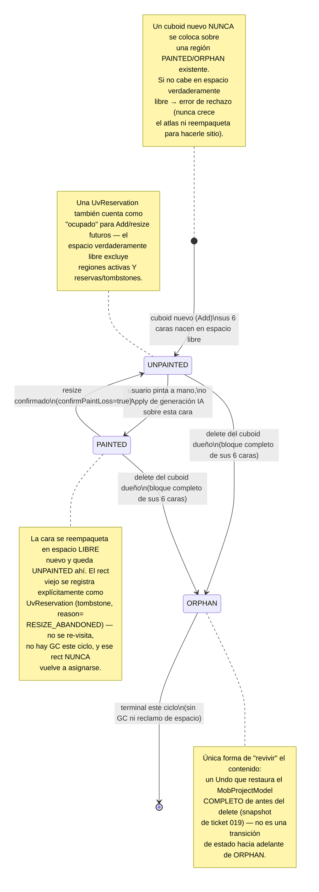
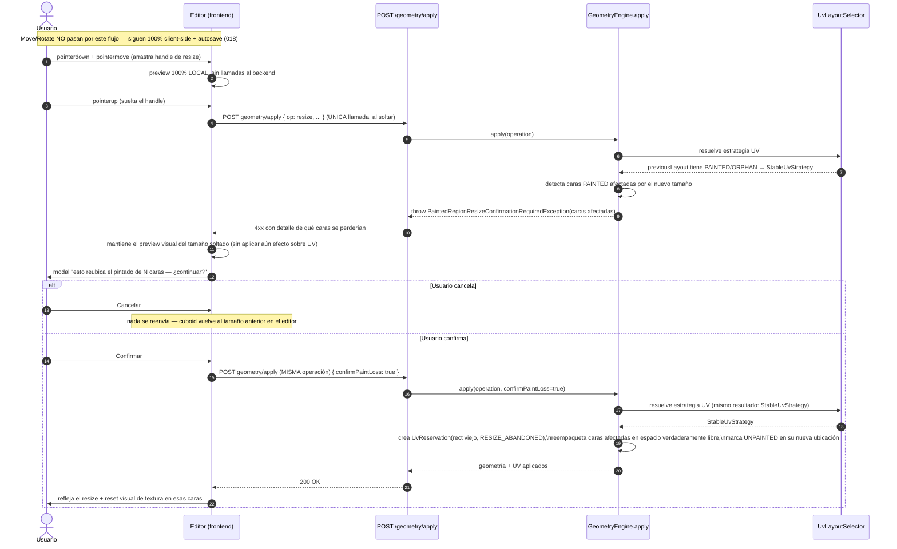
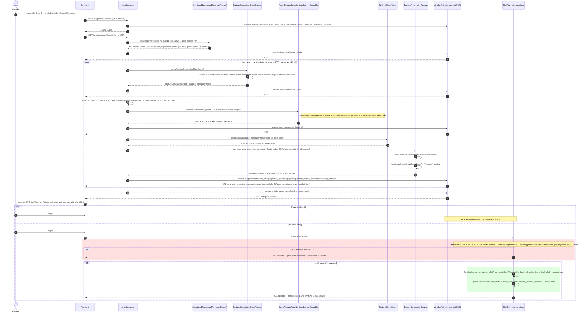
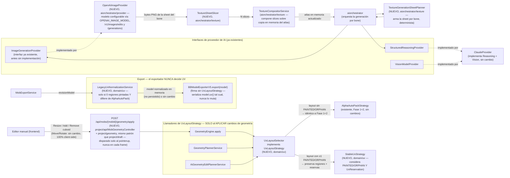

# Definición: Galgoth Studio — Fase 3 (Editor de textura/UV + Generación de textura por IA)

> Este documento es continuación del documento aprobado `docs/definiciones/galgoth-studio-mvp.md` (Technical Alpha, Fase 1 + Fase 2, VoBo del PO el 8 sep 2026, cerrado formalmente el 9 sep 2026). Reutiliza su numeración de Historias de Usuario (continúa desde HU-23) y de épicas (continúa desde Épica I). No reabre alcance ni arquitectura de Fase 1+2 — las asume como baseline ya construido y las referencia explícitamente donde esta fase se apoya en ellas.

## Resumen ejecutivo

Fase 3 agrega al Technical Alpha ya aprobado la capacidad de **pintar y generar por IA la textura real de un mob**, reemplazando la textura placeholder checkerboard que hoy garantiza únicamente que el export sea válido. Cubre: un editor de textura/UV manual tipo pixel-art sobre el atlas ya calculado por `AutoUv`, con selección cruzada cuboid↔UV y preview 3D en vivo; la integración de ese trabajo con el sistema ya existente de Draft/Command/Revision, con Undo/Redo basado en patches (nunca snapshots completos del bitmap) y el bitmap persistido content-addressed con el backend como única autoridad del hash; la resolución del riesgo abierto #7 heredado de Fase 1+2 (qué pasa con una UV que ya no puede reempaquetarse libremente porque tiene textura pintada encima, vía una `StableUvStrategy` nueva con reservas explícitas de espacio abandonado); y un pipeline de generación de textura por IA usando **OpenAI** (modelo configurable, no hardcodeado) como `ImageGenerationProvider`, generando una sola imagen coherente por bone (nunca por cuboid) y con el mismo patrón "IA propone, la app valida y aplica con diff" ya probado en geometría (ticket 031). El exportador (`BBModelExporterV5`/`V4`) es, a partir de esta fase, un serializador puro — nunca calcula ni reempaqueta UV, solo serializa la UV canónica que ya quedó fijada en la Revision.

> **VoBo FINAL del Product Owner: 10 sep 2026.** El diseño técnico incorpora 13 correcciones precisas del 9 sep 2026 (primera revisión) más 3 correcciones finales del 10 sep 2026 (semántica de densidad de texel x1/x2 — Diseño técnico §7; modelo de OpenAI configurable actualizado a un snapshot fechado — §12; aislamiento espacial del pipeline de generación por bone — §21). Con estas, Fase 3 queda **aprobada para desglose de tickets**.

## Objetivo de negocio

El Technical Alpha entrega geometría editable con textura placeholder — suficiente para validar el pipeline determinista de modelo 3D, pero insuficiente como producto usable: un mob sin textura real no es un mob terminado para un servidor de Minecraft. Fase 3 cierra esa brecha, permitiendo que el flujo completo (`referencia → geometría por IA → textura por IA/manual → export`) produzca un `.bbmodel` con arte real, listo para usarse, sin salir de Galgoth Studio ni depender de Blockbench para la parte de pintado.

### Usuarios / roles involucrados

Sin cambios respecto a Fase 1+2: **creador de contenido para Minecraft** (usuario principal) y **usuario avanzado/editor manual** (ajusta a mano lo que la IA generó) — la misma persona, ahora también pintando/generando textura, no un rol nuevo. Sigue sin roles de colaboración, permisos, ni autenticación.

## Alcance

### Incluye

**Editor de textura/UV manual**
- Pixel editor (canvas 2D/OffscreenCanvas) sobre el atlas de textura del mob (`MobProjectModel.texture`), con el layout UV ya calculado por `AutoUv`/`UvLayoutStrategy` (006/007) como guía visual.
- Regiones UV etiquetadas por parte del cuerpo/cara.
- Selección cruzada: seleccionar una cara de un cuboid en el viewport 3D resalta su región UV correspondiente, y viceversa.
- Preview 3D en vivo reutilizando el mismo `ThreeViewportService` singleton ya existente (008/016), no un viewport nuevo.
- Herramientas: color picker/paleta, brush, eraser, fill bucket, eyedropper, selection, copy/paste, crop/fit de una imagen pegada a la región seleccionada, undo/redo (basado en patches por región, nunca snapshots completos del bitmap — ver Diseño técnico §9), grid toggle, control de tamaño de pincel.
- Importar un PNG completo sobre el atlas entero también está en alcance (crop/pad seguro, nunca deformar — ver Diseño técnico §8), además de pegar sobre una región seleccionada.
- La resolución del atlas tiene dos estados: recomendada/ajustable antes de pintar, y **congelada** en cuanto existe la primera región `PAINTED` — ver Diseño técnico §7.

**Persistencia y revisiones de textura**
- Integración con el Draft (`mob_drafts`) + autosave con dirty-check, y con las Revisiones (`mob_revisions`) inmutables ya existentes (HU-08/09/22) — "Guardar" crea una revisión que incluye textura y geometría juntas, no dos sistemas de historial separados.
- Bitmap de textura persistido content-addressed en MinIO, con el backend como única autoridad del hash/`storageKey` (nunca embebido inline en `model_jsonb`, nunca confiando en un `storageKey` propuesto por el cliente) — ver Diseño técnico §4/§6.

**`StableUvStrategy` / integridad de UV pintada**
- Resolución del riesgo abierto #7 de Fase 1+2: una vez que una región UV tiene textura pintada o generada, un cambio de geometría ya no puede reempaquetarla libremente.
- **Resize de un cuboid con caras ya pintadas**: se avisa y se pide confirmación explícita antes de aplicar — nunca silencioso, nunca reescalado automático, nunca bloqueo permanente (decisión del PO, 9 sep 2026).
- **Creación de un cuboid nuevo sin espacio libre** en un atlas con regiones ya pintadas: se rechaza con error explícito, mismo patrón que `UvAtlasOverflowException` ya existente — nunca crece el atlas ni reempaqueta regiones pintadas (decisión del PO).
- **Eliminación de un cuboid con textura pintada**: sus 6 caras quedan reservadas como huérfanas (`ORPHAN`), no reutilizables este ciclo — prioriza que Undo siempre recupere el contenido exacto, acepta el costo de espacio de atlas desperdiciado (decisión del PO).

**Generación de textura por IA**
- Pipeline completo (master prompt §12): análisis de material/paleta de la imagen de referencia ya subida en Fase 2 → mapeo semántico de caras (vía `StructuredReasoningProvider`/Claude, `TexturePlan`) → una **`TextureGenerationSheet` por bone** con el layout UV determinista ya resuelto → **una sola llamada de imagen a OpenAI por bone** (todas sus caras/cuboids juntos, para garantizar coherencia de estilo/paleta — nunca una llamada independiente por cuboid) → slicing determinista → compositor de atlas → limpieza de píxeles/paleta → preview/diff. Batching en varias llamadas solo como fallback explícito si un bone excede los límites técnicos del modelo configurado.
- **4 opciones de estilo**: Fiel a la referencia / Minecraft Vanilla / Pixel Art / Realista (decisión del PO: fiel al mockup 08, no solo los 3 del master prompt original).
- Nivel de detalle, y **regenerar solo un bone completo** (decisión del PO sobre granularidad — no cara individual, no todo el atlas).
- Si un slice de la imagen generada no respeta las dimensiones exactas de su región objetivo, se recorta/escala automáticamente — sin reintento, sin error, salvo que el propio recorte falle técnicamente (decisión del PO).
- Patrón "IA propone, la app valida y aplica" con diff Antes/Después obligatorio — nunca se aplica el resultado de la IA directo sin mostrarlo primero (mismo espíritu que 031, para píxeles en vez de geometría). El Apply es **atómico**: bitmap, `MobProjectModel`, draft y revisión se actualizan como una sola unidad, o ninguno (ver Diseño técnico §10).
- `ImageGenerationProvider`: implementación real `OpenAiImageProvider` + `MockImageProvider` de tests real (no solo placeholder de interfaz), modelo de imagen **configurable** (`OPENAI_IMAGE_MODEL`, nunca hardcodeado), mismo patrón de reproducibilidad (provider/model real usado/prompt version/schema version/reference IDs) que las otras dos interfaces ya implementadas.

**Pantallas 07 y 08**
- Fidelidad al Visual Contract y a los mockups `07_editor_textura.png`/`08_generador_textura_ia.png`.
- El tab "Textura" (presente pero deshabilitado desde el ticket 002) pasa a funcional. "Animación" permanece "Próximamente" (fuera de alcance de esta fase).

**Flujo end-to-end de esta fase**
- Pintar/generar textura → verla en vivo en 3D → Guardar → exportar `.bbmodel` con la textura real (ya no placeholder) → abre en Blockbench sin diálogo de reparación.

### No incluye

- **Sistema de capas tipo Photoshop** — una sola superficie de textura editable por mob (master prompt principio #9, explícito).
- **Generación de textura en batch para múltiples mobs simultáneamente** — el pipeline es por mob, igual patrón que el resto de las APIs.
- **Selección múltiple de distintas partes/cuboides simultáneas** para pintar o generar a la vez — una región/bone enfocado por vez.
- **Importador de `.bbmodel` o de proyectos completos externos** — sigue vigente la decisión de Fase 1+2. Distinto de importar un PNG dentro del editor de textura, sea sobre una región seleccionada o sobre el atlas completo (HU-28), que sí está en alcance.
- **Sistema de animación / biblioteca de animaciones** — sigue fuera (Fase 4).
- **Checkpoints nombrados / restore de revisión específica** — sigue fuera; el historial de textura sigue las mismas reglas ya vigentes (Undo/Redo lineal en cliente + revisiones inmutables creadas solo por Guardar/Apply).
- **Autenticación / multi-tenencia** — sigue sin login.
- **Responsive completo del editor de textura** — desktop-first, igual criterio que el editor de modelo.
- **Helpers de autoría FMM guiados** — sin cambios, no relacionado a esta fase.
- **`RunPodProvider` o motor de generación de imágenes local/self-hosted** — descartado explícitamente por el PO para `ImageGenerationProvider`; esta fase usa exclusivamente OpenAI vía API REST.
- **Exportación de la textura como asset independiente** fuera del paquete `.bbmodel`/zip ya definido en Fase 1+2 (HU-19) — sin nuevo formato de export.
- **GC de bitmaps huérfanos en MinIO** (referenciados por cero drafts/revisiones) — fuera de alcance este ciclo, mismo criterio que la falta de política de poda de `mob_revisions` en Fase 1+2.

## Historias de Usuario

### Épica J: Editor de textura/UV manual

**HU-24**
```
Como creador de contenido para Minecraft
quiero ver el atlas de textura de mi mob dividido en regiones UV etiquetadas por parte del cuerpo/cara
para ubicar rápido qué región pintar sin adivinar coordenadas UV

Criterios de aceptación:
- Dado que entro al tab "Textura" de un mob con geometría ya usable (revision_number >= 1), cuando la pantalla carga, entonces veo el atlas completo (MobProjectModel.texture) en el canvas 2D, con el layout de UV ya calculado por AutoUv/UvLayoutSelector superpuesto como guía.
- Dado que cada cara de cada cuboid tiene una región UV asignada, cuando la veo en el canvas, entonces cada región muestra una etiqueta identificable.
- Dado un selector de región (dropdown, igual mockup 07: "Cabeza" / "Todas las caras"), cuando elijo una opción, entonces el canvas resalta/enfoca esa región.
- Dado un mob SIN ninguna revisión guardada todavía (current_revision_number = 0, solo draft en memoria), cuando entro al tab Textura, entonces se aplica el mismo criterio de acceso ya resuelto para el editor de modelo (ticket 034): el tab carga sobre el draft vacío, nunca bloqueado.
```

**HU-25**
```
Como creador de contenido para Minecraft
quiero que seleccionar una cara de un cuboid en el viewport 3D resalte automáticamente su región UV en el editor de textura, y viceversa
para ubicar visualmente qué parte de la textura corresponde a qué parte del modelo 3D

Criterios de aceptación:
- Dado que estoy en el tab Textura con el viewport 3D visible, cuando hago clic en una cara de un cuboid en el viewport, entonces la región UV correspondiente se resalta/enfoca en el editor 2D.
- Dado que selecciono una región UV en el editor 2D, cuando lo hago, entonces la cara correspondiente se resalta en el preview 3D.
- La selección por cara se implementa etiquetando cada cara/grupo de material de la geometría Three.js con `FaceName` de forma determinista en su construcción (`buildCuboidMesh`), y `pickCuboidFaceAt` resuelve `{ cuboidId, face }` a partir de ese etiquetado (`intersection.face.materialIndex`), nunca calculando la cara desde la normal del triángulo — la normal queda solo como validación/fallback (ver Diseño técnico §14). Vive en un store nuevo y separado del de selección de cuboid completo — sin modificar el contrato de selección ya usado por 017/031/036.
```

**HU-26**
```
Como creador de contenido para Minecraft
quiero ver la textura actualizarse en tiempo real sobre el modelo 3D mientras pinto
para juzgar el resultado visual sin necesidad de exportar

Criterios de aceptación:
- Dado que aplico un trazo de pincel/borrador/cubeta sobre el atlas, cuando el trazo se completa, entonces el preview 3D (mismo viewport singleton reutilizado, sin instanciar uno nuevo) refleja el cambio de inmediato.
- Dado que roto/hago zoom del preview 3D mientras pinto, cuando interactúo con él, entonces responde igual que el viewport del editor de modelo (mismo componente reutilizado).
```

**HU-27**
```
Como creador de contenido para Minecraft
quiero contar con herramientas estándar de edición de píxeles (color picker/paleta, brush, eraser, fill bucket, eyedropper, selection, copy/paste, undo/redo, grid toggle, tamaño de pincel)
para pintar la textura sin depender de un editor externo

Criterios de aceptación:
- Dado que elijo un color de la paleta o del color picker, cuando pinto con el pincel, entonces el trazo usa ese color exacto, sin antialiasing que degrade la nitidez pixel-art.
- Dado que uso la Cubeta, cuando hago clic dentro de una región de color contiguo, entonces se rellena esa región contigua con el color activo (flood-fill estándar).
- Dado que uso el Selector (eyedropper), cuando hago clic sobre un píxel, entonces el color activo pasa a ser el de ese píxel.
- Dado que cambio el tamaño de pincel/borrador, cuando pinto, entonces el trazo respeta ese tamaño en píxeles del atlas, no píxeles de pantalla.
- Dado que activo el toggle de cuadrícula, cuando lo activo, entonces se superpone una grilla de píxeles como ayuda visual (nunca se guarda como parte de la textura).
- Dado que uso Deshacer/Rehacer sobre ediciones de textura, cuando lo hago, entonces cada acción de usuario (un trazo completo de pincel/borrador entre `pointerdown` y `pointerup`, un fill, un paste) es una única unidad de Undo implementada como un `TexturePatchCommand` acotado al rectángulo mínimo tocado — nunca una copia completa del bitmap (ver Diseño técnico §9). Opera sobre una pila independiente de la del editor de geometría — Ctrl+Z en el tab Textura nunca deshace un cambio de geometría y viceversa.
```

**HU-28**
```
Como creador de contenido para Minecraft
quiero poder importar una imagen sobre una región UV seleccionada o sobre el atlas completo
para reutilizar arte externo o partes de otra textura sin redibujar a mano

Criterios de aceptación:
- (A, región seleccionada) Dado que tengo una región UV seleccionada, cuando pego una imagen de tamaño distinto a la región, entonces se me ofrece ajustarla a las dimensiones exactas de la región antes de confirmar; al confirmar, la región queda reemplazada, registrado como una operación de Undo.
- (B, atlas completo) Dado que importo un PNG sobre el atlas completo con dimensiones EXACTAS a las vigentes, cuando lo hago, entonces se muestra una confirmación/diff antes de reemplazar el atlas completo.
- (B, atlas completo) Dado que importo un PNG de dimensiones DISTINTAS a las vigentes, cuando lo hago, entonces se me ofrece ÚNICAMENTE crop (recortar excedente) y/o pad (agregar margen transparente) — nunca escalado/resize, para no introducir blur/aliasing sobre el canvas pixel-perfect ya decidido.
- Dado cualquiera de los dos casos (A o B), cuando no confirmo explícitamente el ajuste ofrecido, entonces no se aplica nada — nunca se deforma la imagen silenciosamente.
- Dado que confirmo un import de atlas completo, cuando se aplica, entonces es UNA única operación de Undo (un solo `TexturePatchCommand` con `rect` = atlas completo), sin importar si hubo crop/pad de por medio.
- Dado que el atlas ya está congelado (existe al menos una región `PAINTED`, ver HU-29), cuando importo un PNG de dimensiones distintas a las congeladas, entonces se aplica el mismo criterio de crop/pad hacia esas dimensiones fijas — nunca las cambia.
- Exportar la textura como PNG independiente sigue fuera de alcance — esta HU es exclusivamente sobre IMPORT.
```

**HU-29**
```
Como creador de contenido para Minecraft
quiero que la resolución del atlas de mi mob se recomiende automáticamente antes de pintar y quede protegida una vez que empiezo a pintar
para no perder trabajo por un cambio de tamaño posterior

Criterios de aceptación:
- **`x1`/`x2` son perfiles de DENSIDAD DE TEXEL, nunca una dimensión de atlas** (cerrado definitivamente por el PO, 10 sep 2026): `x1` = 1 texel por unidad de modelo Minecraft/Blockbench; `x2` = 2 texels por unidad. Ejemplo: una cara física de 8×8 unidades produce un footprint de 8×8 texels a `x1`, o 16×16 texels a `x2`.
- (Antes de pintar) Dado un mob sin ninguna región PAINTED todavía, cuando se calcula el atlas, entonces AutoUv calcula el footprint de CADA cara aplicando la densidad de texel elegida (`x1` por defecto para presets Minecraft, `x2` como upgrade explícito), empaqueta todos los footprints, y **el tamaño del atlas resulta del packing** — nunca un valor elegido de antemano. Para modelos custom, el footprint se calcula a densidad estándar (`x1`) y el atlas es la potencia de 2 inmediatamente superior al footprint empaquetado.
- (Antes de pintar) Dado que el footprint empaquetado no cabe en la resolución vigente, cuando esto ocurre, entonces se permite un upgrade explícito (recalcular a `x2`, o la siguiente potencia de 2 para custom) — nunca un crecimiento silencioso.
- (Después de pintar) Dado que existe al menos una región PAINTED, cuando se intenta cambiar la densidad de texel o width/height del atlas, entonces la operación no tiene efecto — ambos quedan congelados mientras exista contenido pintado (ver Diseño técnico §7).
- (Después de pintar) Dado que una región nueva no cabe en el espacio libre del atlas ya congelado, cuando esto ocurre, entonces se lanza UvAtlasOverflowException — el atlas nunca crece ni recalcula densidad para hacerle espacio.
- El campo "Resolución de textura" del wizard IA (ticket 027) deja de ser un parámetro vinculante enviado al backend — a lo sumo dispara el upgrade explícito de densidad descrito arriba, antes de que exista contenido pintado. El detalle de copy/UX es un handoff a `ux-ui-designer` al desglosar el ticket.
```

### Épica K: Persistencia y revisiones de textura

**HU-30**
```
Como creador de contenido para Minecraft
quiero que mis cambios de textura se autoguarden en el draft igual que los cambios de geometría
para no perder trabajo si cierro el navegador sin hacer clic en Guardar

Criterios de aceptación:
- Dado que edito píxeles de la textura, cuando dejo de interactuar por unos segundos, entonces el draft (mob_drafts) se actualiza incluyendo el estado actual de texture/uv, con el mismo criterio de dirty-check "solo en cambio material" ya usado para geometría (HU-08/HU-22) — sin crear una mob_revision.
- El dirty-check compara el `storageKey` (hash de contenido del bitmap) en vez del bitmap completo — comparación O(1), equivalente semánticamente, sin cambios al mecanismo de `DraftPersistenceService` ya existente (ver Diseño técnico §5/§6).
- El `storageKey` comparado es siempre el que el BACKEND devolvió al subir el bitmap (`PUT /texture`) — nunca uno calculado y propuesto solo por el cliente (ver Diseño técnico §6).
```

**HU-31**
```
Como creador de contenido para Minecraft
quiero que al hacer clic en "Guardar" se persista tanto mi geometría como mi textura en la misma revisión
para tener un único punto de retorno confiable para todo el mob

Criterios de aceptación:
- Dado cambios pendientes de textura y/o geometría en el draft, cuando hago clic en "Guardar", entonces se crea una nueva mob_revision (mismo mecanismo de HU-09/HU-22) cuyo snapshot incluye el estado completo de texture/uv junto con bones/cuboids.
- Dado que no hice ningún cambio (ni de geometría ni de textura) desde la última revisión, cuando abro "Guardar", entonces la acción sigue deshabilitada/no genera una revisión duplicada.
- El bitmap de textura se persiste content-addressed en MinIO (`textures/{sha256}.png`), calculado/verificado y decodificado por el BACKEND (nunca confiando en un `storageKey` propuesto por el cliente) — dos revisiones consecutivas sin cambio de bitmap comparten la misma clave automáticamente, sin lógica de deduplicación explícita (ver Diseño técnico §4/§6).
- Dado un `PUT /texture` todavía pendiente de confirmación, cuando hago clic en "Guardar", entonces la creación de la Revision espera (flush) el `storageKey` oficial del backend antes de escribirse — una Revision jamás apunta a un `storageKey` no persistido (ver Diseño técnico §6).
```

**HU-32**
```
Como sistema
quiero que el Command stack de Undo/Redo de textura tenga un alcance claro respecto al de geometría
para que el usuario entienda qué deshace cada Ctrl+Z según el tab activo

Criterios de aceptación:
- El Command stack de textura es independiente del de geometría (018/019) — cada tab (Modelo/Textura) mantiene su propia pila de Undo/Redo, sin cruce entre ellas.
- Cada Command de textura es un `TexturePatchCommand { rect, beforePixels, afterPixels }` acotado al rectángulo mínimo tocado — nunca una copia completa del bitmap (ver Diseño técnico §9). Esto es lo que hace viable en memoria que la pila sea independiente: snapshotear el bitmap completo por cada trazo sería órdenes de magnitud más pesado que un Command de geometría.
```

### Épica L: `StableUvStrategy` / integridad de UV pintada

**HU-33**
```
Como creador de contenido para Minecraft
quiero que redimensionar un cuboid que ya tiene textura pintada no destruya ese trabajo sin avisarme
para no perder pintura por un ajuste posterior de geometría

Criterios de aceptación:
- Dado un cuboid con al menos una cara UV en estado PAINTED, cuando lo redimensiono (Move/Scale del editor manual, o una edición por IA vía HU-17/HU-18) de forma que cambia el footprint de esa cara, entonces el sistema detiene la operación y muestra un aviso explícito de qué caras se verían afectadas, pidiendo confirmación antes de proceder.
- Dado que confirmo la operación, cuando se aplica, entonces las caras afectadas se reempaquetan en espacio verdaderamente libre del atlas (nunca sobre otra región PAINTED/ORPHAN ni sobre una reserva/tombstone existente) y quedan en estado UNPAINTED en su nueva ubicación — el rect anterior queda registrado explícitamente como una `UvReservation` (tombstone), nunca vuelve a asignarse este ciclo (ver Diseño técnico §1/§2 y el diagrama de estados de UvRegionStatus).
- Dado que cancelo la confirmación, cuando lo hago, entonces el resize no se aplica y el cuboid mantiene su tamaño anterior.
- Dado que la misma situación se origina por una edición conversacional por IA (HU-17/HU-18) que redimensiona un cuboid con textura existente, cuando esto ocurra, entonces el diff Antes/Después de esa propuesta muestra explícitamente qué caras perderían su ubicación de pintado — el botón "Aplicar cambios" de esa pantalla sirve como la confirmación explícita, sin un segundo diálogo (ver Diseño técnico §2).
- Dado que arrastro el handle de resize de un cuboid, cuando muevo el puntero (`pointermove`), entonces veo un preview 100% local sin ninguna llamada al backend — la operación canónica (y, si aplica, el chequeo de confirmación de esta HU) solo se dispara al soltar (`pointerup`), nunca en cada frame del arrastre (ver Diseño técnico §15).
```

**HU-34**
```
Como creador de contenido para Minecraft
quiero que agregar un cuboid nuevo (manual o por IA) siga asignando su UV automáticamente sin afectar las regiones ya pintadas de otros cuboids
para seguir usando el mismo flujo simple de AutoUv que ya conozco

Criterios de aceptación:
- Dado un atlas con una o más regiones ya pintadas, cuando agrego un cuboid nuevo, entonces la estrategia activa (`UvLayoutSelector` → `StableUvStrategy`) le asigna espacio verdaderamente libre del atlas — el atlas completo menos TODAS las regiones existentes (sin importar su estado) menos TODAS las reservas/tombstones (`UvReservation`) — sin mover ni reempaquetar nada de eso.
- Dado que el atlas no tiene espacio libre suficiente para el cuboid nuevo, cuando esto ocurre, entonces la creación se rechaza con `UvAtlasOverflowException` — el atlas NUNCA crece automáticamente ni reempaqueta regiones pintadas/huérfanas/reservadas para hacerle espacio.
```

**HU-35**
```
Como creador de contenido para Minecraft
quiero saber qué pasa con la región de textura de un cuboid que elimino
para no sorprenderme si esa región se reutiliza o se pierde

Criterios de aceptación:
- Dado un cuboid con al menos una cara PAINTED, cuando lo elimino, entonces sus 6 caras (bloque completo, no solo las pintadas) quedan en estado ORPHAN — reservadas, no reutilizables este ciclo por ningún cuboid nuevo.
- Dado que hago Undo inmediatamente después de eliminar ese cuboid, cuando el Undo se ejecuta (snapshot completo de MobProjectModel, ticket 019), entonces el cuboid y su textura pintada se restauran exactamente como estaban — sin riesgo de que la región ya haya sido ocupada por otro contenido, porque el estado ORPHAN es terminal este ciclo (no hay reclamo de espacio automático).
```

### Épica M: Generación de textura por IA

**HU-36**
```
Como creador de contenido para Minecraft
quiero generar la textura completa de mi mob por IA a partir de la misma imagen de referencia ya subida, eligiendo un estilo y nivel de detalle
para obtener una textura utilizable sin pintar todo a mano

Criterios de aceptación:
- Dado un mob con geometría ya usable (revision_number >= 1), cuando entro al tab Textura y elijo "Generar con IA", entonces veo 4 opciones de estilo (Fiel a la referencia / Minecraft Vanilla / Pixel Art / Realista) y un control de nivel de detalle (bajo-alto), siguiendo el mockup 08.
- Dado que confirmo la generación, cuando se dispara, entonces se reutiliza la MISMA imagen de referencia ya subida en Fase 2 — no se pide subir una imagen nueva.
- Dado que el pipeline corre (análisis de material/paleta vía Claude → `TextureGenerationSheet` por bone → UNA llamada de imagen a OpenAI por bone → slicing determinista → compositor de atlas → limpieza de píxeles/paleta), cuando se muestra el progreso al usuario, entonces sigue el mismo patrón de progreso por etapas vía SSE ya usado en generación de geometría (HU-11), reutilizando `ai_job_events` con nuevos valores de `stage` y el esquema formal de `preview_texture_patch` (ver Diseño técnico §13).
```

**HU-37**
```
Como creador de contenido para Minecraft
quiero poder regenerar por IA solo la textura de un bone completo seleccionado
para corregir una parte puntual sin perder el trabajo ya hecho en el resto del atlas

Criterios de aceptación:
- Dado que tengo un bone seleccionado (selector "Parte a generar" del mockup 08, con granularidad de bone completo — agrupa todas las caras de todos los cuboids de ese bone), cuando confirmo "Regenerar textura", entonces solo las regiones de ese bone se reemplazan — el resto del atlas permanece intacto.
- Dado que el bone regenerado tenía textura pintada a mano previamente en alguna de sus caras, cuando la regeneración por IA se ejecuta, entonces el flujo de diff Antes/Después (HU-38) muestra explícitamente que se sobrescribirá contenido pintado a mano — no solo contenido generado previamente por IA — antes de aplicarse.
- Dado que un bone tiene varios cuboids, cuando se regenera, entonces se genera UNA sola imagen coherente para todo el bone (`TextureGenerationSheet`, todas sus caras/cuboids en la misma llamada a OpenAI) y se reparte de vuelta a cada cuboid/cara vía slicing determinista — nunca una llamada independiente por cuboid con estilo potencialmente distinto. El usuario ve un único paso de progreso/una única unidad de Undo: "Regenerando: <nombre del bone>". Batching en varias llamadas ocurre solo como fallback explícito si el bone excede los límites técnicos del modelo configurado, nunca como camino silencioso (ver Diseño técnico §11).
```

**HU-38**
```
Como creador de contenido para Minecraft
quiero ver un diff Antes/Después del resultado de la generación de textura por IA antes de que se aplique a mi mob
para decidir con confianza si lo acepto, sin que la IA escriba directo sobre mi textura

Criterios de aceptación:
- Dado que la generación/regeneración de textura por IA termina, cuando llego a la pantalla de resultado, entonces veo un Antes/Después de la región afectada (o del atlas completo, si fue "Modelo completo") — nunca se aplica directo sin esta revisión.
- Dado el resultado propuesto, cuando lo reviso, entonces tengo Apply/Reject explícitos — Reject no modifica ni el draft ni ninguna revisión.
- Dado que hago Apply, cuando se confirma, entonces primero se verifica el conflicto (si CUALQUIER parte del draft/revisión compartido avanzó desde que se generó la propuesta — geometría o textura, ambas viven en el mismo MobProjectModel — se responde 409 y la propuesta se descarta, informando al usuario, mismo mecanismo ya usado por HU-18); si no hay conflicto, el bitmap, el `MobProjectModel`, el draft y una nueva mob_revision se actualizan de forma **atómica** — todo o nada, nunca un estado parcial (ver Diseño técnico §10/§16). Después de un Apply exitoso y un refresh, se obtiene exactamente la textura aplicada.
```

**HU-39**
```
Como equipo de ingeniería
quiero que cada llamada de generación de textura por IA registre proveedor/modelo/versión de prompt/versión de esquema/IDs de referencia
para poder auditar y reproducir cualquier resultado, mismo patrón ya usado para geometría (HU-13)

Criterios de aceptación:
- Dado que se dispara una generación de textura, cuando se persiste el job, entonces se guardan provider=openai, el modelo REAL configurado en ese momento (vía `OPENAI_IMAGE_MODEL`, nunca un literal fijo — ver Diseño técnico §12), versión de prompt, versión de esquema del `TexturePlan`, IDs de imagen(es) de referencia usadas y la propuesta resultante — mismo criterio que `ai_jobs` ya existente, extendido con nuevos `job_type` (`generate_texture`, `edit_texture`) y una columna `target_bone_id` nullable.
- Dado que `ImageGenerationProvider` ya existe como interfaz (ticket 025), cuando se implemente `OpenAiImageProvider` este ciclo, entonces se extiende de forma aditiva con `generateTextureSheet(TextureGenerationSheetRequest)` (ver Diseño técnico §11) sin romper el método existente `generateImage(String)`.
- Dado el patrón ya establecido en el ticket 025 (interfaz + implementación real + MockProvider de tests), cuando se implemente `OpenAiImageProvider`, entonces `MockImageProvider` se completa con un doble determinista real y utilizable en tests (el de 025 es hoy solo un placeholder de interfaz sin proveedor real detrás).
```

**HU-40**
```
Como sistema
quiero recortar/escalar automáticamente cada slice de la sheet generada que no respete las dimensiones de su región UV objetivo
para no corromper el atlas con contenido mal alineado, sin reintentos ni interrupciones innecesarias

Criterios de aceptación:
- Dado que `TextureSheetSlicer` extrae un slice de la imagen generada por OpenAI y sus dimensiones no coinciden exactamente con las esperadas para su `atlasUvRect` objetivo, cuando `TextureCompositorService` lo recibe, entonces lo recorta/escala automáticamente al tamaño exacto esperado antes de componerlo en el atlas — sin reintentar la llamada de generación ni mostrar error al usuario.
- Dado que el propio recorte/decodificación de la imagen falla técnicamente (imagen corrupta, formato inesperado), cuando esto ocurre, entonces se lanza un error explícito (`TextureGenerationFailedException`, mismo patrón que `InvalidGeometryProposalException`) y no se aplica nada — nunca se compone un atlas parcialmente corrupto.
```

### Épica N: Pantallas 07 y 08

**HU-41**
```
Como creador de contenido para Minecraft
quiero que la pantalla del editor de textura respete el Visual Contract y el mockup 07
para tener una experiencia consistente con el resto del producto

Criterios de aceptación:
- Dado que entro al tab "Textura" de un mob, cuando la pantalla carga, entonces el tab pasa de "Próximamente" (estado actual, deshabilitado desde los tickets 002/036) a funcional, siguiendo el layout del mockup 07 (UV Editor con selector de región y controles de color/tamaño/opacidad a la izquierda, Vista previa 3D a la derecha).
- Dado el Visual Contract vigente (dark graphite/mint accent, viewport protagonista, colores propios del mob nunca reemplazados por el accent de UI), cuando se implementa la pantalla, entonces se respeta sin reinterpretar la estructura sin aprobación explícita del PO — mismo criterio ya vigente para todas las pantallas de Fase 1+2.
- Dado los tabs de workspace ya existentes (Modelo | Textura | Animación), cuando esta fase se completa, entonces "Textura" deja de mostrarse deshabilitado — "Animación" permanece "Próximamente" (fuera de alcance de esta fase).
```

**HU-42**
```
Como creador de contenido para Minecraft
quiero que la pantalla del generador de textura por IA respete el mockup 08
para reconocer el mismo patrón visual ya usado en el wizard de generación de geometría

Criterios de aceptación:
- Dado que abro "Generar con IA" desde el tab Textura, cuando la pantalla carga, entonces veo imagen de referencia + resultado/preview, selector de Estilo con las 4 opciones (Fiel a la referencia / Minecraft Vanilla / Pixel Art / Realista), control de Detalle (bajo-alto) y selector "Parte a generar" (granularidad de bone completo), siguiendo el mockup 08.
```

### Épica O: Flujo de aceptación end-to-end de esta fase

**HU-43**
```
Como creador de contenido para Minecraft
quiero completar el flujo de textura de punta a punta y confirmar que el .bbmodel final ya no usa la textura placeholder
para confirmar que Fase 3 entrega valor real de forma determinista

Criterios de aceptación:
- Dado un mob con geometría ya usable (revision_number >= 1 desde Fase 1+2), cuando pinto manualmente y/o genero por IA parte de su textura y hago clic en "Guardar", entonces se crea una nueva mob_revision cuyo model_jsonb refleja la textura actualizada, no el placeholder.
- Dado que exporto el mob (mismo flujo de HU-19/ticket 032 ya existente), cuando genero el .bbmodel, entonces el archivo incluye la textura real pintada/generada — la textura placeholder checkerboard (`PlaceholderTexture`, ticket 011) queda reservada solo para mobs sin ninguna región pintada todavía.
- Dado el .bbmodel exportado con textura real, cuando lo abro en Blockbench, entonces abre sin diálogos de reparación — el exportador NUNCA recomputa ni reempaqueta la UV (serializa exactamente la UV canónica de la Revision, ver Diseño técnico §3) y la textura embebida corresponde exactamente al atlas usado por esa UV.
- Dado que exporto una Revision legacy de Fase 1+2 (sin regiones pintadas), cuando el `UvLayout` almacenado difiere de lo que `AlphaAutoPackStrategy` calcularía hoy, entonces `LegacyUvNormalizationService` normaliza en memoria ANTES del exportador (nunca dentro de él, nunca persistido de vuelta a la Revision) — el export sigue siendo idéntico al de hoy para esos mobs (ver Diseño técnico §3).
- Dado que valido el modelo (HU-20 ya existente), cuando corre la validación, entonces sigue sin errores pendientes, ahora también con contenido de textura real en vez de placeholder.
```

## Diseño técnico

> **Nota de versión**: esta sección incorpora, sobre las 13 correcciones técnicas de la ronda anterior, 3 correcciones finales del PO (10 sep 2026, ver puntos 7/12/21) — **con estas, el PO dio VoBo FINAL a Fase 3**. Donde una corrección revierte una decisión previa se dice explícitamente — no se disimula. Ningún punto de la lista "sin cambios" del PO (§19) fue reabierto.

Dos hallazgos de Fase 1+2 seguían pendientes de cierre en el diseño anterior:

> **Hallazgo A — REVERTIDO por decisión directa del PO.** La versión anterior de este documento proponía que `BBModelExporterV5` invocara `UvLayoutSelector` (y por lo tanto, indirectamente, pudiera caer en `AlphaAutoPackStrategy`) para decidir si recomputar UV o no. El PO lo rechaza explícitamente: **el exportador nunca debe invocar `UvLayoutSelector` ni ninguna estrategia de layout, ni siquiera en el caso "sin regiones pintadas"**. A partir de Fase 3 el exportador es un serializador puro: exporta EXACTAMENTE la UV que ya está en la Revision, punto. Se cierra en el punto 3.
>
> **Hallazgo B — sin cambios respecto al diseño anterior.** El editor manual calcula geometría/UV client-side sin que el backend lo revalide en autosave. Sigue resuelto por el mismo mecanismo: el backend (`GeometryEngine.apply` vía `POST /geometry/apply`) es la única autoridad para las 3 operaciones que tocan UV. Se detalla en el punto 2, y su disparo pasa a ser exclusivamente en `pointerup` (punto 15, corrección #10).

### 1. `UvRegion`, `UvRegionStatus` y `UvReservation` (tombstone explícito de espacio abandonado)

**Qué cambia respecto al diseño anterior**: se agrega `UvReservation` como concepto nuevo. La corrección del PO identifica un gap real: `UvRegion` está indexada por `(cuboidId, face)` de un cuboid **vivo**. Cuando un resize confirmado mueve una cara `PAINTED` a una ubicación nueva, la ÚNICA fila de `UvRegion` para esa clave se actualiza en el sitio (mismo `cuboidId`/`face`, `rect` nuevo, status `UNPAINTED`) — el `rect` viejo, que debía quedar reservado como "atlas garbage no reutilizable este ciclo", no tiene dónde vivir: se pierde silenciosamente y ese espacio podría reasignarse por error a un Add posterior en el mismo ciclo. `ORPHAN` no tiene este problema (el `cuboidId` deja de resolver a un cuboid vivo, pero la fila de `UvRegion` permanece intacta en la lista con su `rect` original). El problema es específico del caso resize.

```java
package com.galgothstudio.backend.domain.model;

public record UvRegion(String cuboidId, FaceName face, Vec4 rect, UvRegionStatus status) {}

public enum UvRegionStatus { UNPAINTED, PAINTED, ORPHAN }

/**
 * Tombstone explícito de espacio de atlas abandonado que NO puede
 * describirse como UvRegion porque ya no corresponde a ningún
 * (cuboidId, face) vivo o vigente -- típicamente el rect que un cuboid
 * PAINTED ocupaba antes de un resize confirmado que lo reubicó.
 * sourceCuboidId/sourceFace son solo trazabilidad para debug/QA, no
 * se usan para resolver ocupación (eso lo hace `rect`).
 */
public record UvReservation(
        String id,
        Vec4 rect,
        UvReservationReason reason,
        String sourceCuboidId,
        FaceName sourceFace) {}

public enum UvReservationReason { RESIZE_ABANDONED }
```

`UvLayout` gana un campo aditivo:

```java
public record UvLayout(int textureWidth, int textureHeight, List<UvRegion> regions, List<UvReservation> reservations) {}
```

- **`UNPAINTED`**: región de un cuboid/cara vivo, sin arte real todavía.
- **`PAINTED`**: región de un cuboid/cara vivo con al menos un píxel editado a mano o compuesto por IA. Flag explícito que la app actualiza en el mismo commit que pinta — nunca derivado por diff de píxeles.
- **`ORPHAN`**: fila cuyo `cuboidId` ya no existe en `model.cuboids()` (cuboid eliminado). Se conserva solo para bookkeeping de espacio ocupado; su `rect` original nunca se mueve.
- **`UvReservation`**: tombstone de espacio que NO corresponde a ninguna fila de `UvRegion` viva — el caso concreto de esta fase es el `rect` abandonado de un resize destructivo confirmado.

`Undo` (snapshot completo de `MobProjectModel`, ticket 019) revierte `reservations` igual que revierte `regions`/`cuboids` — sin lógica adicional: un Undo después de un resize confirmado hace desaparecer la reserva junto con el resto del cambio, porque es un campo más del mismo agregado inmutable.

Contratos espejo a actualizar de forma aditiva (mismo mecanismo ya usado para `status`): `frontend/src/domain/MobProjectModel.ts`, `contracts/schemas/mob-project-model.schema.json`.

### 2. Resolución de estrategia UV para los llamadores del motor de geometría

**Esto sigue siendo necesario — solo que ya NO para el exportador (ver punto 3).** `GeometryEngine.apply`, `GeometryPlannerService` y `AiGeometryEditPlannerService` siguen necesitando decidir, en el momento de aplicar una operación de geometría, si el packing puede recalcularse libremente (`AlphaAutoPackStrategy`, comportamiento de Fase 1+2) o si debe preservar contenido pintado (`StableUvStrategy`, nuevo esta fase).

`UvLayoutStrategy.layout(List<Cuboid>, int, int)` gana una sobrecarga `default` aditiva, cero cambios en `AlphaAutoPackStrategy`:

```java
public interface UvLayoutStrategy {
    Result layout(List<Cuboid> cuboids, int textureWidth, int textureHeight); // sin cambios

    default Result layout(List<Cuboid> cuboids, int textureWidth, int textureHeight, UvLayout previousLayout) {
        return layout(cuboids, textureWidth, textureHeight); // default: reflow completo
    }
}
```

`StableUvStrategy implements UvLayoutStrategy` sobreescribe la sobrecarga de 4 argumentos (recibe el `UvLayout` completo, no solo la lista de regiones, para poder leer también `reservations`); su versión de 3 argumentos delega a `layout(cuboids, w, h, UvLayout(w, h, List.of(), List.of()))`.

**`UvLayoutSelector implements UvLayoutStrategy`** (`domain/uv/`, `@Primary`), inyectado ÚNICAMENTE en `GeometryEngine.apply`, `GeometryPlannerService`, `AiGeometryEditPlannerService` — **el exportador queda fuera de esta lista de inyección a partir de esta revisión** (cambio directo respecto al diseño anterior, que sí lo incluía). Regla de decisión sin cambios:

- si `previousLayout.regions()` no contiene ningún `PAINTED`/`ORPHAN` → delega en `AlphaAutoPackStrategy`.
- si contiene al menos uno → delega en `StableUvStrategy`.

`GeometryEngine.apply(model, ops, uvLayoutStrategy)` invoca `uvLayoutStrategy.layout(cuboids, w, h, model.uv())` (pasa el `UvLayout` completo, no solo `regions()`, para que `StableUvStrategy` pueda leer `reservations`). `StableUvStrategy` reutiliza la matemática de box-unwrap ya verificada de `AlphaAutoPackStrategy` vía el helper compartido `BoxUvMath`.

**"Espacio verdaderamente libre" — definición única, usada por los 3 casos**: atlas completo MENOS la unión de los `rect` de TODAS las filas de `regions` (sin importar su `status` — hasta una `UNPAINTED` de un cuboid vivo está ocupada) MENOS la unión de los `rect` de TODAS las filas de `reservations`.

**Algoritmo concreto, los 3 casos ya decididos por el PO (actualizado con reservas):**

| Caso | Detección | Resultado |
|---|---|---|
| **Resize con cara(s) `PAINTED`** | El nuevo `from`/`to` cambia el footprint de al menos una cara ya `PAINTED` | Lanza `PaintedRegionResizeConfirmationRequiredException` con el detalle de qué caras se verían afectadas. Solo tras confirmación explícita: (1) agrega una `UvReservation(id=nuevo, rect=rectViejo, reason=RESIZE_ABANDONED, sourceCuboidId, sourceFace)` por cada cara afectada, (2) reempaqueta esas caras en espacio verdaderamente libre (definición de arriba) y actualiza su `UvRegion` existente con el `rect` nuevo y `status=UNPAINTED`. |
| **Add sin espacio libre** | El footprint del cuboid nuevo no cabe en ningún espacio verdaderamente libre | Rechaza con `UvAtlasOverflowException` — nunca crece el atlas, nunca reempaqueta regiones ni reservas existentes. |
| **Delete con textura pintada** | El cuboid removido tiene ≥1 cara `PAINTED` | Las 6 caras de ESE cuboid (bloque único) pasan a `status=ORPHAN` en su fila existente de `UvRegion` — no se crea `UvReservation` (no hace falta: la fila sigue viva con su `rect` original, solo el `cuboidId` deja de resolver). |

**Vía manual vs. vía IA — ninguna se salta la protección (Hallazgo B):**

- **Vía IA (`AiGeometryEditPlannerService`)**: ya pasa por `GeometryEngine.apply`. Si dispara `PaintedRegionResizeConfirmationRequiredException`, se refleja en el diff como "N caras perderán su arte por este cambio" — el botón "Aplicar cambios" (ya una confirmación explícita) sirve como la confirmación.
- **Vía manual**: **`POST /api/mobs/{mobId}/geometry/apply`** (`MobGeometryController`, `project/api/`, respaldado por un servicio en `project/geometry/` que invoca `GeometryEngine`/`UvLayoutSelector` de `domain/geometry`/`domain/uv`) — solo para `createCuboid`/`resizeCuboid`/`removeCuboid` (nunca `moveCuboid`/`rotateCuboid`/pivot, que no afectan UV y siguen 100% client-side). El disparo de este endpoint, para resize, es exclusivamente al soltar el drag — ver punto 15. Si el backend devuelve la excepción de confirmación, el frontend muestra el modal y reenvía la misma operación con `confirmPaintLoss: true`.

### 3. El exportador NO resuelve UV — reversión de Hallazgo A + migración legacy explícita

**Decisión directa del PO, revierte el diseño anterior.** `BBModelExporterV4`/`V5` deja de recibir un `UvLayoutStrategy` como parámetro — su firma cambia de `export(model, uvLayoutStrategy)` a `export(model)`. El exportador:

1. Nunca invoca `UvLayoutSelector`, `AlphaAutoPackStrategy` ni `StableUvStrategy`.
2. Nunca muta ni reempaqueta el `UvLayout`/`regions` que recibe dentro de `model`.
3. Serializa EXACTAMENTE `model.uv()` y `model.texture()` tal como llegan — la UV canónica de esa Revision, sin excepciones (ni siquiera para el caso "cero regiones pintadas", que en el diseño anterior sí recomputaba).

Esto es un cambio de firma interna de un método Java, no un contrato de API externo — la `GET /api/mobs/{mobId}/export` sigue devolviendo bytes idénticos para el 100% de los mobs de Fase 1+2 (ver mecanismo de compatibilidad abajo). No requiere VoBo dedicado bajo la regla de "cambios que rompen compatibilidad" porque ningún contrato externo ni esquema de datos cambia — se señala igual por transparencia.

**Dónde vive entonces "resolver qué estrategia usar"**: exclusivamente en los 3 llamadores de motor del punto 2 (`GeometryEngine.apply`, `GeometryPlannerService`, `AiGeometryEditPlannerService`), en el momento en que se APLICA un cambio de geometría — nunca en el momento de exportar. Por diseño, cuando se llega al export, `model.uv()` YA es la UV canónica final decidida por esos llamadores en su momento; el exportador no tiene (ni necesita) opinión sobre UV.

**Mecanismo explícito de compatibilidad/migración para revisiones legacy** (nuevo, corrección #1 — "previo al exporter, no escondido dentro de la serialización"): las revisiones de Fase 1+2 no tienen `status` en sus regiones (se deserializan con default `UNPAINTED` — ver punto 17) y, como el exportador de esa fase SIEMPRE recomputaba UV vía `AlphaAutoPackStrategy` en cada export, nunca hubo garantía fuerte de que el `UvLayout` efectivamente ALMACENADO en esas revisiones coincida byte a byte con lo que `AlphaAutoPackStrategy` produciría hoy contra la misma geometría (implementaciones de box-unwrap pueden haber tenido ajustes menores entre iteraciones de 006/007). Se agrega `LegacyUvNormalizationService` (nuevo, `domain/uv/`):

- Se invoca como un paso EXPLÍCITO y SEPARADO por `MobExportService`, ANTES de llamar a `BBModelExporterV5.export(model)` — nunca dentro del exportador ni de su método de serialización:

```java
MobProjectModel normalized = legacyUvNormalizationService.normalizeIfSafe(revisionModel);
byte[] bbmodel = bbModelExporterV5.export(normalized);
```

- `normalizeIfSafe(model)` es un no-op (devuelve `model` sin tocar) salvo que se cumplan AMBAS condiciones: (a) `model.uv().regions()` no contiene ningún `PAINTED`/`ORPHAN` (garantiza que no hay nada pintado que perder — condición de seguridad, no una heurística), y (b) el `UvLayout` almacenado difiere estructuralmente de lo que `AlphaAutoPackStrategy.layout(cuboids, w, h)` calcularía hoy contra esa misma geometría. Cuando ambas se cumplen, devuelve un `MobProjectModel` con el `UvLayout` recalculado — **transitorio, en memoria, solo para esa llamada de export**, nunca persistido de vuelta a la Revision (las revisiones son inmutables por diseño; no se reabre esa invariante).
- Determinístico e idempotente: exportar la misma Revision legacy dos veces produce el mismo `.bbmodel` byte a byte.
- Un test de regresión (ya previsto en el diseño anterior) deserializa una fixture real de una revisión de Fase 1+2 y confirma que el export sigue siendo idéntico al de hoy.

### 4. Persistencia content-addressed de textura (sin cambios de fondo)

**Decisión de Fase 1+2/diseño anterior, sin cambios**: bitmap en MinIO, clave `textures/{sha256-hex}.png`, global (dedup automático incluso entre mobs). `TextureDocument.storageKey` guarda esa clave; el bitmap **nunca** se embebe inline en `model_jsonb`. Se descartan diffs binarios por región — cada `mob_revisions` sigue siendo un snapshot completo e independiente. GC de bitmaps huérfanos sigue fuera de alcance este ciclo. Lo que SÍ cambia es quién tiene la autoridad sobre el hash/`storageKey` — ver punto 6.

### 5. Dirty-check/autosave para textura (sin cambios de fondo)

**Sin cambios**: como `storageKey` sigue siendo un hash de contenido, el `.equals()` estructural de records que `DraftPersistenceService` ya usa compara strings de clave — O(1). Único matiz nuevo: el `storageKey` que se compara es siempre el que el BACKEND devolvió en el `PUT /texture` (punto 6), nunca uno que el cliente haya propuesto por su cuenta.

### 6. Integridad de `storageKey` — el backend es la autoridad, no el frontend

**Nueva sección — corrección #6.** El frontend puede seguir calculando SHA-256 client-side (Web Crypto) como optimización pura: evitar re-subir bytes que ya sabe que existen en MinIO. Eso NUNCA es la fuente de verdad.

**Flujo `PUT /api/mobs/{mobId}/texture`:**

1. El cliente sube los bytes crudos del PNG compuesto (mismo patrón de bytes crudos que `thumbnailApi.ts`).
2. El backend **siempre**: decodifica la imagen recibida (rechaza explícitamente si no es un PNG válido/decodificable — nunca confía en el `Content-Type` declarado), calcula él mismo el SHA-256 sobre los bytes decodificados/canónicos, sube a MinIO bajo `textures/{sha256-hex}.png` (idempotente — solo si la clave no existe ya), y devuelve ese `storageKey` en la respuesta.
3. El cliente usa EXACTAMENTE el `storageKey` de la respuesta para referenciarlo en `TextureDocument` — nunca uno que haya calculado o propuesto él mismo, incluso si en el 100% de los casos normales coinciden.

**Flush obligatorio antes de crear una Revision** (mismo criterio para "Guardar" y para "Apply" de una propuesta de IA — punto 10): la acción de guardar/aplicar debe esperar (await) la respuesta del `PUT /texture` pendiente y su `storageKey` oficial ANTES de invocar el endpoint que crea la `mob_revision`. Una Revision jamás debe apuntar a un `storageKey` que todavía no está confirmado persistido en MinIO. Como defensa en profundidad (contra un cliente que por bug no respete ese orden), el servicio que crea la Revision (`DraftPersistenceService.saveRevision` y el nuevo método de Apply de textura, punto 10) verifica la existencia del `storageKey` referenciado en MinIO antes de escribir la fila — si no existe, lanza un error explícito en vez de escribir una referencia colgante.

### 7. Resolución del atlas — densidad de texel (x1/x2), dos estados: pre-pintado y post-pintado

**Cerrado definitivamente por el PO, 10 sep 2026.** La semántica de `x1`/`x2` NO es una dimensión de atlas — es un perfil de **densidad de texel** que alimenta el cálculo de footprint de `AutoUv`, y el atlas es una CONSECUENCIA del packing resultante, nunca un valor elegido de antemano.

- **`x1`** = 1 texel por unidad de modelo Minecraft/Blockbench.
- **`x2`** = 2 texels por unidad (el doble de densidad lineal).
- Ejemplo: una cara física de 8×8 unidades produce un footprint de 8×8 texels a `x1`, o 16×16 texels a `x2` — el mismo cuboid, empaquetado a densidades distintas, produce footprints de tamaño distinto (NO "el mismo layout UV al doble de resolución", como decía una versión anterior de este documento).

**Estado A — ANTES de que exista contenido `PAINTED`** (mob recién creado, o con geometría pero sin ningún píxel pintado/generado todavía):

- `AutoUv` (`AlphaAutoPackStrategy`/`StableUvStrategy`, vía el helper compartido `BoxUvMath`) calcula el footprint de CADA cara aplicando la densidad de texel elegida, empaqueta TODOS los footprints, y **el tamaño del atlas resulta de ese packing** — se elige el menor atlas permitido (potencia de 2) que pueda contenerlos. `BoxUvMath.footprintOf(cuboid, texelDensity)` gana el parámetro de densidad como entrada explícita.
- **Presets Minecraft** (`BaseType` ≠ `CUSTOM`: `HUMANOID`, `ARACHNID`, `QUADRUPED`, `FLYING`): el usuario elige `x1` (default) o `x2` como densidad de texel en el paso de Configuración, ANTES de que exista geometría pintada. `x2` es un upgrade explícito (recalcula footprints al doble de densidad y vuelve a empaquetar) — nunca automático.
- **Modelos `CUSTOM`**: footprint calculado a densidad estándar (`x1`, 1 texel/unidad); el atlas resultante es la potencia de 2 inmediatamente superior al footprint empaquetado.
- Si el footprint empaquetado a la densidad vigente no cabe en la resolución actual, se permite un upgrade explícito (recalcular a `x2`, o la siguiente potencia de 2 para `CUSTOM`) — nunca un crecimiento silencioso.
- El campo "Resolución de textura" del wizard IA dejó de ser vinculante desde el diseño anterior; sigue así — es, cuando mucho, la forma de disparar este upgrade explícito de densidad antes de pintar, nunca un valor de atlas que el backend reciba como parámetro ciego.

**Estado B — DESPUÉS del primer contenido `PAINTED`** (al menos una región tiene `status=PAINTED`):

- La **densidad de texel** (`x1`/`x2`) y `TextureDocument.width`/`height` quedan **congelados** — inmutables mientras exista al menos una región `PAINTED` en la Revision/draft activo.
- `StableUvStrategy` **nunca** crece el atlas ni recalcula la densidad de texel para hacerle espacio a nada, bajo ninguna circunstancia.
- Si una región nueva (Add de cuboid) no cabe en el "espacio verdaderamente libre" (definición del punto 2), se lanza `UvAtlasOverflowException` — mismo tipo ya existente, mismo criterio que el caso "Add sin espacio libre".
- El picker de resolución/densidad del wizard/editor deja de tener efecto alguno una vez cruzado este umbral — UX debe reflejar esto (deshabilitado o informativo), detalle de `ux-ui-designer` al desglosar el ticket.

La transición A→B es unidireccional dentro de un mismo ciclo de vida del mob: una vez que existe `PAINTED`, no hay vuelta atrás a "atlas/densidad mutable" salvo que TODO el contenido pintado se elimine (fuera de alcance diseñar ese caso — no hay mecanismo de "despintar todo" en esta fase).

### 8. Importación de PNG — contrato técnico de HU-28 (región seleccionada + atlas completo)

**Corrección #4 — cierra la pregunta abierta de HU-28: SÍ se soporta importar sobre el atlas completo este ciclo.** Dos caminos, ambos dentro de alcance:

**(A) Pegar/importar imagen dentro de una región UV seleccionada** (ya diseñado, sin cambios): si el tamaño difiere del de la región, se ofrece ajuste antes de confirmar; al confirmar, la región queda reemplazada, registrado como una operación de Undo (ver punto 9 — ahora expresado como un único `TexturePatchCommand` acotado al `rect` de esa región).

**(B) Importar un PNG sobre el atlas completo** (nuevo, en alcance):

- **Dimensiones exactas** (coinciden con `TextureDocument.width`/`height` vigentes): se muestra una confirmación/diff (mismo patrón visual que el diff Antes/Después de IA) antes de reemplazar el atlas completo.
- **Dimensiones distintas**: se ofrece ÚNICAMENTE **crop** (recortar el excedente cuando la imagen importada es más grande en algún eje) y/o **pad** (agregar margen transparente cuando es más chica) — nunca escalado/resize. Justificación: escalar implica resamplear píxeles, lo que introduce blur/aliasing y viola directamente la decisión ya aprobada e inmodificable de "canvas pixel-perfect sin antialiasing" (§18). Crop y pad son las únicas dos operaciones que preservan cada píxel importado sin resamplear — por eso son las "seguras" que la corrección del PO pide ofrecer. Si el usuario quiere una densidad de píxel distinta, debe pre-escalar la imagen fuera de Galgoth Studio.
- **Nunca se deforma silenciosamente**: sin crop/pad explícitamente confirmado por el usuario, no se aplica nada.
- **Una única operación de Undo**: el reemplazo completo del atlas (post crop/pad si aplicó) es UN `TexturePatchCommand` con `rect` = atlas completo — nunca N comandos.
- Si el atlas está en Estado B (post-pintado, congelado — punto 7), importar un PNG de dimensiones distintas a las congeladas sigue el mismo criterio de crop/pad hacia esas dimensiones fijas — nunca las cambia.
- Exportar la textura como PNG independiente sigue fuera de alcance (sin cambios) — esto es exclusivamente sobre IMPORT.

### 9. Undo/Redo de textura basado en patches — `TexturePatchCommand`

**Reescritura completa — corrección #5.** "Pila independiente por tab" (Modelo vs. Textura) sigue siendo la decisión correcta y NO se reabre — lo que faltaba era el mecanismo real de cada Command individual dentro de esa pila. Snapshotear el bitmap completo por cada trazo es inviable en memoria (un atlas de 256×256 son 256KB+ sin comprimir, por Command, por trazo).

```ts
// frontend/src/editor/texture/TexturePatchCommand.ts
interface TexturePatchCommand {
  rect: { x: number; y: number; width: number; height: number } // bounding box mínimo tocado
  beforePixels: Uint8ClampedArray // solo los píxeles de rect, ANTES
  afterPixels: Uint8ClampedArray  // solo los píxeles de rect, DESPUÉS
}
```

- **Brush/erase**: el `rect` es el bounding box acumulado de TODO el trazo entre `pointerdown` y `pointerup` — un trazo completo de arrastre es UN Command, no uno por evento `pointermove` intermedio ("una acción de usuario = una unidad de Undo", tal como pide la corrección).
- **Fill (cubeta)**: `rect` = bounding box de la región contigua rellenada.
- **Paste/import de región** (HU-28-A): `rect` = la región UV seleccionada.
- **Import de atlas completo** (HU-28-B): `rect` = atlas completo (ver punto 8).
- **Apply de generación IA** (HU-36/HU-37/HU-38): `rect` = unión de los `atlasUvRect` de todas las caras tocadas por esa generación (un bone completo, o todos los bones si fue generación de "Modelo completo") — un solo Apply = un solo Command, sin importar cuántos bones/cuboids/llamadas de sheet involucró internamente (ver punto 11).
- Undo aplica `beforePixels` sobre `rect`; Redo aplica `afterPixels` — operación O(área del rect), nunca O(atlas completo).
- La pila de textura (`textureEditorStore.ts`) sigue siendo 100% independiente de la de geometría (019) — Ctrl+Z en el tab Textura nunca toca la pila de Modelo y viceversa (sin cambios respecto al diseño anterior, solo se define ahora el "cómo").

### 10. Atomicidad del Apply de textura

**Nueva sección — corrección #11.** El Apply de una propuesta de IA (HU-38) debe dejar SIEMPRE uno de dos estados válidos: todo aplicado, o nada aplicado — nunca un estado parcial donde, por ejemplo, el bitmap ya está en MinIO pero la Revision no lo referencia, o el draft avanzó pero la Revision no.

**Nota de diseño explícita**: esto es una divergencia deliberada respecto al Apply de geometría ya existente (`AiEditService.applyEdit` → `DraftPersistenceService.applyGenerationProposal`, que SOLO actualiza el draft — la Revision se crea después, en un "Guardar" separado). La corrección del PO lista explícitamente `mob_revision` y `current_revision_number` como parte de lo que el Apply de TEXTURA debe actualizar atómicamente — a diferencia de geometría, aquí Apply crea la Revision en el mismo movimiento. Se documenta así para que no se lea como inconsistencia entre ambos flujos: es intencional, específico de este tipo de propuesta.

**Mecanismo, en orden:**

1. **Flush de MinIO PRIMERO, fuera de la transacción de base de datos** (punto 6): el bitmap resultante ya debe estar persistido bajo su `storageKey` content-addressed antes de que arranque el paso 2. Como la clave es el hash del contenido, escribirlo especulativamente es seguro — no hay forma de que quede "a medias" de forma observable (`PUT` a MinIO es atómico a nivel de objeto).
2. **UNA transacción Postgres** (`@Transactional`, mismo patrón que `saveRevision`/`applyGenerationProposal` ya existentes) que en un solo commit: actualiza `mob_drafts` (nuevo `draft_version`), inserta la fila de `mob_revisions` (snapshot completo, texture+geometría juntas, referenciando el `storageKey` ya confirmado), y actualiza `mobs.current_revision_number`. Si cualquier paso falla, la transacción entera hace rollback — ningún row queda a medio escribir.
3. Si el paso 1 tuvo éxito pero el 2 falla/hace rollback, el resultado es un blob huérfano en MinIO sin ninguna Revision que lo referencie — exactamente el mismo tipo de "garbage aceptado sin GC este ciclo" que ya está decidido para reservas de UV y bitmaps huérfanos (sin cambio de política).
4. **Reject no modifica ninguno de los dos** — ni MinIO (no hay flush) ni Postgres.
5. Después de un Apply exitoso, cualquier `GET` de draft/modelo posterior lee post-commit — el usuario obtiene EXACTAMENTE la textura aplicada, nunca un estado intermedio, porque el `200 OK` de la respuesta de Apply solo se emite después de que la transacción del paso 2 comprometió.

El chequeo de conflicto 409 (`base_revision_number`/`base_draft_version`, sin cambios respecto al diseño anterior) ocurre ANTES de iniciar este flujo — si hay conflicto, ni el flush de MinIO ni la transacción llegan a ejecutarse.

### 11. Generación de textura por IA — `TextureGenerationSheet` por bone (reemplaza el diseño de "una llamada por cuboid")

**Reescritura completa — corrección #7, cambia la estrategia principal del diseño anterior.** El diseño anterior emitía una llamada a `generateTextureRegion` POR CUBOID del bone — esto nunca se implementó (sin VoBo, sin código escrito), así que no hay compatibilidad que romper; se reemplaza directamente. El problema real que resolvía mal: cada cuboid del mismo bone podía salir con estilo/paleta ligeramente distintos al venir de llamadas de imagen independientes.

**Nueva forma**: `TexturePlan` global (Claude, sin cambios) → `TextureGenerationSheet` **por bone** → `ImageGenerationProvider` → UNA imagen temporal con TODAS las caras/cuboids de ese bone → slicing determinista → `TextureCompositorService` → atlas.

```java
package com.galgothstudio.backend.aiorchestrator.texture;

public record TextureGenerationSheet(
    String boneId,
    String boneName,
    List<CuboidFacePlacement> placements,
    String semanticLabel,     // del TexturePlan, ej. "cabeza", "torso frontal"
    String dominantPalette,   // del TexturePlan
    String materialNotes,     // del TexturePlan
    String referenceImageId,  // la misma imagen de referencia ya subida en Fase 2
    int sheetWidth,
    int sheetHeight) {}        // dimensiones de la imagen temporal a generar

public record CuboidFacePlacement(
    String cuboidId,
    FaceName face,
    Vec4 sheetRect,      // posición/tamaño de esta cara DENTRO de la imagen temporal generada
    Vec4 atlasUvRect,    // footprint UV REAL de esta cara en el atlas final -- destino del slicing
    Vec3 relativeSize,   // dimensiones relativas del cuboid dentro del bone
    String orientationHint) {} // ej. "front"/"side"/"top", resuelto desde FaceName + rotación del bone
```

`ImageGenerationProvider` (interfaz de ticket 025) se extiende de forma aditiva sobre `generateImage(String)` (el único método que ya existía y se conserva):

```java
public interface ImageGenerationProvider {
    byte[] generateImage(String prompt); // se conserva

    byte[] generateTextureSheet(TextureGenerationSheetRequest request);

    record TextureGenerationSheetRequest(
        String prompt, byte[] referenceImageBytes,
        int sheetWidth, int sheetHeight, String style) {}
}
```

**Pipeline, paso a paso:**

1. **`TexturePlan` — `StructuredReasoningProvider` (Claude), sin cambios respecto al diseño anterior**: etiqueta semántica por bone, paleta dominante/acento, notas de material por cara.
2. **`TextureGenerationSheetPlanner` (nuevo, `aiorchestrator/texture/`, 100% determinista, sin IA)**: para el/los bone(s) objetivo (uno si es regenerar-un-bone HU-37, todos si es generación inicial HU-36), arma un `TextureGenerationSheet` con el layout INTERNO de la imagen temporal (una disposición tipo grid de las caras del bone, optimizada para una sola imagen coherente — distinta del layout UV final del atlas) y calcula, para cada cara, su `atlasUvRect` real vía `AutoUv`/`UvLayoutSelector` ya resuelto.
3. **Composición de prompt — determinista**: estilo (uno de los 4) + `semanticLabel` + `dominantPalette`/`materialNotes` del `TexturePlan` + orientación de cada cara.
4. **Llamada a `ImageGenerationProvider.generateTextureSheet(...)`**: **UNA sola llamada de imagen por bone cuando es técnicamente posible** — reduce costo/latencia y, sobre todo, resuelve el problema real (todas las caras del bone salen de la MISMA generación, mismo estilo/paleta garantizado por construcción, no por instrucción de prompt).
5. **`TextureSheetSlicer` (nuevo, `aiorchestrator/texture/`) — determinista**: recorta de la imagen generada, para cada `CuboidFacePlacement`, el sub-rect `sheetRect` correspondiente.
6. **`TextureCompositorService` (sin cambios de responsabilidad, ahora opera por slice en vez de por llamada completa)**: por cada slice, si sus dimensiones no calzan exactamente con el `atlasUvRect` esperado, recorta/escala automáticamente (decisión ya vigente del PO, sin cambios); compone sobre una COPIA del atlas actual; corre limpieza de píxeles/paleta para estilos Pixel Art/Minecraft Vanilla.
7. **`ai_jobs` bookkeeping**: sin cambios de esquema — ver punto 12 para el detalle del campo `model`.

**Fallback/batching explícito (nunca el camino por defecto)**: si `sheetWidth`×`sheetHeight` de un bone excede los límites técnicos del modelo de imagen configurado (dimensión/resolución máxima soportada — detalle a verificar al implementar, depende de qué `OPENAI_IMAGE_MODEL` esté activo, punto 12), `TextureGenerationSheetPlanner` divide el bone en N sub-sheets (bin-packing determinista de sus cuboids/caras) y dispara N llamadas — cada una queda registrada explícitamente (ej. `stage=generando_bone_X (parte 2/3)` en el SSE, ver punto 13) para que nunca sea una llamada "silenciosa" indistinguible del camino normal de una sola llamada.

### 12. Configuración del modelo de imagen de OpenAI

**Corrección #8, valor default actualizado en la ronda de VoBo final (10 sep 2026).** Ningún literal de modelo en dominio ni en lógica de negocio. Mismo patrón de configuración ya usado para Claude (`ai.claude.model`), pero explícitamente sobreescribible por variable de entorno (a diferencia de `ai.claude.model`, que hoy es un literal fijo en `application.properties` — aquí se pide explícitamente que sea configurable). El PO fija el default/documentado vigente como un **snapshot fechado** (preferido sobre un alias flotante, por reproducibilidad — mismo criterio que fijar versiones de imagen Docker por dígest en vez de `:latest`):

```properties
# application.properties
ai.openai.api-key=${OPENAI_API_KEY:}
ai.openai.image-model=${OPENAI_IMAGE_MODEL:gpt-image-2.5-sunburst-2026-09-08}
ai.openai.base-url=https://api.openai.com
```

- `OpenAiImageProvider` lee `ai.openai.image-model` (vía `@Value` o `@ConfigurationProperties`, mismo mecanismo ya usado) y lo usa como el modelo en toda llamada a `/v1/images/generations` y `/v1/images/edits` — nunca hardcodeado en el cuerpo de la petición.
- `ai_jobs.model` (columna `text not null` ya existente, sin cambio de esquema) persiste EXACTAMENTE el model ID real usado en cada llamada — nunca un literal fijo en el código que arma la fila de `ai_jobs`. Si `OPENAI_IMAGE_MODEL` cambia a un snapshot fechado más nuevo, jobs viejos y nuevos siguen siendo auditables porque cada uno guardó lo que realmente se usó.
- Ambos endpoints (`/v1/images/generations` para la primera pasada sin región existente que preservar, `/v1/images/edits` con máscara/imagen base para inpaint) se mantienen según las capacidades vigentes del modelo configurado — verificar contra la documentación real de OpenAI al momento de implementar el ticket, y actualizar la documentación del proyecto con el modelo vigente en ese momento; la arquitectura se compromete a la familia de modelos vía configuración, no a un string congelado en el dominio.

### 13. Progreso de generación de textura vía SSE — esquema formal de `preview_texture_patch`

**Formalización — corrección #12.** Reutiliza `ai_job_events`/SSE tal cual (`GET /api/jobs/{jobId}/events`, replay por `Last-Event-ID`). Nuevos valores de `stage`: `analizando_paleta`, `mapeando_caras`, `generando_bone_X` (o `generando_bone_X (parte N/M)` en el caso de fallback/batching del punto 11), `componiendo_atlas`, `limpiando_pixeles`.

Esquema exacto del payload `preview_texture_patch` (en `payload_jsonb` del evento):

```ts
type PreviewTexturePatchEvent = {
  type: 'preview_texture_patch'
  rect: { x: number; y: number; width: number; height: number }
} & (
  | { encoding: 'base64'; data: string }   // PNG del parche, base64, cuando el parche es pequeño
  | { encoding: 'asset_url'; url: string } // asset temporal (MinIO, mismo PUT idempotente), cuando es grande
)
```

**Umbral inline vs. asset temporal**: **32 KB del payload base64 codificado** (~24 KB de PNG crudo) es el corte. Por debajo o igual, `encoding: 'base64'` con los bytes inline en el evento SSE; por encima, se sube el parche como un asset temporal (mismo mecanismo idempotente de MinIO, sin garantía de retención a largo plazo — es solo para refrescar la UI durante el streaming) y se emite `encoding: 'asset_url'`. Rationale: mantiene cada frame SSE chico (no satura conexiones lentas ni arriesga los límites de buffer del proxy nginx ya afinado en el ticket 038), evita duplicar el costo de un parche grande en cada evento.

**Estos previews NUNCA se persisten como textura definitiva** — son exclusivamente para refrescar el atlas en pantalla durante el streaming; ni el `rect`+`data` inline ni el asset temporal de `asset_url` tocan `textures/{sha256}.png` ni ninguna fila de `mob_drafts`/`mob_revisions`. Lo único que persiste algo real es Apply (punto 10).

### 14. Selección de cara determinista en el viewport 3D

**Reescritura completa — corrección #9.** El diseño anterior dependía de `intersection.face.normal` como mecanismo PRIMARIO de `pickCuboidFaceAt`. Se invierte: el etiquetado se hace en la construcción de la geometría, la normal queda como fallback/validación.

- En `buildCuboidMesh` (`buildMobScene.ts`), cada `BoxGeometry` ya tiene 6 grupos de material en un orden fijo y documentado de Three.js (`+x, -x, +y, -y, +z, -z`). Al construir el mesh, se etiqueta explícitamente `mesh.userData.faceNamesByGroup: FaceName[6]`, resuelto una sola vez a partir de los ejes canónicos de `CoordinateSystemContract` (mismo mapeo que ya usa el resto del proyecto para no introducir una segunda fuente de verdad de orientación). Cero cambios a la forma en que `buildMobGroup` compone la escena.
- `pickCuboidFaceAt(clientX, clientY)` (nuevo): raycastea igual que `pickCuboidIdAt` (ticket 017, sin cambios), y de la intersección toma `intersection.face.materialIndex` (el índice de grupo, nativo de Three.js, no depende de calcular nada) para indexar directamente `mesh.userData.faceNamesByGroup[materialIndex]` → `FaceName` de forma determinista.
- `intersection.face.normal` se conserva solo como validación/fallback (ej. assert en dev de que la normal esperada del `FaceName` resuelto, compuesta con la rotación del mesh, coincide aproximadamente con la normal real reportada) — nunca como el mecanismo que decide el resultado.
- La selección de cara vive en un store nuevo y separado (`textureSelectionStore.ts`, sibling de `selectionStore.ts`) — no se sobrecarga el contrato de `selectionStore.ts` que 017/031/036 ya dependen de él tal cual.

### 15. Resize manual — preview local en `pointermove`, commit único en `pointerup`

**Corrección #10, cierra un gap real del diseño anterior.** El endpoint `POST /geometry/apply` (punto 2) NO se llama en cada frame del drag:

- **Durante `pointermove`**: el usuario ve un preview 100% local — la geometría del cuboid se actualiza visualmente en el viewport (tamaño en vivo del drag), sin ninguna llamada al backend. El editor NO intenta mostrar durante el arrastre cuál sería el resultado final de UV (evita el problema de Hallazgo B: el cliente no calcula UV autoritativa) — la textura de las caras afectadas se mantiene sin cambios visuales hasta el commit.
- **Solo al `pointerup`** (o al confirmar el valor si se edita por input numérico) se envía la operación canónica a `POST /geometry/apply`.
- Si el backend responde `PaintedRegionResizeConfirmationRequiredException`, el frontend restaura/mantiene el preview visual apropiado (el tamaño que el usuario soltó, sin aplicar aún el efecto sobre UV) y muestra el diálogo de confirmación.
- "Confirmar" reenvía la MISMA operación con `confirmPaintLoss: true` — mismo mecanismo ya descrito en el punto 2, ahora explícitamente disparado solo al soltar, nunca durante el arrastre.
- El diagrama de secuencia ya existente en este documento (sección `## Diagramas`) ya representaba una única llamada `POST` por operación — no requiere cambios de diagrama, solo esta aclaración de prosa sobre cuándo exactamente se dispara.

### 16. Conflicto 409 al aplicar una propuesta de textura (sin cambios de fondo)

**Sin cambios respecto al diseño anterior.** Geometría y textura viven en el MISMO `MobProjectModel`/misma fila de `mob_drafts`/`mob_revisions`. Se reutiliza el mismo chequeo ya implementado (`current_revision_number != base_revision_number || draft_version != base_draft_version` → 409) para jobs `generate_texture`/`edit_texture`. Este chequeo corre ANTES del flujo de atomicidad del punto 10 — si hay conflicto, no se toca ni MinIO ni Postgres.

### 17. Compatibilidad con revisiones existentes de Fase 1+2

**Sin cambios de fondo respecto al diseño anterior**, más el nuevo mecanismo del punto 3: `UvRegion.status` se deserializa con default explícito `UNPAINTED` cuando el campo falta (revisiones legacy) — un `MobProjectModel` viejo carga con TODAS sus regiones `UNPAINTED` y `reservations=[]`. `UvLayoutSelector` (para los llamadores del punto 2) cae en la rama `AlphaAutoPackStrategy`. Para EXPORTAR esas revisiones legacy, `LegacyUvNormalizationService` (punto 3) decide si hace falta normalizar en memoria antes de serializar. Cambio de esquema puramente aditivo con default seguro, sin migración de datos.

### 18. Nuevas tablas/columnas Postgres

Sin cambios respecto al diseño anterior — `target_bone_id` sigue siendo la única columna nueva, y sigue sin ser necesaria ninguna columna nueva para la corrección #8 (modelo de OpenAI configurable): `ai_jobs.model` ya es `text not null` genérico, solo cambia qué valor de runtime se le escribe (punto 12).

```sql
-- V3__ai_jobs_texture_job_types.sql
alter table ai_jobs drop constraint ai_jobs_job_type_check;
alter table ai_jobs add constraint ai_jobs_job_type_check
    check (job_type in ('generate', 'edit', 'generate_texture', 'edit_texture'));

alter table ai_jobs add column target_bone_id text; -- nullable; qué bone se regeneró
```

Deliberadamente sin tabla nueva para bitmaps (MinIO ya es la fuente de verdad content-addressed) ni para reservas de UV (`UvReservation` vive dentro de `uv.reservations` del mismo JSONB que ya contiene `uv.regions`).

### 19. Puntos confirmados sin cambios (corrección #13)

Ninguno de estos se reabre — se listan para que el documento sea autocontenido:

- Editor sin sistema general de layers (una sola superficie de textura editable por mob).
- Canvas pixel-perfect sin antialiasing (invariante que además fundamenta la regla de crop/pad-nunca-scale del punto 8).
- Selección UV↔3D cruzada, ahora con face picking determinista (punto 14).
- Preview 3D en vivo reutilizando el `ThreeViewportService` singleton existente.
- Herramientas brush/eraser/fill/eyedropper/selection, ahora con el mecanismo de Undo por patches (punto 9).
- Grid visual (nunca se persiste como parte de la textura).
- Undo independiente POR TAB (Modelo vs. Textura) — se refinó CÓMO (punto 9), no que sea independiente.
- Bitmap fuera del `model_jsonb` (punto 4).
- MinIO content-addressed (punto 4/6).
- `StableUvStrategy` como concepto (puntos 1/2/7).
- Diff Before/After obligatorio para IA, nunca se aplica directo.
- Conflicto por `base_revision_number`+`base_draft_version` (punto 16).
- SSE como mecanismo de progreso, ahora con el esquema formal de `preview_texture_patch` (punto 13).
- OpenAI como `ImageGenerationProvider` (punto 11/12).
- Claude como `StructuredReasoningProvider` para `TexturePlan` (punto 11).
- Mockup 07/08 como fuente visual.
- Animación permanece "Próximamente".
- El export final abre en Blockbench sin reparación — reforzado, no debilitado, por el punto 3 (el exportador ya no reempaqueta nada que pudiera introducir una UV distinta a la que Blockbench ya validó al guardarse).

### 20. Semántica de x1/x2 — cerrada, sin preguntas pendientes

**Resuelto por el PO, 10 sep 2026 (ver punto 7).** La pregunta abierta que dejó la revisión anterior queda cerrada: `x1`/`x2` son perfiles de densidad de texel (1 o 2 texels por unidad de modelo), no una dimensión de atlas ni una tabla de dimensiones fijas por especie vanilla. El atlas es siempre una consecuencia del packing a esa densidad. Sin preguntas pendientes de esta revisión.

### 21. Aislamiento espacial de `TextureGenerationSheet` — la IA propone contenido, la app es la autoridad espacial

**Nuevo — corrección #3 de la ronda de VoBo final (10 sep 2026).** El pipeline de generación por bone (punto 11) necesita garantías espaciales explícitas para que un `TextureGenerationSheet` con varios `CuboidFacePlacement` nunca permita que el contenido de una cara invada/corrompa la de otra, ni que el bitmap final incluya nada fuera de lo que la app decidió. Estas garantías son parte del Definition of Done del ticket de Épica M que implemente `TextureGenerationSheetPlanner`/`TextureSheetSlicer`/`TextureCompositorService`, verificables con tests:

- `TextureGenerationSheetPlanner` calcula los `sheetRect` de todos los `CuboidFacePlacement` de un bone de forma que **nunca se solapan entre sí** — incluye gutters/padding explícitos entre caras adyacentes dentro de la sheet (constante de diseño, valor exacto a fijar en el ticket).
- El prompt compuesto para `ImageGenerationProvider.generateTextureSheet(...)` incluye un **background/mask determinista** que delimita visualmente cada `sheetRect` para la IA — la IA propone el contenido visual dentro de esas fronteras, nunca decide dónde empieza o termina cada cara.
- `TextureSheetSlicer` aplica **clipping obligatorio por `sheetRect`**: al recortar cada slice de la imagen generada, **solo lee píxeles dentro del rect asignado** a ese `CuboidFacePlacement` — nunca un píxel fuera de ese rect, sin excepción.
- Cualquier "bleed" (contenido que la IA generó fuera de los límites esperados de un `sheetRect`, p. ej. por imprecisión del modelo de imagen) se **descarta silenciosamente en el slicing** — nunca se compone en el atlas, nunca dispara un error visible al usuario (la limpieza es responsabilidad determinista del slicer, no un caso de error).
- `TextureCompositorService` compone cada slice EXCLUSIVAMENTE sobre su `atlasUvRect` de destino — **ningún píxel de un placement puede modificar otra región del atlas**, ni siquiera por accidente de redondeo (el compositor recorta/clampa al rect exacto antes de escribir).
- En una frase que resume el principio: **la IA propone contenido visual dentro de fronteras ya decididas por la app; `TextureSheetSlicer` + `TextureCompositorService` son la única autoridad espacial** — nunca al revés.

## Diagramas

*Extienden los diagramas de Fase 1+2 (`galgoth-studio-mvp.md`, sección `## Diagramas`). No se repite el diagrama de arquitectura general ni el ER completo — solo lo que cambia o se añade.*

### Diagrama de estados — `UvRegionStatus`



Este es el diagrama central del documento: cada cara de cada cuboid vivo tiene uno de estos 3 estados, y la única transición hacia atrás (`PAINTED → UNPAINTED`) no "limpia" nada — mueve la cara a una ubicación nueva y abandona el bitmap viejo como basura permanente. `ORPHAN` es una trampa de un solo sentido dentro del ciclo: la salida no es un estado nuevo, es un Undo que reemplaza todo el modelo.

### Diagrama de secuencia — resize con confirmación (vía manual)



El mismo endpoint y la misma excepción cubren Add/Remove cuboid — se dibuja Resize porque es el único de los tres con una rama de confirmación explícita; Add nunca pisa `PAINTED`/`ORPHAN` por diseño, Remove no requiere confirmación porque el usuario ya sabe que borra el cuboid completo.

### Diagrama de secuencia — generación de textura por IA



Mismo lenguaje visual que el diagrama de IA de geometría ya aprobado (rect rojo = único desenlace de conflicto, rect verde = único punto que persiste, y ahora explícitamente atómico — ver Diseño técnico §10): el bloque de conflicto verifica geometría **o** textura indistintamente porque comparten el mismo draft, y el SSE nunca manda el atlas completo — solo el parche y su rectángulo, evento a evento, con el transporte formal de `preview_texture_patch` (Diseño técnico §13). La diferencia central respecto a la versión anterior de este diagrama: el loop externo es **por bone**, no por cuboid — una sola llamada de imagen genera todas las caras de ese bone juntas.

### Diagrama de componentes — extensión de la arquitectura



## Riesgos y preguntas abiertas

Documentadas para resolverse a nivel de ticket — no bloquean el VoBo de este documento porque no cambian alcance ni arquitectura (mismo criterio que Fase 1+2). La semántica de x1/x2 (antes riesgo #1, bloqueante) fue cerrada definitivamente por el PO el 10 sep 2026 (ver Diseño técnico §7) y se retira de esta lista.

1. **Convención exacta de etiquetado de regiones UV** (HU-24) cuando los bones tienen nombres libres/arbitrarios (asignados por la IA o por el usuario, no un esqueleto fijo tipo vanilla Minecraft) — se define con `ux-ui-designer` al crear el ticket del editor.
2. **Formatos de imagen de referencia adicionales soportados** para el análisis de material/paleta — se define en el ticket de `ai-orchestrator`/Épica M.
3. **Límite absoluto de tamaño/resolución de textura** (tope superior, distinto de la densidad de texel x1/x2) — se define en el ticket de `AutoUv`/Épica J.
4. **Cuotas/rate-limiting y control de costo de llamadas a OpenAI** por mob y/o por sesión — extiende el riesgo #3 ya abierto en Fase 1+2 (equivalente para Claude) a este nuevo proveedor; se define en el ticket de `ai-orchestrator`.
5. **Control de contenido/moderación** sobre las imágenes generadas por OpenAI — se define en el ticket de `ai-orchestrator`.
6. **Límites técnicos exactos de dimensión/resolución del modelo de OpenAI configurado** (Diseño técnico §11, umbral de fallback/batching de `TextureGenerationSheet`) — se verifica contra la documentación real del proveedor al implementar el ticket de Épica M. Valor de configuración vigente al momento de este documento: `OPENAI_IMAGE_MODEL=gpt-image-2.5-sunburst-2026-09-08` (snapshot fechado, ver Diseño técnico §12) — verificar que siga siendo el snapshot recomendado al implementar.
7. **Constante exacta de gutter/padding entre caras** dentro de un `TextureGenerationSheet` (Diseño técnico §21) — valor a fijar en el ticket de Épica M, no cambia el principio de aislamiento ya decidido.
8. **Retención/GC de bitmaps huérfanos en MinIO** (incluye ahora también `UvReservation` sin reclamo de espacio) — sin política de poda este ciclo (mismo criterio que la retención de `mob_revisions` en Fase 1+2).

## Impacto estimado

Lista tentativa de tickets a desglosar con el skill `nuevo-ticket` tras el VoBo — no definitiva:

1. `MobProjectModel`: extensión de `UvRegion`/`UvRegionStatus` + `UvReservation`/`UvReservationReason` nuevos, contratos TS + DTOs Java + JSON Schemas actualizados en `contracts/` (HU-24, HU-29, HU-33/34/35).
2. `UvLayoutSelector` + `StableUvStrategy` (considera regiones y reservas) + `BoxUvMath` compartido + `PaintedRegionResizeConfirmationRequiredException` — inyectado SOLO en `GeometryEngine.apply`/`GeometryPlannerService`/`AiGeometryEditPlannerService`, nunca en el exportador (HU-33, HU-34, HU-35).
3. `POST /api/mobs/{mobId}/geometry/apply` (nuevo `MobGeometryController`/`project/geometry`) + wiring del flujo de confirmación en el editor manual, con preview local en `pointermove` y commit único en `pointerup` (HU-33).
4. Resolución de atlas: densidad de texel x1/x2 (1 o 2 texels/unidad) alimentando el footprint de `AutoUv` — `BoxUvMath.footprintOf` gana el parámetro de densidad, atlas resultante del packing (Minecraft) o power-of-two (custom), congelado + `UvAtlasOverflowException` tras el primer `PAINTED` (HU-29).
5. Persistencia content-addressed de textura con el backend como autoridad de hash (`PUT /api/mobs/{mobId}/texture` decodifica/valida/calcula SHA-256 server-side), dirty-check por `storageKey`, flush obligatorio antes de crear Revision + migración `V3__ai_jobs_texture_job_types.sql` (HU-30, HU-31, HU-39).
6. `TexturePatchCommand` (Undo/Redo de textura por patches, nunca snapshot completo) + `textureEditorStore.ts` con pila independiente — brush/erase/fill/paste/import producen patches acotados a su `rect` (HU-27, HU-32).
7. Editor de textura/UV manual: canvas 2D/OffscreenCanvas, herramientas (brush/eraser/fill/eyedropper/selection/copy-paste/grid) (HU-27).
8. Import de PNG — región seleccionada (crop/fit) y atlas completo (crop/pad seguro, nunca escalar, un solo Undo) (HU-28).
9. Selección cruzada cuboid↔UV con face picking determinista: etiquetado `FaceName` en la construcción de la geometría Three.js, `pickCuboidFaceAt`, `textureSelectionStore.ts` (HU-25, HU-26).
10. Pantalla del editor de textura (mockup 07), tab "Textura" pasa a funcional (HU-41).
11. `OpenAiImageProvider` con modelo configurable (`OPENAI_IMAGE_MODEL`, nunca hardcodeado) — interfaz extendida `ImageGenerationProvider.generateTextureSheet` + `MockImageProvider` real de tests (HU-39, HU-40).
12. `TexturePlan` (contrato + validación de schema) vía `StructuredReasoningProvider`/Claude (HU-36).
13. `TextureGenerationSheetPlanner` + `TextureSheetSlicer` + `TextureCompositorService` — generación por bone (una sola llamada de imagen cuando es posible, fallback/batching explícito si no) (HU-37, HU-40). **DoD obligatorio de aislamiento espacial** (Diseño técnico §21, verificable con tests): placements sin solapes + gutters entre caras, clipping obligatorio por `sheetRect`, bleed fuera de rect descartado en el slicing, ningún píxel de un placement modifica otra región del atlas — la IA propone contenido visual, el slicer/compositor son la única autoridad espacial.
14. Pipeline completo de generación/regeneración de textura por IA + SSE con nuevos `stage` y esquema formal de `preview_texture_patch` (umbral inline/asset) + diff Antes/Después + Apply/Reject **atómico** con conflicto 409 (HU-36, HU-37, HU-38).
15. Pantalla del generador IA de textura (mockup 08) (HU-42).
16. `BBModelExporterV5`/`V4`: cambio de firma a `export(model)` — nunca invoca ninguna `UvLayoutStrategy`, serializa `model.uv()` tal cual + `LegacyUvNormalizationService` (paso explícito previo, solo para revisiones legacy seguras) + fixtures nuevas contra Blockbench real con textura pintada (HU-43).
17. Suite de aceptación E2E de Fase 3 (análoga a HU-23/ticket 033) (HU-43).
