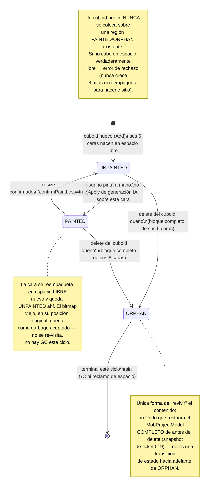
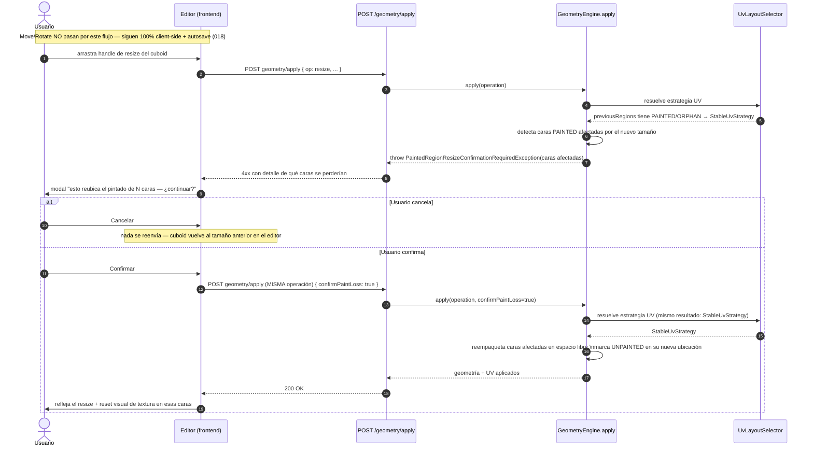
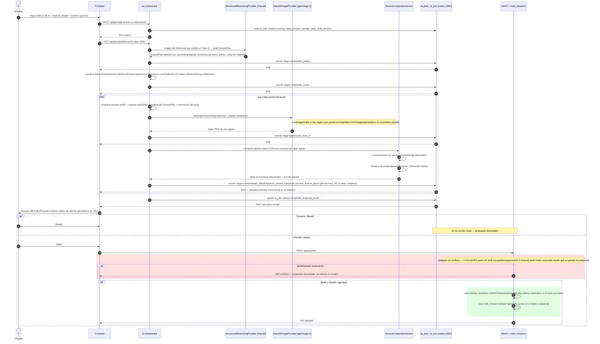
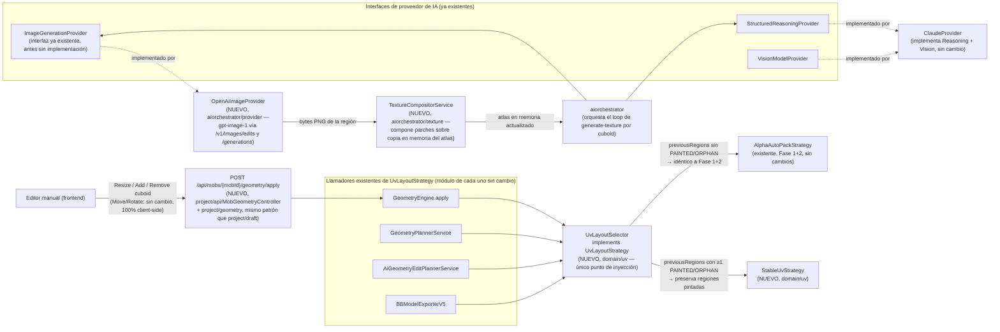

# Definición: Galgoth Studio — Fase 3 (Editor de textura/UV + Generación de textura por IA)

> Este documento es continuación del documento aprobado `docs/definiciones/galgoth-studio-mvp.md` (Technical Alpha, Fase 1 + Fase 2, VoBo del PO el 8 sep 2026, cerrado formalmente el 9 sep 2026). Reutiliza su numeración de Historias de Usuario (continúa desde HU-23) y de épicas (continúa desde Épica I). No reabre alcance ni arquitectura de Fase 1+2 — las asume como baseline ya construido y las referencia explícitamente donde esta fase se apoya en ellas.

## Resumen ejecutivo

Fase 3 agrega al Technical Alpha ya aprobado la capacidad de **pintar y generar por IA la textura real de un mob**, reemplazando la textura placeholder checkerboard que hoy garantiza únicamente que el export sea válido. Cubre: un editor de textura/UV manual tipo pixel-art sobre el atlas ya calculado por `AutoUv`, con selección cruzada cuboid↔UV y preview 3D en vivo; la integración de ese trabajo con el sistema ya existente de Draft/Command/Revision sin duplicar bitmaps completos por trazo; la resolución del riesgo abierto #7 heredado de Fase 1+2 (qué pasa con una UV que ya no puede reempaquetarse libremente porque tiene textura pintada encima, vía una `StableUvStrategy` nueva); y un pipeline de generación de textura por IA usando **OpenAI (`gpt-image-1`)** como `ImageGenerationProvider`, con el mismo patrón "IA propone, la app valida y aplica con diff" ya probado en geometría (ticket 031).

## Objetivo de negocio

El Technical Alpha entrega geometría editable con textura placeholder — suficiente para validar el pipeline determinista de modelo 3D, pero insuficiente como producto usable: un mob sin textura real no es un mob terminado para un servidor de Minecraft. Fase 3 cierra esa brecha, permitiendo que el flujo completo (`referencia → geometría por IA → textura por IA/manual → export`) produzca un `.bbmodel` con arte real, listo para usarse, sin salir de Galgoth Studio ni depender de Blockbench para la parte de pintado.

### Usuarios / roles involucrados

Sin cambios respecto a Fase 1+2: **creador de contenido para Minecraft** (usuario principal) y **usuario avanzado/editor manual** (ajusta a mano lo que la IA generó) — la misma persona, ahora también pintando/generando textura, no un rol nuevo. Sigue sin roles de colaboración, permisos, ni autenticación.

## Alcance

### Incluye

**Editor de textura/UV manual**
- Pixel editor (canvas 2D/OffscreenCanvas) sobre el atlas de textura del mob (`MobProjectModel.texture`), con el layout UV ya calculado por `AutoUv`/`UvLayoutStrategy` (006/007) como guía visual.
- Regiones UV etiquetadas por parte del cuerpo/cara.
- Selección cruzada: seleccionar una cara de un cuboid en el viewport 3D resalta su región UV correspondiente, y viceversa.
- Preview 3D en vivo reutilizando el mismo `ThreeViewportService` singleton ya existente (008/016), no un viewport nuevo.
- Herramientas: color picker/paleta, brush, eraser, fill bucket, eyedropper, selection, copy/paste, crop/fit de una imagen pegada a la región seleccionada, undo/redo, grid toggle, control de tamaño de pincel.
- El tamaño del atlas lo determina la geometría real (vía `AutoUv`/`UvLayoutSelector`), no un parámetro elegido aparte — ver Diseño técnico §10 sobre el campo `textureResolution` del wizard.

**Persistencia y revisiones de textura**
- Integración con el Draft (`mob_drafts`) + autosave con dirty-check, y con las Revisiones (`mob_revisions`) inmutables ya existentes (HU-08/09/22) — "Guardar" crea una revisión que incluye textura y geometría juntas, no dos sistemas de historial separados.
- Bitmap de textura persistido content-addressed en MinIO (nunca embebido inline en `model_jsonb`) — ver Diseño técnico §3.

**`StableUvStrategy` / integridad de UV pintada**
- Resolución del riesgo abierto #7 de Fase 1+2: una vez que una región UV tiene textura pintada o generada, un cambio de geometría ya no puede reempaquetarla libremente.
- **Resize de un cuboid con caras ya pintadas**: se avisa y se pide confirmación explícita antes de aplicar — nunca silencioso, nunca reescalado automático, nunca bloqueo permanente (decisión del PO, 9 sep 2026).
- **Creación de un cuboid nuevo sin espacio libre** en un atlas con regiones ya pintadas: se rechaza con error explícito, mismo patrón que `UvAtlasOverflowException` ya existente — nunca crece el atlas ni reempaqueta regiones pintadas (decisión del PO).
- **Eliminación de un cuboid con textura pintada**: sus 6 caras quedan reservadas como huérfanas (`ORPHAN`), no reutilizables este ciclo — prioriza que Undo siempre recupere el contenido exacto, acepta el costo de espacio de atlas desperdiciado (decisión del PO).

**Generación de textura por IA**
- Pipeline completo (master prompt §12): análisis de material/paleta de la imagen de referencia ya subida en Fase 2 → mapeo semántico de caras (vía `StructuredReasoningProvider`/Claude) → layout UV determinista → generación/inpainting por región vía **OpenAI (`gpt-image-1`)** → compositor de atlas → limpieza de píxeles/paleta → preview/diff.
- **4 opciones de estilo**: Fiel a la referencia / Minecraft Vanilla / Pixel Art / Realista (decisión del PO: fiel al mockup 08, no solo los 3 del master prompt original).
- Nivel de detalle, y **regenerar solo un bone completo** (decisión del PO sobre granularidad — no cara individual, no todo el atlas).
- Si OpenAI devuelve una imagen que no respeta las dimensiones exactas de la región objetivo, se recorta/escala automáticamente — sin reintento, sin error, salvo que el propio recorte falle técnicamente (decisión del PO).
- Patrón "IA propone, la app valida y aplica" con diff Antes/Después obligatorio — nunca se aplica el resultado de la IA directo sin mostrarlo primero (mismo espíritu que 031, para píxeles en vez de geometría).
- `ImageGenerationProvider`: implementación real `OpenAiImageProvider` + `MockImageProvider` de tests real (no solo placeholder de interfaz), mismo patrón de reproducibilidad (provider/model/prompt version/schema version/reference IDs) que las otras dos interfaces ya implementadas.

**Pantallas 07 y 08**
- Fidelidad al Visual Contract y a los mockups `07_editor_textura.png`/`08_generador_textura_ia.png`.
- El tab "Textura" (presente pero deshabilitado desde el ticket 002) pasa a funcional. "Animación" permanece "Próximamente" (fuera de alcance de esta fase).

**Flujo end-to-end de esta fase**
- Pintar/generar textura → verla en vivo en 3D → Guardar → exportar `.bbmodel` con la textura real (ya no placeholder) → abre en Blockbench sin diálogo de reparación.

### No incluye

- **Sistema de capas tipo Photoshop** — una sola superficie de textura editable por mob (master prompt principio #9, explícito).
- **Generación de textura en batch para múltiples mobs simultáneamente** — el pipeline es por mob, igual patrón que el resto de las APIs.
- **Selección múltiple de distintas partes/cuboides simultáneas** para pintar o generar a la vez — una región/bone enfocado por vez.
- **Importador de `.bbmodel` o de proyectos completos externos** — sigue vigente la decisión de Fase 1+2. Distinto de pegar una imagen dentro del editor de textura (HU-28), que sí está en alcance.
- **Sistema de animación / biblioteca de animaciones** — sigue fuera (Fase 4).
- **Checkpoints nombrados / restore de revisión específica** — sigue fuera; el historial de textura sigue las mismas reglas ya vigentes (Undo/Redo lineal en cliente + revisiones inmutables creadas solo por Guardar/Apply).
- **Autenticación / multi-tenencia** — sigue sin login.
- **Responsive completo del editor de textura** — desktop-first, igual criterio que el editor de modelo.
- **Helpers de autoría FMM guiados** — sin cambios, no relacionado a esta fase.
- **`RunPodProvider` o motor de generación de imágenes local/self-hosted** — descartado explícitamente por el PO para `ImageGenerationProvider`; esta fase usa exclusivamente OpenAI vía API REST.
- **Exportación de la textura como asset independiente** fuera del paquete `.bbmodel`/zip ya definido en Fase 1+2 (HU-19) — sin nuevo formato de export.
- **GC de bitmaps huérfanos en MinIO** (referenciados por cero drafts/revisiones) — fuera de alcance este ciclo, mismo criterio que la falta de política de poda de `mob_revisions` en Fase 1+2.

## Historias de Usuario

### Épica J: Editor de textura/UV manual

**HU-24**
```
Como creador de contenido para Minecraft
quiero ver el atlas de textura de mi mob dividido en regiones UV etiquetadas por parte del cuerpo/cara
para ubicar rápido qué región pintar sin adivinar coordenadas UV

Criterios de aceptación:
- Dado que entro al tab "Textura" de un mob con geometría ya usable (revision_number >= 1), cuando la pantalla carga, entonces veo el atlas completo (MobProjectModel.texture) en el canvas 2D, con el layout de UV ya calculado por AutoUv/UvLayoutSelector superpuesto como guía.
- Dado que cada cara de cada cuboid tiene una región UV asignada, cuando la veo en el canvas, entonces cada región muestra una etiqueta identificable.
- Dado un selector de región (dropdown, igual mockup 07: "Cabeza" / "Todas las caras"), cuando elijo una opción, entonces el canvas resalta/enfoca esa región.
- Dado un mob SIN ninguna revisión guardada todavía (current_revision_number = 0, solo draft en memoria), cuando entro al tab Textura, entonces se aplica el mismo criterio de acceso ya resuelto para el editor de modelo (ticket 034): el tab carga sobre el draft vacío, nunca bloqueado.
```

**HU-25**
```
Como creador de contenido para Minecraft
quiero que seleccionar una cara de un cuboid en el viewport 3D resalte automáticamente su región UV en el editor de textura, y viceversa
para ubicar visualmente qué parte de la textura corresponde a qué parte del modelo 3D

Criterios de aceptación:
- Dado que estoy en el tab Textura con el viewport 3D visible, cuando hago clic en una cara de un cuboid en el viewport, entonces la región UV correspondiente se resalta/enfoca en el editor 2D.
- Dado que selecciono una región UV en el editor 2D, cuando lo hago, entonces la cara correspondiente se resalta en el preview 3D.
- La selección por cara se implementa extendiendo el raycast ya existente (017) con la normal del triángulo intersectado (nativo de la geometría, ver Diseño técnico §7) en un store nuevo y separado del de selección de cuboid completo — sin modificar el contrato de selección ya usado por 017/031/036.
```

**HU-26**
```
Como creador de contenido para Minecraft
quiero ver la textura actualizarse en tiempo real sobre el modelo 3D mientras pinto
para juzgar el resultado visual sin necesidad de exportar

Criterios de aceptación:
- Dado que aplico un trazo de pincel/borrador/cubeta sobre el atlas, cuando el trazo se completa, entonces el preview 3D (mismo viewport singleton reutilizado, sin instanciar uno nuevo) refleja el cambio de inmediato.
- Dado que roto/hago zoom del preview 3D mientras pinto, cuando interactúo con él, entonces responde igual que el viewport del editor de modelo (mismo componente reutilizado).
```

**HU-27**
```
Como creador de contenido para Minecraft
quiero contar con herramientas estándar de edición de píxeles (color picker/paleta, brush, eraser, fill bucket, eyedropper, selection, copy/paste, undo/redo, grid toggle, tamaño de pincel)
para pintar la textura sin depender de un editor externo

Criterios de aceptación:
- Dado que elijo un color de la paleta o del color picker, cuando pinto con el pincel, entonces el trazo usa ese color exacto, sin antialiasing que degrade la nitidez pixel-art.
- Dado que uso la Cubeta, cuando hago clic dentro de una región de color contiguo, entonces se rellena esa región contigua con el color activo (flood-fill estándar).
- Dado que uso el Selector (eyedropper), cuando hago clic sobre un píxel, entonces el color activo pasa a ser el de ese píxel.
- Dado que cambio el tamaño de pincel/borrador, cuando pinto, entonces el trazo respeta ese tamaño en píxeles del atlas, no píxeles de pantalla.
- Dado que activo el toggle de cuadrícula, cuando lo activo, entonces se superpone una grilla de píxeles como ayuda visual (nunca se guarda como parte de la textura).
- Dado que uso Deshacer/Rehacer sobre ediciones de textura, cuando lo hago, entonces opera sobre una pila independiente de la del editor de geometría (ver Diseño técnico §8) — Ctrl+Z en el tab Textura nunca deshace un cambio de geometría y viceversa.
```

**HU-28**
```
Como creador de contenido para Minecraft
quiero poder copiar/pegar una imagen y ajustarla (crop/fit) a la región UV seleccionada
para reutilizar arte externo o partes de otra textura sin redibujar a mano

Criterios de aceptación:
- Dado que tengo una región UV seleccionada, cuando pego una imagen de tamaño distinto a la región, entonces se me ofrece ajustarla (recorte o escala) a las dimensiones exactas de la región antes de confirmar.
- Dado que confirmo el ajuste, cuando se aplica, entonces la región seleccionada queda reemplazada por el contenido ajustado, registrado como una operación de Undo.
- Este ciclo cubre pegado acotado a una región UV seleccionada. Pegar un PNG que cubra el atlas completo de una sola vez (mencionado también en el master prompt §11) queda como pregunta abierta de ticket (ver Riesgos #10) — no bloquea el resto de esta HU.
```

**HU-29**
```
Como creador de contenido para Minecraft
quiero que el editor de textura respete la resolución real del atlas de mi mob
para que el atlas tenga el tamaño correcto sin calcularlo yo mismo

Criterios de aceptación:
- Dado un mob cuyo MobProjectModel.texture ya tiene dimensiones fijadas por AutoUv/UvLayoutSelector, cuando abro el editor de textura, entonces el canvas usa exactamente esas dimensiones.
- El campo "Resolución de textura" del paso Configuración del wizard IA (ticket 027) deja de ser un parámetro vinculante — confirmado que hoy es solo un `<select>` visual sin efecto en backend/MobProjectModel (verificado en el código actual por `architect`). El atlas de arranque sigue usando el default ya fijado en el ticket 028 (128×128) y crece/rechaza según la geometría real, como ya hace hoy (ver Diseño técnico §10). El detalle de copy/UX de remover o resignificar ese campo del wizard es un handoff a `ux-ui-designer` al desglosar el ticket.
```

### Épica K: Persistencia y revisiones de textura

**HU-30**
```
Como creador de contenido para Minecraft
quiero que mis cambios de textura se autoguarden en el draft igual que los cambios de geometría
para no perder trabajo si cierro el navegador sin hacer clic en Guardar

Criterios de aceptación:
- Dado que edito píxeles de la textura, cuando dejo de interactuar por unos segundos, entonces el draft (mob_drafts) se actualiza incluyendo el estado actual de texture/uv, con el mismo criterio de dirty-check "solo en cambio material" ya usado para geometría (HU-08/HU-22) — sin crear una mob_revision.
- El dirty-check compara el `storageKey` (hash de contenido del bitmap) en vez del bitmap completo — comparación O(1), equivalente semánticamente, sin cambios al mecanismo de `DraftPersistenceService` ya existente (ver Diseño técnico §3/§4).
```

**HU-31**
```
Como creador de contenido para Minecraft
quiero que al hacer clic en "Guardar" se persista tanto mi geometría como mi textura en la misma revisión
para tener un único punto de retorno confiable para todo el mob

Criterios de aceptación:
- Dado cambios pendientes de textura y/o geometría en el draft, cuando hago clic en "Guardar", entonces se crea una nueva mob_revision (mismo mecanismo de HU-09/HU-22) cuyo snapshot incluye el estado completo de texture/uv junto con bones/cuboids.
- Dado que no hice ningún cambio (ni de geometría ni de textura) desde la última revisión, cuando abro "Guardar", entonces la acción sigue deshabilitada/no genera una revisión duplicada.
- El bitmap de textura se persiste content-addressed en MinIO (`textures/{sha256}.png`), nunca embebido inline en `mob_revisions.model_jsonb` — dos revisiones consecutivas sin cambio de bitmap comparten la misma clave automáticamente, sin lógica de deduplicación explícita (ver Diseño técnico §3).
```

**HU-32**
```
Como sistema
quiero que el Command stack de Undo/Redo de textura tenga un alcance claro respecto al de geometría
para que el usuario entienda qué deshace cada Ctrl+Z según el tab activo

Criterios de aceptación:
- El Command stack de textura es independiente del de geometría (018/019) — cada tab (Modelo/Textura) mantiene su propia pila de Undo/Redo, sin cruce entre ellas (decisión de diseño técnico, ver §8: snapshotear el bitmap completo por cada trazo de pincel en la misma pila que geometría sería órdenes de magnitud más pesado en memoria).
```

### Épica L: `StableUvStrategy` / integridad de UV pintada

**HU-33**
```
Como creador de contenido para Minecraft
quiero que redimensionar un cuboid que ya tiene textura pintada no destruya ese trabajo sin avisarme
para no perder pintura por un ajuste posterior de geometría

Criterios de aceptación:
- Dado un cuboid con al menos una cara UV en estado PAINTED, cuando lo redimensiono (Move/Scale del editor manual, o una edición por IA vía HU-17/HU-18) de forma que cambia el footprint de esa cara, entonces el sistema detiene la operación y muestra un aviso explícito de qué caras se verían afectadas, pidiendo confirmación antes de proceder.
- Dado que confirmo la operación, cuando se aplica, entonces las caras afectadas se reempaquetan en espacio libre del atlas (nunca sobre otra región PAINTED/ORPHAN) y quedan en estado UNPAINTED en su nueva ubicación — el bitmap anterior permanece en su posición original como espacio de atlas no reutilizado este ciclo (ver Diseño técnico §2 y el diagrama de estados de UvRegionStatus).
- Dado que cancelo la confirmación, cuando lo hago, entonces el resize no se aplica y el cuboid mantiene su tamaño anterior.
- Dado que la misma situación se origina por una edición conversacional por IA (HU-17/HU-18) que redimensiona un cuboid con textura existente, cuando esto ocurra, entonces el diff Antes/Después de esa propuesta muestra explícitamente qué caras perderían su ubicación de pintado — el botón "Aplicar cambios" de esa pantalla sirve como la confirmación explícita, sin un segundo diálogo (ver Diseño técnico §2).
```

**HU-34**
```
Como creador de contenido para Minecraft
quiero que agregar un cuboid nuevo (manual o por IA) siga asignando su UV automáticamente sin afectar las regiones ya pintadas de otros cuboids
para seguir usando el mismo flujo simple de AutoUv que ya conozco

Criterios de aceptación:
- Dado un atlas con una o más regiones ya pintadas, cuando agrego un cuboid nuevo, entonces la estrategia activa (`UvLayoutSelector` → `StableUvStrategy`) le asigna espacio verdaderamente libre del atlas (nunca una región PAINTED u ORPHAN) sin mover ni reempaquetar ninguna región ya pintada existente.
- Dado que el atlas no tiene espacio libre suficiente para el cuboid nuevo, cuando esto ocurre, entonces la creación se rechaza con un error explícito (mismo tipo/forma que `UvAtlasOverflowException` ya existente) — el atlas NUNCA crece automáticamente ni reempaqueta regiones pintadas/huérfanas para hacerle espacio.
```

**HU-35**
```
Como creador de contenido para Minecraft
quiero saber qué pasa con la región de textura de un cuboid que elimino
para no sorprenderme si esa región se reutiliza o se pierde

Criterios de aceptación:
- Dado un cuboid con al menos una cara PAINTED, cuando lo elimino, entonces sus 6 caras (bloque completo, no solo las pintadas) quedan en estado ORPHAN — reservadas, no reutilizables este ciclo por ningún cuboid nuevo.
- Dado que hago Undo inmediatamente después de eliminar ese cuboid, cuando el Undo se ejecuta (snapshot completo de MobProjectModel, ticket 019), entonces el cuboid y su textura pintada se restauran exactamente como estaban — sin riesgo de que la región ya haya sido ocupada por otro contenido, porque el estado ORPHAN es terminal este ciclo (no hay reclamo de espacio automático).
```

### Épica M: Generación de textura por IA

**HU-36**
```
Como creador de contenido para Minecraft
quiero generar la textura completa de mi mob por IA a partir de la misma imagen de referencia ya subida, eligiendo un estilo y nivel de detalle
para obtener una textura utilizable sin pintar todo a mano

Criterios de aceptación:
- Dado un mob con geometría ya usable (revision_number >= 1), cuando entro al tab Textura y elijo "Generar con IA", entonces veo 4 opciones de estilo (Fiel a la referencia / Minecraft Vanilla / Pixel Art / Realista) y un control de nivel de detalle (bajo-alto), siguiendo el mockup 08.
- Dado que confirmo la generación, cuando se dispara, entonces se reutiliza la MISMA imagen de referencia ya subida en Fase 2 — no se pide subir una imagen nueva.
- Dado que el pipeline corre (análisis de material/paleta vía Claude → mapeo semántico de caras → layout UV determinista → generación/inpainting por región vía OpenAI → compositor de atlas → limpieza de píxeles/paleta), cuando se muestra el progreso al usuario, entonces sigue el mismo patrón de progreso por etapas vía SSE ya usado en generación de geometría (HU-11), reutilizando `ai_job_events` con nuevos valores de `stage` (ver Diseño técnico §6).
```

**HU-37**
```
Como creador de contenido para Minecraft
quiero poder regenerar por IA solo la textura de un bone completo seleccionado
para corregir una parte puntual sin perder el trabajo ya hecho en el resto del atlas

Criterios de aceptación:
- Dado que tengo un bone seleccionado (selector "Parte a generar" del mockup 08, con granularidad de bone completo — agrupa todas las caras de todos los cuboids de ese bone), cuando confirmo "Regenerar textura", entonces solo las regiones de ese bone se reemplazan — el resto del atlas permanece intacto.
- Dado que el bone regenerado tenía textura pintada a mano previamente en alguna de sus caras, cuando la regeneración por IA se ejecuta, entonces el flujo de diff Antes/Después (HU-38) muestra explícitamente que se sobrescribirá contenido pintado a mano — no solo contenido generado previamente por IA — antes de aplicarse.
- Dado que un bone tiene varios cuboids, cuando se regenera, entonces se emite una llamada de generación por cada cuboid del bone, agrupadas bajo un único paso de progreso/una única unidad de Undo — el usuario nunca ve llamadas separadas, solo "Regenerando: <nombre del bone>" (ver Diseño técnico §5).
```

**HU-38**
```
Como creador de contenido para Minecraft
quiero ver un diff Antes/Después del resultado de la generación de textura por IA antes de que se aplique a mi mob
para decidir con confianza si lo acepto, sin que la IA escriba directo sobre mi textura

Criterios de aceptación:
- Dado que la generación/regeneración de textura por IA termina, cuando llego a la pantalla de resultado, entonces veo un Antes/Después de la región afectada (o del atlas completo, si fue "Modelo completo") — nunca se aplica directo sin esta revisión.
- Dado el resultado propuesto, cuando lo reviso, entonces tengo Apply/Reject explícitos — Reject no modifica ni el draft ni ninguna revisión.
- Dado que hago Apply, cuando se confirma, entonces el resultado se integra al draft de textura, sujeto a un chequeo de conflicto: si CUALQUIER parte del draft/revisión compartido avanzó desde que se generó la propuesta — geometría o textura, ambas viven en el mismo MobProjectModel — se responde 409 y la propuesta se descarta, informando al usuario (mismo mecanismo ya usado por HU-18, ver Diseño técnico §9).
```

**HU-39**
```
Como equipo de ingeniería
quiero que cada llamada de generación de textura por IA registre proveedor/modelo/versión de prompt/versión de esquema/IDs de referencia
para poder auditar y reproducir cualquier resultado, mismo patrón ya usado para geometría (HU-13)

Criterios de aceptación:
- Dado que se dispara una generación de textura, cuando se persiste el job, entonces se guardan provider=openai, modelo (`gpt-image-1`), versión de prompt, versión de esquema del `TexturePlan`, IDs de imagen(es) de referencia usadas y la propuesta resultante — mismo criterio que `ai_jobs` ya existente, extendido con nuevos `job_type` (`generate_texture`, `edit_texture`) y una columna `target_bone_id` nullable (ver Diseño técnico §12).
- Dado que `ImageGenerationProvider` ya existe como interfaz (ticket 025), cuando se implemente `OpenAiImageProvider` este ciclo, entonces se extiende de forma aditiva con `generateTextureRegion(TextureGenerationRequest)` (ver Diseño técnico §5) sin romper el método existente `generateImage(String)`.
- Dado el patrón ya establecido en el ticket 025 (interfaz + implementación real + MockProvider de tests), cuando se implemente `OpenAiImageProvider`, entonces `MockImageProvider` se completa con un doble determinista real y utilizable en tests (el de 025 es hoy solo un placeholder de interfaz sin proveedor real detrás).
```

**HU-40**
```
Como sistema
quiero recortar/escalar automáticamente una imagen de OpenAI que no respeta los límites de la región UV objetivo
para no corromper el atlas con contenido mal alineado, sin reintentos ni interrupciones innecesarias

Criterios de aceptación:
- Dado que OpenAI devuelve una imagen cuyas dimensiones no coinciden exactamente con las esperadas para la región objetivo, cuando `TextureCompositorService` la recibe, entonces la recorta/escala automáticamente al tamaño exacto esperado antes de componerla en el atlas — sin reintentar la llamada ni mostrar error al usuario.
- Dado que el propio recorte/decodificación de la imagen falla técnicamente (imagen corrupta, formato inesperado), cuando esto ocurre, entonces se lanza un error explícito (`TextureGenerationFailedException`, mismo patrón que `InvalidGeometryProposalException`) y no se aplica nada — nunca se compone un atlas parcialmente corrupto.
```

### Épica N: Pantallas 07 y 08

**HU-41**
```
Como creador de contenido para Minecraft
quiero que la pantalla del editor de textura respete el Visual Contract y el mockup 07
para tener una experiencia consistente con el resto del producto

Criterios de aceptación:
- Dado que entro al tab "Textura" de un mob, cuando la pantalla carga, entonces el tab pasa de "Próximamente" (estado actual, deshabilitado desde los tickets 002/036) a funcional, siguiendo el layout del mockup 07 (UV Editor con selector de región y controles de color/tamaño/opacidad a la izquierda, Vista previa 3D a la derecha).
- Dado el Visual Contract vigente (dark graphite/mint accent, viewport protagonista, colores propios del mob nunca reemplazados por el accent de UI), cuando se implementa la pantalla, entonces se respeta sin reinterpretar la estructura sin aprobación explícita del PO — mismo criterio ya vigente para todas las pantallas de Fase 1+2.
- Dado los tabs de workspace ya existentes (Modelo | Textura | Animación), cuando esta fase se completa, entonces "Textura" deja de mostrarse deshabilitado — "Animación" permanece "Próximamente" (fuera de alcance de esta fase).
```

**HU-42**
```
Como creador de contenido para Minecraft
quiero que la pantalla del generador de textura por IA respete el mockup 08
para reconocer el mismo patrón visual ya usado en el wizard de generación de geometría

Criterios de aceptación:
- Dado que abro "Generar con IA" desde el tab Textura, cuando la pantalla carga, entonces veo imagen de referencia + resultado/preview, selector de Estilo con las 4 opciones (Fiel a la referencia / Minecraft Vanilla / Pixel Art / Realista), control de Detalle (bajo-alto) y selector "Parte a generar" (granularidad de bone completo), siguiendo el mockup 08.
```

### Épica O: Flujo de aceptación end-to-end de esta fase

**HU-43**
```
Como creador de contenido para Minecraft
quiero completar el flujo de textura de punta a punta y confirmar que el .bbmodel final ya no usa la textura placeholder
para confirmar que Fase 3 entrega valor real de forma determinista

Criterios de aceptación:
- Dado un mob con geometría ya usable (revision_number >= 1 desde Fase 1+2), cuando pinto manualmente y/o genero por IA parte de su textura y hago clic en "Guardar", entonces se crea una nueva mob_revision cuyo model_jsonb refleja la textura actualizada, no el placeholder.
- Dado que exporto el mob (mismo flujo de HU-19/ticket 032 ya existente), cuando genero el .bbmodel, entonces el archivo incluye la textura real pintada/generada — la textura placeholder checkerboard (`PlaceholderTexture`, ticket 011) queda reservada solo para mobs sin ninguna región pintada todavía.
- Dado el .bbmodel exportado con textura real, cuando lo abro en Blockbench, entonces abre sin diálogos de reparación — la UV sigue siendo válida (el exportador ya no recomputa UV desde cero si hay regiones pintadas, ver Diseño técnico §2 "Hallazgo A") y la textura embebida corresponde exactamente al atlas usado por esa UV.
- Dado que valido el modelo (HU-20 ya existente), cuando corre la validación, entonces sigue sin errores pendientes, ahora también con contenido de textura real en vez de placeholder.
```

## Diseño técnico

Antes de entrar en los puntos, dos hallazgos reales de la arquitectura de Fase 1+2 que este diseño debe cerrar (no son preguntas al PO — son consecuencias técnicas directas de sus decisiones, resueltas aquí):

> **Hallazgo A** — `BBModelExporterV5.export(model, uvLayoutStrategy)` (ticket 011) siempre recomputa la UV desde cero vía `AlphaAutoPackStrategy` antes de exportar. Esto era correcto y deliberado en Fase 1+2 (no existía textura pintada, así que recomputar desde la misma geometría es determinista y produce el mismo resultado). En Fase 3 sería destructivo: exportar un mob con textura pintada volvería a empaquetar todo el atlas ignorando dónde está el arte real. Se resuelve en el punto 2.
>
> **Hallazgo B** — el editor manual (018/036) calcula AutoUv 100% client-side y el backend nunca lo revalida en `autosave`/`Guardar`. En Fase 1+2 esto era inocuo (el backend siempre recomputaba en export de todas formas). En Fase 3, con `StableUvStrategy` protegiendo regiones pintadas/huérfanas, un cliente que calcule su propia UV localmente podría saltarse esa protección por completo. Se resuelve en el punto 2.

### 1. Extensión de `MobProjectModel`: `TextureDocument` y `UvLayout`

`TextureDocument(int width, int height, String storageKey)` no cambia de forma — solo de semántica: `storageKey` pasa de "siempre null, salvo el placeholder sintetizado al exportar" a ser la clave real, content-addressed, de la textura pintada (ver punto 3). Cero cambio de esquema JSON para este record.

`UvRegion` necesita un campo nuevo para representar el estado que exige `StableUvStrategy`:

```java
public record UvRegion(String cuboidId, FaceName face, Vec4 rect, UvRegionStatus status) {}

public enum UvRegionStatus { UNPAINTED, PAINTED, ORPHAN }
```

- **`UNPAINTED`**: región asignada a un cuboid/cara vivo, sin arte real todavía.
- **`PAINTED`**: región de un cuboid/cara vivo con al menos un píxel editado por el usuario o compuesto por IA. Es un flag explícito que la app actualiza en el mismo commit que pinta — no derivado por diff de píxeles contra el placeholder (frágil y costoso).
- **`ORPHAN`**: tombstone de una región cuyo `cuboidId` ya no existe en `model.cuboids()` (el cuboid fue eliminado). Se conserva solo para bookkeeping de espacio ocupado.

### 2. Contrato `StableUvStrategy`

`UvLayoutStrategy.layout(List<Cuboid>, int, int)` no puede, tal cual, soportar comportamiento "estable" — no tiene forma de saber qué regiones ya están pintadas ni de representar huérfanas. Se resuelve con **extensión aditiva, no ruptura**: un método `default` nuevo en la interfaz que preserva 100% compatibilidad con `AlphaAutoPackStrategy` (cero cambios en esa clase):

```java
public interface UvLayoutStrategy {
    Result layout(List<Cuboid> cuboids, int textureWidth, int textureHeight); // sin cambios

    default Result layout(List<Cuboid> cuboids, int textureWidth, int textureHeight, List<UvRegion> previousRegions) {
        return layout(cuboids, textureWidth, textureHeight); // default: reflow completo
    }
}
```

`StableUvStrategy implements UvLayoutStrategy` sobreescribe la sobrecarga de 4 argumentos; su versión de 3 argumentos delega a `layout(cuboids, w, h, List.of())`.

**`UvLayoutSelector implements UvLayoutStrategy`** (nuevo, `domain/uv/`), marcado `@Primary`, inyectado en todos los puntos que hoy reciben `UvLayoutStrategy` (`GeometryEngine.apply`, `GeometryPlannerService`, `AiGeometryEditPlannerService`, `BBModelExporterV5`). Regla de decisión determinista:

- si `previousRegions` no contiene ningún `PAINTED`/`ORPHAN` → delega en `AlphaAutoPackStrategy` (comportamiento de Fase 1+2, byte-idéntico).
- si contiene al menos uno → delega en `StableUvStrategy`.

`GeometryEngine.apply(model, ops, uvLayoutStrategy)` cambia su invocación interna a `uvLayoutStrategy.layout(cuboids, w, h, model.uv().regions())`. `StableUvStrategy` reutiliza (no duplica) la matemática de box-unwrap ya verificada de `AlphaAutoPackStrategy` — se extraen a un helper compartido (`BoxUvMath`).

**Algoritmo concreto, los 3 casos ya decididos por el PO:**

| Caso | Detección | Resultado |
|---|---|---|
| **Resize con cara(s) `PAINTED`** | El nuevo `from`/`to` cambia el footprint de al menos una cara ya `PAINTED` | Lanza `PaintedRegionResizeConfirmationRequiredException` (misma familia que `UvAtlasOverflowException`) con el detalle de qué caras se verían afectadas. Solo tras confirmación explícita reempaqueta esas caras en espacio libre y las marca `UNPAINTED` en su nueva ubicación — los píxeles viejos permanecen físicamente en el bitmap (atlas garbage aceptado). |
| **Add sin espacio libre** | El footprint del cuboid nuevo no cabe en ninguna región verdaderamente libre (atlas menos la unión de TODAS las regiones existentes, sin importar su estado) | Rechaza con el mismo tipo/forma de error que `UvAtlasOverflowException` — nunca crece el atlas, nunca reempaqueta pintadas/huérfanas. |
| **Delete con textura pintada** | El cuboid removido tiene ≥1 cara `PAINTED` | Las 6 caras de ESE cuboid (bloque único) pasan a `ORPHAN` — más simple de razonar/deshacer que huérfanas parciales, y Undo (019, snapshot completo) recupera el estado exacto sin lógica adicional. |

**Vía manual vs. vía IA — ninguna se salta la protección (cierra el Hallazgo B):**

- **Vía IA (031, `AiGeometryEditPlannerService`)**: ya pasa por `GeometryEngine.apply`. Si dispara `PaintedRegionResizeConfirmationRequiredException`, se captura y se refleja en el diff (`ChangedElement`) como "N caras perderán su arte por este cambio" — el botón "Aplicar cambios" (ya una confirmación explícita de HU-18) sirve como la confirmación.
- **Vía manual (018/036)**: no existe hoy ningún paso de revisión antes de aplicar. Se agrega un endpoint síncrono nuevo — **`POST /api/mobs/{mobId}/geometry/apply`** (nuevo `MobGeometryController` en `project/api/`, respaldado por un nuevo servicio en `project/geometry/` que invoca el `GeometryEngine`/`UvLayoutSelector` ya canónicos de `domain/geometry`/`domain/uv` — mismo patrón de separación ya usado por `project/draft/DraftPersistenceService`) — solo para las 3 operaciones que tocan UV (`createCuboid`, `resizeCuboid`, `removeCuboid`; nunca `moveCuboid`/`rotateCuboid`/pivot, que no afectan UV y siguen 100% client-side + autosave debounced, sin regresión de latencia en el drag). Si el backend devuelve la excepción de confirmación, el frontend muestra el modal y reenvía la misma operación con un flag `confirmPaintLoss: true`.

**Cierra el Hallazgo A**: `BBModelExporterV5.export(model, uvLayoutStrategy)` invoca `UvLayoutSelector` en vez de `AlphaAutoPackStrategy` directo — si la revisión no tiene ninguna región pintada/huérfana (100% de los mobs de Fase 1+2), el comportamiento es idéntico al actual; si tiene, exporta la UV tal cual está almacenada, sin recomputar. Cambio aditivo, retrocompatible.

### 3. Persistencia eficiente de textura en revisiones

**Decisión: bitmap content-addressed en MinIO.** Clave `textures/{sha256-hex}.png`, global — el hash ya desambigua, permite dedup incluso entre mobs distintos con bitmaps idénticos. `TextureDocument.storageKey` guarda esa clave; el bitmap **nunca** se embebe inline (ni base64) en `model_jsonb`/`draft_model_jsonb`.

Se descarta diffs binarios por región: cada `mob_revisions` es hoy un snapshot completo e independiente (`MobExportService.exportBbmodel` lee UNA fila en aislamiento) — introducir deltas solo para textura rompería esa auto-contención, obligando a reconstruir contra una cadena de revisiones para exportar cualquiera de ellas.

Efecto directo: dos revisiones consecutivas que no cambiaron el bitmap comparten el mismo `storageKey` — dedup automático y gratuito. `mob_drafts` usa el mismo mecanismo.

Flujo de escritura: el editor de píxeles (Web Worker/OffscreenCanvas) exporta el bitmap compuesto, calcula SHA-256 (Web Crypto) y lo sube vía `PUT /api/mobs/{mobId}/texture` (mismo patrón de bytes crudos que `thumbnailApi.ts`, ticket 023) — el backend sube a MinIO solo si la clave no existe ya (idempotente) y devuelve el `storageKey`.

GC de bitmaps huérfanos en MinIO queda explícitamente fuera de alcance este ciclo (mismo criterio que la retención de `mob_revisions` en Fase 1+2).

### 4. Dirty-check/autosave para textura

**Decisión: valor completo del `MobProjectModel`, sin caso especial.** Como `storageKey` ya ES un hash del contenido, el `.equals()` estructural de records que `DraftPersistenceService.autosave`/`saveRevision` ya usan (ticket 020) compara strings de clave — O(1), equivalente semánticamente a comparar el bitmap completo. No se necesita un checksum separado ni lógica nueva.

### 5. `OpenAiImageProvider`

`ImageGenerationProvider.generateImage(String prompt)` (definida en 025, sin implementación real) se extiende de forma aditiva:

```java
public interface ImageGenerationProvider {
    byte[] generateImage(String prompt); // se conserva

    byte[] generateTextureRegion(TextureGenerationRequest request);

    record TextureGenerationRequest(
        String prompt, byte[] referenceImageBytes,
        int targetWidth, int targetHeight, String style) {}
}
```

`OpenAiImageProvider implements ImageGenerationProvider` (nuevo, `aiorchestrator/provider/`) usa `gpt-image-1` vía `POST /v1/images/edits` (con máscara/imagen base) cuando hay región existente que preservar/inpaintear, o `POST /v1/images/generations` para la primera pasada. **Nota para el ticket de implementación**: verificar el identificador de modelo vigente contra la documentación real de OpenAI al momento de implementar — la arquitectura se compromete a la familia `gpt-image-*` + endpoint de edits, no a una versión de string congelada aquí.

**Split de responsabilidades ("IA propone, la app valida y aplica"):**

1. **Paleta + mapeo semántico de caras — `StructuredReasoningProvider` (Claude), paso separado, ANTES de OpenAI.** Nueva salida validada `TexturePlan` (mismo patrón de `contracts/schemas/` que `ModelIntent`): etiqueta semántica por bone, paleta dominante/acento, notas de material por cara. Se hace con Claude para no acoplar el paso de razonamiento estructurado a qué proveedor de imágenes esté activo.
2. **Resolución determinista de layout — 100% código, sin IA.** Granularidad de regeneración = bone (decisión del PO); un bone puede tener varios cuboids, cada uno con su propio footprint. Se emite **una llamada a `generateTextureRegion` por cuboid del bone**, agrupadas bajo un único paso de progreso/una única unidad de Undo.
3. **Composición de prompt — código determinista**: estilo (uno de los 4) + etiqueta semántica + paleta del `TexturePlan` + orientación de cara.
4. **Llamada a OpenAI** → bytes PNG crudos.
5. **`TextureCompositorService` (nuevo, `aiorchestrator/texture/`) — determinista**: recorta/escala automáticamente al tamaño exacto esperado si OpenAI no lo respetó (decisión del PO); compone sobre una COPIA del atlas actual (nunca sobre el bitmap persistido en vivo); corre limpieza de píxeles (posterizado/snap a paleta para estilos Pixel Art/Minecraft Vanilla — algoritmo exacto es detalle de ticket).
6. **`ai_jobs` bookkeeping**: nuevos `job_type` (`generate_texture`, `edit_texture`), mismo esquema (`provider='openai'`, `model`, `prompt_version`, `schema_version` del `TexturePlan`, `reference_ids`).

### 6. Progreso de generación de textura vía SSE

Reutiliza `ai_job_events`/SSE tal cual (`GET /api/jobs/{jobId}/events`, replay por `Last-Event-ID`) — nada lo acopla a geometría. Se agregan nuevos valores de `stage` (`analizando_paleta`, `mapeando_caras`, `generando_bone_X`, `componiendo_atlas`, `limpiando_pixeles`). Cada evento lleva un `preview_texture_patch` en `payload_jsonb` (parche recién compuesto + su rect, no el atlas completo repetido).

### 7. Selección de cara individual en el viewport 3D

`ThreeViewportService.pickCuboidIdAt` raycastea contra `mesh.userData.cuboidId` (un mesh = un cuboid completo) — no hay tagging por cara. Se extiende de forma aditiva: la misma intersección de raycast expone `intersection.face.normal` — se mapea esa normal (compuesta con la rotación del mesh) a `NORTH/SOUTH/EAST/WEST/UP/DOWN` reusando los ejes canónicos de `CoordinateSystemContract`. Cero cambios a `buildMobScene.ts`. Nueva función `pickCuboidFaceAt`; la selección de cara vive en un store separado (`textureSelectionStore.ts`, sibling de `selectionStore.ts`) — no se sobrecarga el contrato de `selectionStore.ts` que 017/031/036 ya dependen de él tal cual.

### 8. Alcance del Undo/Redo de textura

**Decisión: pila independiente por tab (Modelo vs. Textura).** El Command stack de geometría (019) funciona porque cada paso es una referencia liviana a un `MobProjectModel` completo (records inmutables). Un trazo de pincel puede tocar miles de píxeles — snapshotear el bitmap completo por cada Command de textura sería órdenes de magnitud más pesado que un Command de geometría. Compartir una sola pila obligaría a que todo Command de geometría cargue también un snapshot de textura y viceversa. Los tabs Modelo/Textura ya son una frontera natural: cada uno opera su propio store/pila (`textureEditorStore.ts` nuevo).

### 9. Conflicto 409 al aplicar una propuesta de textura

**Decisión: contra CUALQUIER avance del draft/revisión compartido, no solo textura.** Geometría y textura viven en el MISMO `MobProjectModel`/misma fila de `mob_drafts`/`mob_revisions`. Se reutiliza literalmente el mismo chequeo ya implementado en `AiEditService.applyEdit` (`current_revision_number != base_revision_number || draft_version != base_draft_version` → 409) para jobs `generate_texture`/`edit_texture`.

### 10. `textureResolution` del wizard vs. atlas real

**Decisión: se reemplaza por un valor derivado del atlas.** El tamaño real del atlas lo determina el packing de la geometría real, y eso ocurre DESPUÉS de que el wizard pide `textureResolution` (antes de que exista geometría). Mantenerlo como parámetro vinculante reintroduciría dos fuentes de verdad del tamaño del atlas que pueden discrepar. Se quita el picker como parámetro vinculante (o queda puramente cosmético, nunca enviado al backend) — el atlas de arranque sigue usando el default ya fijado en el ticket 028 (128×128) y crece/rechaza según la geometría real. El detalle de copy/UX es handoff a `ux-ui-designer` al desglosar el ticket.

### 11. Compatibilidad con revisiones existentes de Fase 1+2

Las filas viejas de `mob_revisions`/`mob_drafts` tienen `uv.regions[].status` ausente y `texture.storageKey = null`. Se resuelve sin migración de datos: `UvRegion.status` se deserializa con un default explícito (`UNPAINTED`) cuando el campo falta — un `MobProjectModel` viejo carga con TODAS sus regiones `UNPAINTED`, por lo que `UvLayoutSelector` cae en la rama `AlphaAutoPackStrategy` (comportamiento idéntico a hoy) y el exportador sintetiza el placeholder checkerboard como siempre. Cambio de esquema puramente aditivo con default seguro. Se agrega un test de regresión que deserializa una fixture real de una revisión de Fase 1+2 y confirma round-trip/export idénticos.

### 12. Nuevas tablas/columnas Postgres

Como texture/UV viven dentro del mismo `model_jsonb`/`draft_model_jsonb` ya existente, el cambio relacional es mínimo:

```sql
-- V3__ai_jobs_texture_job_types.sql
alter table ai_jobs drop constraint ai_jobs_job_type_check;
alter table ai_jobs add constraint ai_jobs_job_type_check
    check (job_type in ('generate', 'edit', 'generate_texture', 'edit_texture'));

alter table ai_jobs add column target_bone_id text; -- nullable; qué bone se regeneró
```

Deliberadamente sin tabla nueva para bitmaps de textura: MinIO ya es la fuente de verdad del contenido (content-addressed). Tampoco tabla nueva para huérfanas: viven dentro de `uv.regions` del JSONB.

### 13. Riesgos confirmados como pendientes de ticket (no bloquean VoBo)

Mismo criterio que Fase 1+2 (riesgos #1/#3 de ese documento): formatos de imagen adicionales más allá de PNG, límites de tamaño/resolución de textura, cuotas/rate-limiting de OpenAI, y moderación de contenido de imágenes generadas — se definen al desglosar el ticket correspondiente de Épica M, no cambian alcance ni arquitectura de este documento.

## Diagramas

*Extienden los diagramas de Fase 1+2 (`galgoth-studio-mvp.md`, sección `## Diagramas`). No se repite el diagrama de arquitectura general ni el ER completo — solo lo que cambia o se añade.*

### Diagrama de estados — `UvRegionStatus`



Este es el diagrama central del documento: cada cara de cada cuboid vivo tiene uno de estos 3 estados, y la única transición hacia atrás (`PAINTED → UNPAINTED`) no "limpia" nada — mueve la cara a una ubicación nueva y abandona el bitmap viejo como basura permanente. `ORPHAN` es una trampa de un solo sentido dentro del ciclo: la salida no es un estado nuevo, es un Undo que reemplaza todo el modelo.

### Diagrama de secuencia — resize con confirmación (vía manual)



El mismo endpoint y la misma excepción cubren Add/Remove cuboid — se dibuja Resize porque es el único de los tres con una rama de confirmación explícita; Add nunca pisa `PAINTED`/`ORPHAN` por diseño, Remove no requiere confirmación porque el usuario ya sabe que borra el cuboid completo.

### Diagrama de secuencia — generación de textura por IA



Mismo lenguaje visual que el diagrama de IA de geometría ya aprobado (rect rojo = único desenlace de conflicto, rect verde = único punto que persiste): el bloque de conflicto verifica geometría **o** textura indistintamente porque comparten el mismo draft, y el SSE nunca manda el atlas completo — solo el parche y su rectángulo, evento a evento.

### Diagrama de componentes — extensión de la arquitectura



## Riesgos y preguntas abiertas

Documentadas para resolverse a nivel de ticket — no bloquean el VoBo de este documento porque no cambian alcance ni arquitectura (mismo criterio que Fase 1+2):

1. **Convención exacta de etiquetado de regiones UV** (HU-24) cuando los bones tienen nombres libres/arbitrarios (asignados por la IA o por el usuario, no un esqueleto fijo tipo vanilla Minecraft) — se define con `ux-ui-designer` al crear el ticket del editor.
2. **Formatos de imagen de referencia adicionales soportados** para el análisis de material/paleta — se define en el ticket de `ai-orchestrator`/Épica M.
3. **Límite de tamaño/resolución de textura** — se define en el ticket de `AutoUv`/Épica J.
4. **Cuotas/rate-limiting y control de costo de llamadas a OpenAI** por mob y/o por sesión — extiende el riesgo #3 ya abierto en Fase 1+2 (equivalente para Claude) a este nuevo proveedor; se define en el ticket de `ai-orchestrator`.
5. **Control de contenido/moderación** sobre las imágenes generadas por OpenAI — se define en el ticket de `ai-orchestrator`.
6. **¿Soporta este ciclo pegar un PNG completo sobre TODO el atlas de una sola vez** (mencionado en master prompt §11), o solo pegado acotado a una región seleccionada (HU-28)? — se define al desglosar el ticket del editor manual.
7. **Retención/GC de bitmaps huérfanos en MinIO** — sin política de poda este ciclo (mismo criterio que la retención de `mob_revisions` en Fase 1+2).

## Impacto estimado

Lista tentativa de tickets a desglosar con el skill `nuevo-ticket` tras el VoBo — no definitiva:

1. `MobProjectModel`: extensión de `UvRegion`/`UvRegionStatus`, contratos TS + DTOs Java + JSON Schemas actualizados en `contracts/` (HU-24, HU-29).
2. `UvLayoutSelector` + `StableUvStrategy` + `BoxUvMath` compartido + `PaintedRegionResizeConfirmationRequiredException` (HU-33, HU-34, HU-35).
3. `POST /api/mobs/{mobId}/geometry/apply` (nuevo `MobGeometryController`/`project/geometry`) + wiring del flujo de confirmación en el editor manual (HU-33).
4. Persistencia content-addressed de textura en MinIO (`PUT /api/mobs/{mobId}/texture`, dirty-check por `storageKey`) + migración `V3__ai_jobs_texture_job_types.sql` (HU-30, HU-31, HU-39).
5. Editor de textura/UV manual: canvas 2D/OffscreenCanvas, herramientas (brush/eraser/fill/eyedropper/selection/copy-paste/undo-redo/grid), `textureEditorStore.ts` con pila de Undo independiente (HU-27, HU-28, HU-32).
6. Selección cruzada cuboid↔UV: `pickCuboidFaceAt`, `textureSelectionStore.ts`, resaltado bidireccional 2D↔3D (HU-25, HU-26).
7. Pantalla del editor de textura (mockup 07), tab "Textura" pasa a funcional (HU-41).
8. `OpenAiImageProvider` (interfaz extendida `ImageGenerationProvider.generateTextureRegion`) + `MockImageProvider` real de tests (HU-39, HU-40).
9. `TexturePlan` (contrato + validación de schema) vía `StructuredReasoningProvider`/Claude (HU-36).
10. `TextureCompositorService` (recorte/escala automático, limpieza de píxeles/paleta) (HU-40).
11. Pipeline completo de generación/regeneración de textura por IA + SSE con nuevos `stage` + diff Antes/Después + Apply/Reject con conflicto 409 (HU-36, HU-37, HU-38).
12. Pantalla del generador IA de textura (mockup 08) (HU-42).
13. Actualización de `BBModelExporterV5` para no recomputar UV cuando hay regiones pintadas (Hallazgo A) + fixtures nuevas contra Blockbench real con textura pintada (HU-43).
14. Suite de aceptación E2E de Fase 3 (análoga a HU-23/ticket 033) (HU-43).
