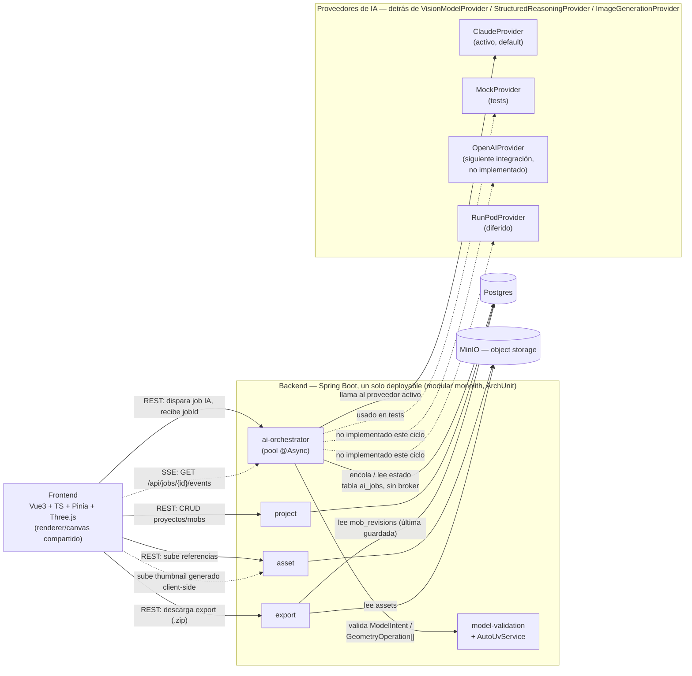
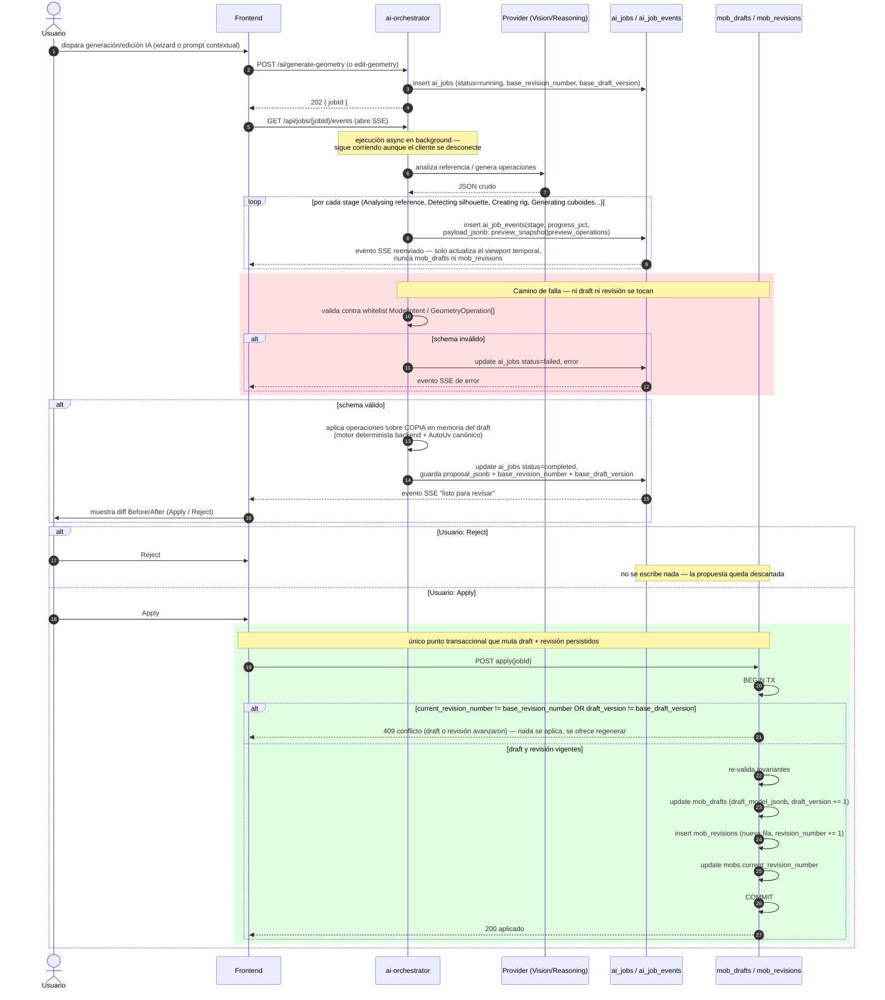
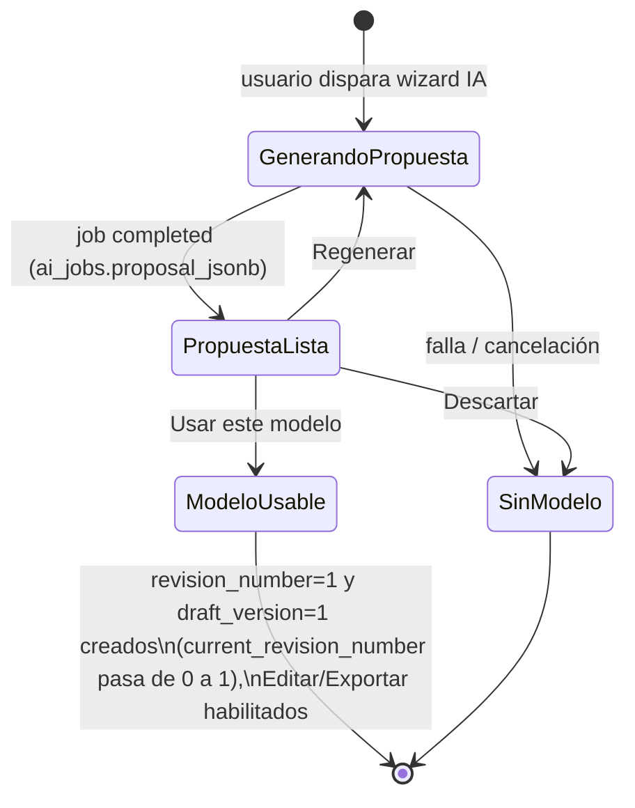
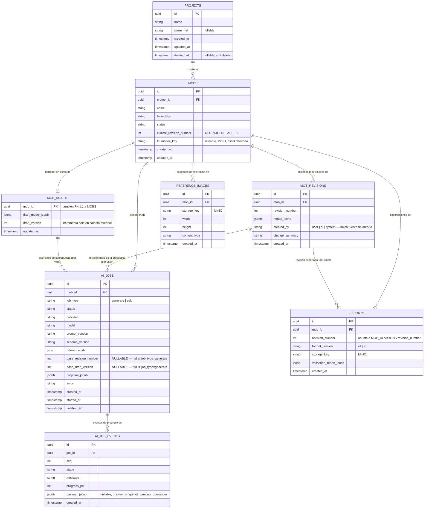

# Definición: Galgoth Studio — Technical Alpha (Fase 1 + Fase 2)

> **✅ VoBo APROBADO (8 sep 2026).** Este documento queda **congelado como baseline**. No se modifica alcance ni arquitectura general salvo que, durante la implementación, aparezca un bloqueo técnico real — en ese caso se documenta explícitamente y se vuelve a pedir VoBo puntual, no se cambia en silencio. Ver el **Addendum de implementación** al final del documento para los ajustes de orden/desglose de tickets acordados después de este VoBo (no cambian alcance ni arquitectura, solo secuencia de entrega y dos contratos técnicos menores).

> **Encuadre de alcance:** este documento define un **Technical Alpha** — el editor core determinista de cuboides más la generación/edición de geometría por IA. **No es el producto Galgoth Studio completo**: textura pintada, animación y biblioteca de animaciones permanecen fuera de este ciclo (Fases 3-5 del master prompt). Donde el resto del documento dice "Galgoth Studio" se refiere siempre a este alcance de Technical Alpha, nunca al producto final.

## Resumen ejecutivo

Galgoth Studio es un editor web asistido por IA para crear mobs/modelos de Minecraft Java Edition: imagen de concept art → modelo 3D de cuboides generado por IA (editable a mano) → export `.bbmodel` validado, compatible con Blockbench y FreeMinecraftModels (FMM). Este **Technical Alpha** entrega el editor core determinista más la generación/edición de geometría por IA — sin textura pintada ni animación funcional, con una textura placeholder auto-generada solo para que el export sea válido.

## Objetivo de negocio

Galgoth Studio existe para eliminar la barrera de entrada de crear mobs/modelos personalizados para servidores de Minecraft Java Edition. Hoy ese trabajo requiere dominar Blockbench, UV mapping manual, rigging y, para servidores con FreeMinecraftModels (FMM), además las convenciones específicas de ese plugin.

El producto propone: **imagen de concept art → modelo 3D de cuboides generado por IA (editable a mano) → export `.bbmodel` validado, compatible con Blockbench/FMM**. La IA propone estructura; la aplicación valida y aplica de forma determinista — la IA nunca escribe el `.bbmodel` final directamente.

Este Technical Alpha entrega el flujo vertical: crear proyecto → agregar mob → generar geometría por IA → **decidir explícitamente si se usa esa propuesta** → editar a mano y por IA con diff → exportar `.bbmodel` validado.

### Usuarios / roles involucrados

- **Creador de contenido para Minecraft** (usuario principal): administrador de servidor, diseñador de mods/datapacks o modder hobbyista.
- **Usuario avanzado / editor manual**: ajusta a mano lo que la IA generó.
- Sin roles de colaboración multi-usuario, permisos, ni administración de plataforma — confirmado: herramienta de un solo operador, sin autenticación.

## Alcance

### Incluye

**Gestión de proyectos y mobs**
- Crear proyecto (nombre + selección inicial de mobs).
- Dashboard "Mis proyectos": tarjetas con nombre, hasta 3 **miniaturas pre-renderizadas** de mob, `+N`, acciones Rename/Duplicate/Export/Delete.
- Detalle de proyecto: título, metadata, `Agregar mob`, búsqueda, grid de mobs con **miniatura pre-renderizada** y estado (Ready/In progress/Draft).

**Editor de modelo manual**
- Jerarquía (izquierda), viewport Three.js (centro), propiedades (derecha).
- Herramientas: Select, Move, Scale, Rotate, Pivot, Add cuboid, Add bone, Delete, Duplicate, **Undo/Redo sobre el draft**, grid/snap, **Guardar** (acción explícita).
- Reglas de geometría cuboid: `from`/`to`/origin/rotación opcional/UV por cara, sin dimensiones negativas, validación de referencias padre/hijo, IDs generados por la aplicación.
- **Todo cuboid creado o redimensionado (manual o por IA) recibe UV válida automáticamente en sus 6 caras vía `AutoUv`** — implementado en frontend (feedback inmediato, sin red) y en backend (autoridad canónica, ver Diseño técnico §6) — el usuario nunca necesita editar UV a mano este ciclo.

**Wizard de generación IA** (4 pasos)
- Referencia → Configuración → Generación (progreso por etapas, render incremental) → **Resultado, presentado como una PROPUESTA con tres acciones: Descartar / Regenerar / Usar este modelo**.

**Vision → ModelIntent**
- JSON estrictamente validado. Interfaces `VisionModelProvider` / `StructuredReasoningProvider` / `ImageGenerationProvider`; **implementaciones este ciclo: `ClaudeProvider` (default/activo) y `MockProvider` (tests)**. `OpenAIProvider` queda como siguiente integración (no implementado este ciclo); `RunPodProvider` diferido.

**Geometry planner**
- Whitelist cerrada de operaciones, validación de esquema atómica, `tempRef` para referencias internas de la propuesta.

**Edición por IA con diff**
- Prompt en lenguaje natural → plan de cambio → Before/After → **Apply/Reject**, verificando que ni el draft ni la revisión base hayan avanzado desde que se generó la propuesta.

**Exportador `.bbmodel` y validador**
- `BBModelExporterV5` (prioritario) y `BBModelExporterV4` (compatibilidad), con fixtures doradas. Exporta desde la **última revisión guardada** (no desde el draft en curso). Textura placeholder mínima auto-generada. `FmmCompatibilityValidator` con los checks de la sección 15 aplicables a geometría/bones/UV/texturas.

**Draft, Comandos y Revisiones** (semántica corregida — ver Diseño técnico §4)
- Edición manual → `Command` en la pila de Undo/Redo + mutación del `draft` en memoria.
- Autosave → persiste el `draft` en `mob_drafts` (con `draft_version` incremental). **Nunca crea una revisión.**
- `Guardar` explícito → crea una `mob_revision` (snapshot completo e inmutable).
- `Apply` de una propuesta de IA → crea una `mob_revision` y actualiza el `draft` en la misma transacción.

**Miniaturas / rendering**
- Miniatura (thumbnail) generada automáticamente en cada commit relevante (Guardar / Apply / Usar este modelo), usada en grids/listados. **Sin un WebGL renderer independiente permanentemente activo por card** — el preview 3D interactivo solo se monta en el editor/resultado, reutilizando renderer/canvas.

### No incluye

- **Editor de textura/UV pintado a mano** ni **generación de textura por IA** (`ImageGenerationProvider` solo como interfaz).
- **Sistema de animación** ni **biblioteca de animaciones**.
- **Helpers de autoría FMM guiados** (solo se valida un nombre de bone especial puesto manualmente).
- **Autenticación / multi-tenencia** — confirmado sin login.
- **Checkpoints nombrados / restore de revisión específica** — confirmado fuera de alcance; solo Undo/Redo lineal sobre el draft + historial de revisiones inmutables creadas por Guardar/Apply.
- **`OpenAIProvider` y `RunPodProvider` implementados** — la interfaz los admite, pero no se codifican este ciclo.
- **Despliegue en nube / infraestructura de producción**.
- **Responsive completo de workspaces de edición** — el editor 3D es desktop-first.
- **Colaboración multi-usuario, permisos y roles de plataforma**.

## Visual Contract

Los 12 mockups y `mockups/00_all_views.png` son **fuente de verdad visual** para este ciclo — no una referencia orientativa. Cada pantalla implementada se contrasta directamente contra su mockup correspondiente antes de darse por terminada; **no se reinterpreta completamente un mockup sin aprobación explícita del Product Owner** (un ajuste menor de detalle no requiere re-aprobación, un cambio de estructura/layout sí).

Requisitos obligatorios:

1. UI dark graphite/charcoal (`--bg #0B0F14`, `--panel #111820`, `--surface #171F29`, del master prompt §2).
2. **Verde menta** (`--accent #48E5A0`) como acento funcional principal — estados activos, foco, CTAs primarios.
3. El **viewport/modelo 3D es el protagonista visual** de cada pantalla de edición — nunca compite en jerarquía con paneles secundarios.
4. Evitar apariencia genérica de dashboard SaaS (tarjetas de métricas gratuitas, iconografía de stock, gradientes decorativos sin función).
5. Evitar **cards anidadas innecesarias** — un borde/superficie por nivel real de agrupación, no por reflejo.
6. **Sidebar global compacta**: Inicio, Mis proyectos, Explorar, Plantillas arriba; Configuración, Usuario abajo (corregido 2026-09-08 contra `mockups/00_all_views.png`/`01_inicio_mis_proyectos.png` — el texto original de esta sección, copiado del master prompt §3, no coincidía con el mockup real; ver Addendum). "Nuevo proyecto" **no** es un ítem de sidebar — es la tarjeta CTA "Crear un mob con IA" dentro del dashboard (mockup 01). Sin ítem "Volver".
7. **Editor de modelo**: layout fijo `hierarchy | viewport | inspector`.
8. **Tabs de workspace del mob**: `Modelo | Textura | Animación` — Textura y Animación se muestran como tabs presentes aunque su contenido funcional llegue en un ciclo posterior (deshabilitadas/con estado "próximamente", nunca ocultas, para no romper la estructura de navegación de los mockups).
9. Mantener **proporciones, jerarquía visual, spacing y estructura** de columnas/paneles de los mockups — no reinventar el layout.
10. Estados activos/seleccionados se comunican en verde menta **y nunca solo por color** (también forma/ícono — accesibilidad, master prompt §24).
11. **Los colores propios de los mobs** (piel, ropa, grietas violeta de Carcomido, etc.) **nunca se reemplazan por el accent de la UI** — el accent es exclusivamente de interfaz, nunca de contenido/arte del mob.

## Historias de Usuario

### Épica A: Gestión de proyectos y mobs

**HU-01**
```
Como creador de contenido para Minecraft
quiero crear un proyecto nuevo indicando su nombre
para agrupar ahí todos los mobs de un mismo mundo/servidor/tema

Criterios de aceptación:
- Dado que estoy en "Mis proyectos", cuando hago clic en "Nuevo proyecto" e ingreso un nombre válido, entonces se crea el proyecto y soy redirigido a su detalle.
- Dado que intento crear un proyecto sin nombre, cuando confirmo, entonces el sistema lo impide con un mensaje de validación claro.
- Dado que el formulario está abierto, cuando lo completo, entonces solo se pide nombre y selección inicial de mobs — sin campos técnicos de IA/geometría.
```

**HU-02**
```
Como creador de contenido para Minecraft
quiero ver mis proyectos en un dashboard
para retomar rápido el trabajo en curso

Criterios de aceptación:
- Dado que tengo proyectos creados, cuando entro a "Mis proyectos", entonces veo una tarjeta por proyecto con nombre y hasta 3 miniaturas (thumbnails) pre-renderizadas de sus mobs — no viewports 3D interactivos activos por card.
- Dado que un proyecto tiene más de 3 mobs, cuando veo su tarjeta, entonces se muestra un indicador "+N".
- Dado que hago clic en la tarjeta, cuando navego, entonces entro a su detalle.
- Dado que abro el menú de acciones, cuando lo despliego, entonces veo Rename, Duplicate, Export, Delete.
- Dado que la miniatura de un mob todavía no se generó o su generación falló, cuando veo la tarjeta, entonces se muestra un placeholder genérico en su lugar — el thumbnail es un asset derivado y su ausencia nunca bloquea el listado.
```

**HU-03**
```
Como creador de contenido para Minecraft
quiero agregar un mob nuevo a un proyecto existente
para poder generar y editar su modelo

Criterios de aceptación:
- Dado que estoy en el detalle de un proyecto, cuando hago clic en "Agregar mob", entonces se abre el flujo de creación de mob.
- Dado que completo la creación, cuando se confirma, entonces el mob aparece en el grid con estado "Draft", `current_revision_number = 0` y sin fila en `mob_drafts` (no existe hasta el primer commit).
```

**HU-04**
```
Como creador de contenido para Minecraft
quiero ver el detalle de un proyecto con todos sus mobs y su estado
para saber qué falta trabajar

Criterios de aceptación:
- Dado que entro al detalle, cuando la página carga, entonces veo título, metadata y un grid de mobs con su miniatura (thumbnail) pre-renderizada y estado (Ready / In progress / Draft).
- Dado que tengo varios mobs, cuando uso el buscador, entonces la lista se filtra por nombre.
- Dado que quiero ver un mob en 3D interactivo, cuando entro a su editor o a su pantalla de Resultado, entonces ahí (y solo ahí) se monta el viewport WebGL, reutilizando un renderer/canvas compartido en vez de crear uno nuevo por navegación.
```

### Épica B: Editor de modelo manual

**HU-05**
```
Como creador de contenido para Minecraft
quiero ver la jerarquía de bones y cuboides en un panel lateral
para entender y navegar la estructura del modelo

Criterios de aceptación:
- Dado que abro el editor de modelo, cuando carga la página, entonces veo un árbol de jerarquía con bones y cuboides hijos, en el layout fijo hierarchy | viewport | inspector (ver Visual Contract).
- Dado que hago clic en un nodo, cuando se selecciona, entonces el elemento se resalta también en el viewport 3D.
```

**HU-06**
```
Como creador de contenido para Minecraft
quiero seleccionar, mover, escalar y rotar un cuboide en el viewport 3D
para ajustar manualmente la geometría generada

Criterios de aceptación:
- Dado que tengo un cuboide seleccionado, cuando uso Move/Scale/Rotate, entonces cambia from/to/rotation en tiempo real; el cambio queda registrado como un Command en la pila de Undo/Redo (no crea una revisión — ver HU-22).
- Dado que redimensiono un cuboid, cuando confirmo, entonces AutoUv (frontend) recalcula automáticamente su UV para las nuevas dimensiones, localmente y sin petición HTTP (ver HU-16).
- Dado que intento producir dimensiones negativas o cero, cuando aplico la transformación, entonces el sistema lo rechaza o restringe.
- Dado que edito el pivote de un bone, cuando confirmo, entonces las rotaciones futuras de ese bone y sus hijos usan el nuevo pivote.
```

**HU-07**
```
Como creador de contenido para Minecraft
quiero agregar y eliminar bones y cuboides manualmente
para completar o corregir partes que la IA no generó bien

Criterios de aceptación:
- Dado que uso "Add cuboid" o "Add bone", cuando se crea, entonces el ID lo genera la aplicación (nunca la IA) y AutoUv (frontend) le asigna automáticamente UV válida en sus 6 caras, localmente — no necesito editar UV a mano.
- Dado que elimino un bone con hijos, cuando confirmo, entonces se me advierte del impacto en cascada (comportamiento exacto de cascada a definir con UX al crear el ticket).
- Dado que duplico un cuboide, cuando se completa, entonces aparece una copia independiente con nuevo ID y su propia UV asignada automáticamente.
```

**HU-08**
```
Como creador de contenido para Minecraft
quiero deshacer y rehacer mis cambios sobre el draft en curso
para corregir errores sin perder todo mi trabajo

Criterios de aceptación:
- Dado una serie de cambios manuales, cuando presiono Undo repetidamente, entonces el draft regresa paso a paso en orden inverso exacto — ninguna mob_revision se crea ni se destruye en este proceso.
- Dado que deshice cambios, cuando presiono Redo, entonces el draft avanza hasta el estado más reciente.
- Dado que aplico un cambio nuevo tras deshacer, cuando lo hago, entonces se descarta la rama de redo pendiente.
- Dado que dejo de interactuar por unos segundos, cuando el autosave dispara, entonces el draft actual se persiste en mob_drafts y draft_version se incrementa — sin crear una revisión.
```

**HU-09**
```
Como creador de contenido para Minecraft
quiero guardar explícitamente mi trabajo con un botón "Guardar"
para crear un punto de retorno confiable sin que cada micro-cambio genere uno

Criterios de aceptación:
- Dado que tengo cambios en el draft, cuando hago clic en "Guardar", entonces se valida el draft actual y se crea una nueva mob_revision (snapshot completo e inmutable), actualizando mobs.current_revision_number.
- Dado que no he hecho ningún cambio desde la última revisión guardada, cuando abro "Guardar", entonces la acción está deshabilitada o no genera una revisión duplicada.
- Dado que el draft falla la validación de invariantes al guardar, cuando ocurre, entonces no se crea la revisión y se me muestran los errores específicos.
```

### Épica C: Wizard de generación IA

**HU-10**
```
Como creador de contenido para Minecraft
quiero iniciar la generación subiendo una imagen de referencia y configurando datos básicos
para obtener un modelo 3D inicial sin modelar a mano

Criterios de aceptación:
- Dado el paso "Referencia", cuando subo una imagen válida, entonces avanzo a "Configuración".
- Dado "Configuración", cuando completo nombre/tipo base/resolución, entonces el tipo base propuesto por IA aparece pre-seleccionado y editable.
- Dado que confirmo, cuando avanzo, entonces inicia "Generación" y el job queda registrado (sobrevive a desconexión temporal); nada se persiste todavía como draft o revisión del mob.
```

**HU-11**
```
Como creador de contenido para Minecraft
quiero ver el progreso de generación con etapas visibles y el modelo emergiendo en vivo
para entender qué está pasando y no solo esperar un spinner

Criterios de aceptación:
- Dado la generación en curso, cuando observo el progreso, entonces veo Analizando referencia / Detectando silueta / Creando rig / Generando cuboides marcadas al completarse.
- Dado geometría parcial generada, cuando la etapa avanza, entonces el viewport muestra el modelo emergente a partir de eventos `preview_snapshot`/`preview_operations` transportados en `ai_job_events` — datos efímeros que nunca modifican `mob_drafts` ni crean `mob_revisions`, y pueden descartarse sin efecto en cualquier momento.
- Dado que el proveedor no necesita producir geometría en cada token, cuando el preview se actualiza, entonces puede llegar por etapas/batches en vez de continuamente.
- Dado que cancelo la generación, cuando confirmo, entonces el job se marca cancelado y el mob permanece sin draft ni revisión (los eventos de preview mostrados se descartan sin dejar rastro).
```

**HU-12**
```
Como creador de contenido para Minecraft
quiero revisar el resultado de la generación de IA como una propuesta antes de que se convierta en mi modelo real
para decidir con confianza si lo uso, lo regenero, o lo descarto

Criterios de aceptación:
- Dado que la generación termina exitosamente, cuando llego a "Resultado", entonces veo el modelo propuesto en el viewport, conteo de cuboides/bones y estado de compatibilidad — pero el mob todavía no tiene ninguna revisión persistida.
- Dado la pantalla "Resultado", cuando la veo, entonces tengo exactamente tres acciones: "Descartar", "Regenerar", "Usar este modelo".
- Dado que hago clic en "Descartar", cuando confirmo, entonces la propuesta se abandona, no se crea draft ni revisión, y el mob queda sin modelo.
- Dado que hago clic en "Regenerar", cuando confirmo, entonces se descarta la propuesta actual y se inicia un nuevo job de generación (mismo flujo que HU-11).
- Dado que hago clic en "Usar este modelo", cuando se confirma, entonces el sistema valida invariantes, crea `mob_revisions.revision_number = 1` y `mob_drafts.draft_version = 1` (ambos en la misma transacción, primera vez que existen para este mob), actualiza `mobs.current_revision_number` de `0` a `1`, y habilita "Editar modelo" y "Exportar" — nunca ocurre un Apply implícito antes de este clic explícito.
```

### Épica D: Vision → ModelIntent

**HU-13**
```
Como sistema (comportamiento interno invocado por el wizard de generación)
quiero convertir la imagen de referencia en un ModelIntent JSON estrictamente validado
para tener una base estructurada antes de planear geometría

Criterios de aceptación:
- Dado imagen + tipo base + restricciones enviadas al VisionModelProvider configurado (ClaudeProvider este ciclo; MockProvider en tests), cuando llega la respuesta, entonces se valida contra el esquema de ModelIntent antes de continuar.
- Dado una respuesta que no cumple el esquema, cuando se detecta, entonces el flujo se detiene y se reporta el error, sin generar geometría inválida.
- Dado que la arquitectura desacopla proveedor de dominio mediante interfaz, cuando se agregue OpenAIProvider o RunPodProvider en un ciclo posterior, entonces no se requieren cambios en ai-orchestrator ni en el dominio — solo una nueva implementación de la interfaz y su registro por configuración.
- Dado una llamada completada, cuando se persiste, entonces se guardan proveedor, modelo, versión de prompt, versión de esquema, IDs de referencia y la propuesta.
```

### Épica E: Geometry planner y aplicación de operaciones

**HU-14**
```
Como sistema (comportamiento interno)
quiero traducir el ModelIntent en operaciones de una whitelist cerrada
para nunca dejar que la IA escriba estructura arbitraria

Criterios de aceptación:
- Dado un ModelIntent válido, cuando el planner genera una propuesta, entonces cada operación pertenece a: createBone, createCuboid, resizeCuboid, moveCuboid, rotateCuboid, setBonePivot, setBoneRotation, parentBone, removeCuboid.
- Dado que una operación no pasa el esquema, cuando se detecta, entonces la propuesta completa se rechaza de forma atómica.
- Dado nuevos bones/cuboides, cuando se generan IDs, entonces los genera la aplicación; referencias "hacia adelante" en el mismo batch usan un tempRef opaco resuelto por el backend.
```

**HU-15**
```
Como creador de contenido para Minecraft
quiero que la geometría generada respete las proporciones y reglas de cuboid de Minecraft
para obtener un modelo utilizable sin corrección extensa

Criterios de aceptación:
- Dado un mob humanoide, cuando se crea la geometría, entonces parte de proporciones tipo Minecraft (head 8×8×8, body 8×12×4, arms/legs 4×12×4) con variaciones controladas.
- Dado references/carcomido_reference.png como entrada, cuando se genera, entonces el resultado refleja manos sobrescaladas, asimetría y silueta de ropa dañada, permaneciendo neutral/animable.
- Dado la geometría generada, cuando se valida, entonces no hay dimensiones negativas ni referencias padre/hijo inválidas.
```

**HU-16**
```
Como sistema (motor de aplicación de operaciones, en frontend Y backend)
quiero asignar automáticamente UV válida a las 6 caras de todo cuboid creado o redimensionado, manual o por IA, con el mismo algoritmo determinista en ambos lados
para dar feedback inmediato en el editor sin depender de una llamada HTTP por cada interacción, mientras el backend mantiene la autoridad final sobre lo persistido

Criterios de aceptación:
- Dado que creo o redimensiono un cuboid en el editor (Command manual), cuando el cambio ocurre, entonces AutoUv del frontend calcula y aplica la UV localmente al draft en memoria, sin ninguna petición HTTP — ni una por cada frame de drag/resize.
- Dado que se aplican operaciones de IA, se ejecuta Guardar, se ejecuta Apply, o se exporta, cuando esas acciones corren en backend, entonces AutoUv del backend recomputa/revalida la UV de forma canónica — es la autoridad final sobre lo que queda persistido.
- Dado la misma geometría de entrada, cuando se ejecuta el algoritmo en frontend (TypeScript) y en backend (Java), entonces ambos producen exactamente el mismo layout UV, verificado por fixtures compartidas entre ambos test suites.
- Dado que ningún cuboid recibe UV por otro camino que no sea AutoUv (frontend o backend), cuando se valida el modelo (HU-20), entonces nunca se reporta UV inválida por ausencia de asignación.
- Dado que AutoUv corre este ciclo con textura placeholder, cuando genera el layout, entonces usa una estrategia determinista y simple tipo shelf-packing de caja de Minecraft — no optimiza densidad de atlas todavía, solo validez.
```

### Épica F: Edición por IA con diff

**HU-17**
```
Como creador de contenido para Minecraft
quiero pedirle a la IA cambios en lenguaje natural
para ajustar el resultado sin manipular coordenadas a mano

Criterios de aceptación:
- Dado una instrucción como "haz las manos más grandes y los hombros más irregulares", cuando la envío, entonces recibo un plan con resumen y lista de operaciones, generado contra el draft y la revisión actuales (base_revision_number + base_draft_version registrados en el job).
- Dado un plan recibido, cuando lo reviso, entonces veo Before/After y los cuboides/bones afectados, sin que el draft ni la revisión hayan cambiado todavía.
```

**HU-18**
```
Como creador de contenido para Minecraft
quiero aplicar o rechazar el plan propuesto por la IA
para mantener control total sobre lo que entra a mi modelo

Criterios de aceptación:
- Dado un plan revisado, cuando hago Apply, entonces las operaciones se ejecutan en una única transacción que actualiza mob_drafts (nuevo draft_version) y crea una nueva mob_revisions (nuevo revision_number), dejando el resultado disponible como nueva base de Undo/Redo.
- Dado un plan revisado, cuando hago Reject, entonces ni el draft ni las revisiones cambian.
- Dado que la llamada a la IA falla, cuando ocurre, entonces el modelo actual (draft y revisiones) queda sin cambios y se informa el error.
- Dado que el draft o la revisión base avanzaron desde que se generó la propuesta (base_revision_number o base_draft_version ya no coinciden con los valores actuales de mobs.current_revision_number / mob_drafts.draft_version), cuando intento Apply, entonces se rechaza con 409, no se aplica ninguna operación, y se me ofrece regenerar la propuesta contra el estado actual.
```

### Épica G: Exportador `.bbmodel` y validador

**HU-19**
```
Como creador de contenido para Minecraft
quiero exportar mi mob a un .bbmodel válido en v5 (o v4) usando la última revisión guardada
para abrirlo en Blockbench o usarlo en mi servidor con FMM

Criterios de aceptación:
- Dado que exporto un mob, cuando genero el archivo, entonces el exportador usa mob_revisions (la última revisión guardada) — nunca el draft en curso.
- Dado que tengo cambios en el draft sin guardar (draft_version más nuevo que el contenido de la última revisión), cuando abro la pantalla de exportación, entonces se me advierte explícitamente antes de exportar.
- Dado un mob sin textura pintada, cuando exporto, entonces se incluye automáticamente una textura placeholder mínima.
- Dado el .bbmodel exportado (v4 o v5), cuando se abre en Blockbench, entonces abre sin diálogos de reparación — la UV de cada cara ya es válida gracias a AutoUvService.
- Dado un export, cuando reviso el archivo, entonces todos los UUIDs son únicos y las referencias de outliner/groups son válidas.
```

**HU-20**
```
Como creador de contenido para Minecraft
quiero validar mi modelo antes de exportar y ver errores accionables
para corregir problemas antes de llevar el archivo a mi servidor

Criterios de aceptación:
- Dado una validación solicitada, cuando corre, entonces se verifican JSON válido, unicidad de UUID, referencias de outliner/groups, dimensiones de cuboid, UV por cara, índices de textura (satisfechos por el placeholder) y nombres especiales de bone FMM.
- Dado un problema encontrado, cuando se muestra, entonces cada error es específico y accionable.
- Dado un modelo que pasa todas las validaciones, cuando se muestra el resultado, entonces el estado FMM se marca válido para exportar.
```

**HU-21**
```
Como equipo de ingeniería
quiero fixtures doradas que incluyan tanto snapshots de nuestro propio exportador como archivos .bbmodel REALES exportados desde Blockbench
para garantizar compatibilidad real con el formato, no solo consistencia interna

Criterios de aceptación:
- Dado model_spec_example.json expandido con casos borde (incluyendo cuboides con UV generada por AutoUv), cuando corren los tests, entonces v4 y v5 se comparan estructuralmente contra un snapshot aprobado (fixtures internas).
- Dado un conjunto mínimo de archivos .bbmodel reales exportados a mano desde una versión soportada de Blockbench — cuboid simple, jerarquía parent/child, pivots/rotaciones, múltiples cuboides, UV/textura, formato v5 y v4 cuando aplique — cuando se agregan como fixtures externas, entonces el dominio interno puede leerlos/representarlos sin pérdida relevante.
- Dado carcomido_minecraft_cuboids.bbmodel como fixture adicional, cuando corre el test, entonces el dominio interno puede representarlo sin pérdida relevante.
- Dado una salida de exportador cambiada sin mantener compatibilidad con los snapshots internos O con las fixtures externas reales, cuando corre CI, entonces el pipeline falla.
```

### Épica H: Draft, Comandos y Revisiones (contrato de sistema)

**HU-22**
```
Como sistema
quiero mantener una separación clara entre Command (deshacer/rehacer en memoria), Draft (estado mutable autosalvado) y Revision (snapshot inmutable)
para que el historial sea eficiente y las revisiones solo se creen en los momentos que el producto define como significativos

Criterios de aceptación:
- Dado que el usuario ejecuta una edición manual (mover/escalar/rotar/agregar/eliminar), cuando se ejecuta, entonces se genera un Command en la pila de Undo/Redo del cliente y el modelo en memoria cambia inmediatamente — no se crea ninguna mob_revision (ver HU-08).
- Dado que pasan unos segundos sin actividad y el contenido cambió materialmente desde el último draft persistido, cuando el autosave dispara, entonces el estado actual se persiste en mob_drafts.draft_model_jsonb y draft_version se incrementa en 1 — sigue sin crearse ninguna mob_revision.
- Dado que el autosave dispara pero el contenido es idéntico al último persistido, cuando corre, entonces no se escribe nada y draft_version no se incrementa.
- Dado que el usuario hace clic en "Guardar", cuando se confirma, entonces se valida el draft actual y se crea una nueva fila inmutable en mob_revisions (snapshot completo) con revision_number incrementado, y mobs.current_revision_number se actualiza (ver HU-09).
- Dado que se hace Apply de una propuesta de IA, cuando se confirma, entonces se crea una revisión de la misma forma que "Guardar", además de actualizar el draft para reflejar el nuevo estado en la misma transacción (ver HU-18).
- Dado que el historial de mob_revisions crece, cuando se consulta, entonces cada fila es un snapshot completo e inmutable — no hay revisiones parciales ni deltas entre filas.
```

### Épica I: Flujo end-to-end de aceptación

**HU-23**
```
Como creador de contenido para Minecraft
quiero completar el flujo Galgoth/Carcomido de punta a punta sin tocar textura ni animación
para confirmar que el Technical Alpha entrega valor real de forma determinista

Criterios de aceptación:
- Dado que creo el proyecto "Galgoth", cuando confirmo, entonces existe y puedo entrar a su detalle.
- Dado que agrego "Carcomido" usando carcomido_reference.png y llego a "Resultado", cuando hago clic en "Usar este modelo", entonces se crea la revisión 1 y el mob queda editable/exportable.
- Dado que redimensiono una mano manualmente, cuando lo hago, entonces se genera un Command de Undo y el draft cambia; cuando hago clic en "Guardar", entonces se crea la revisión 2.
- Dado que pido "agranda la otra mano" y reviso el diff, cuando hago Apply, entonces se crea la revisión 3 automáticamente (sin necesidad de un Guardar adicional).
- Dado que valido el modelo, cuando corre, entonces no hay errores pendientes (incluida la UV, ya válida por AutoUvService desde la creación de cada cuboid).
- Dado que exporto, cuando descargo el .bbmodel (revisión 3, con textura placeholder), entonces abre en Blockbench sin diálogos de reparación.
```

## Diseño técnico

### 1. Estructura del repositorio

**Decisión: monorepo** (sin cambios respecto a la versión anterior de este documento).

```text
galgoth-studio/
  frontend/                 # Vue3 + TS + Vite
  backend/                  # Spring Boot 4.1.0 modular monolith (Java 25, ver §2)
  contracts/                # JSON Schemas compartidos (ModelIntent, GeometryOperation[], MobProjectModel)
  docker/                   # docker-compose.yml, Dockerfiles, .env.example
  postman/galgoth-studio/   # colección + environments
  docs/
    definiciones/           # documento de definición, HUs, diagramas
    adr/                    # ADRs cortos por decisión relevante
  pending/  in-process/  done/
  .github/workflows/
```

### 2. Backend — modular monolith, persistencia, progreso de IA

**Confirmado, con una corrección de versión (2026-09-08, ver Addendum):** Spring Boot 4.1.0 + Java 25 (no 3.x/21, desactualizado) + PostgreSQL + storage S3-compatible (MinIO), monolito modular con ArchUnit (paquetes `project`, `asset`, `ai-orchestrator`, `model-validation`, `export`).

**Esquema Postgres actualizado** (agrega `draft_version`, `base_draft_version`, `thumbnail_key`; corrige la fuente de verdad de autoría):

```text
projects(id, name, owner_ref?, created_at, updated_at, deleted_at?)

mobs(id, project_id, name, base_type, status,
     current_revision_number NOT NULL DEFAULT 0,
     thumbnail_key?, created_at, updated_at)
     -- SIN columna created_by: un mob no tiene "autor" a nivel de fila (no hay auth este ciclo);
     -- la autoría vive exclusivamente en mob_revisions.created_by (ver nota más abajo).
     -- current_revision_number=0 significa "sin ninguna revisión todavía" (mob recién creado).

mob_revisions(id, mob_id, revision_number, model_jsonb, created_by[user|ai|system],
              change_summary, created_at)
     -- append-only, inmutable. ÚNICA fuente de verdad de "quién creó cada estado".
     -- Se inserta SOLO por: (a) Guardar explícito, (b) Apply de propuesta IA,
     -- (c) "Usar este modelo" (primera revisión). Nunca por autosave ni por Command.

mob_drafts(mob_id PK, draft_model_jsonb, draft_version, updated_at)
     -- una fila mutable por mob. NO EXISTE hasta el primer commit persistido
     -- (ver "Estado inicial de un mob" más abajo). draft_version se incrementa
     -- solo cuando el contenido persistido cambia materialmente (ver §4, punto 3
     -- de esta revisión) — un autosave sin cambios no escribe ni incrementa nada.

reference_images(id, mob_id, storage_key, width, height, content_type, created_at)

ai_jobs(id, mob_id, job_type[generate|edit], status, provider, model, prompt_version,
        schema_version, reference_ids,
        base_revision_number NULLABLE, base_draft_version NULLABLE,
        proposal_jsonb, error, created_at, started_at, finished_at)
     -- base_revision_number y base_draft_version son NULL cuando job_type='generate'
     -- (generación inicial: el mob todavía no tiene revisión ni draft). Siempre
     -- están presentes (NOT NULL en la práctica) cuando job_type='edit', porque
     -- editar por IA solo es posible sobre un mob que ya tiene revisión 1+.
     -- Apply valida ambos contra los valores actuales antes de escribir nada
     -- (para job_type='generate' no hay valores previos que validar — ver §5).

ai_job_events(id, job_id, seq, stage, message, progress_pct,
              payload_jsonb NULLABLE, created_at)
     -- payload_jsonb transporta eventos de preview no persistente
     -- (preview_snapshot | preview_operations) — ver §5, punto 5 de esta revisión.

exports(id, mob_id, revision_number, format_version[v4|v5], storage_key,
        validation_report_jsonb, created_at)
```

**Estado inicial de un mob** (nuevo, formaliza el punto 1 de esta revisión):

| Momento | `current_revision_number` | `mob_drafts` |
|---|---|---|
| Mob recién creado (HU-03) | `0` | inexistente (sin fila) |
| Primer "Usar este modelo" (HU-12) | `1` | fila creada, `draft_version = 1` |

> **Corrección de inconsistencia (punto 9 de la revisión anterior):** la versión previa mencionaba `mobs.created_by` en la prosa de seguridad (§9) sin que existiera en el esquema. **Fuente de verdad única: `mob_revisions.created_by`** — cada revisión registra quién/qué la originó (`user`/`ai`/`system`); `mobs` no tiene ni necesita esa columna.

> **Nota abierta de implementación (sin cambios):** si `ai_jobs.base_revision_number`/`base_draft_version` y `exports.revision_number` se implementan como FK compuesta real hacia `mob_revisions`/`mob_drafts` o como referencia lógica en código — se resuelve en el ticket de esquema de base de datos.

**Progreso de generación IA — SSE, sin cambios:** `GET /api/jobs/{jobId}/events`, job corre server-side vía pool `@Async` con `ai_jobs` como cola, sin broker de mensajería este ciclo.

### 3. Frontend

**Confirmado sin cambios:** Vue 3 + TypeScript (strict) + Vite + Pinia + Vue Router + Three.js + Canvas2D/OffscreenCanvas + Web Workers + IndexedDB + Vitest + Playwright.

```text
frontend/src/
  app/            # shell, layout, router
  design-system/  # tokens del Visual Contract, componentes base
  domain/         # tipos TS de MobProjectModel, ModelIntent, GeometryOperation
  editor/
    model/        # viewport Three.js (renderer/canvas compartido), hierarchy tree, gizmos
    texture/      # scaffold de tipos/rutas, sin lógica (Fase 3)
    animation/    # scaffold (Fase 4)
    export/       # pantalla de export + validación
  ai/             # panel de asistente contextual, diff viewer, cliente SSE de jobs
  stores/         # Pinia: project, mob (draft + Command stack de Undo/Redo), job, ui
  workers/        # Web Workers para operaciones pesadas de geometría/pixeles
  api/            # cliente REST tipado
  persistence/    # capa IndexedDB de autosave/cache local
```

### 4. Draft, Comandos y Revisiones — contrato corregido (punto 2 y 3)

Tres capas con responsabilidades disjuntas, para que el historial sea eficiente y las revisiones se creen solo en momentos significativos del producto:

| Capa | Dónde vive | Qué la crea | Qué la lee |
|---|---|---|---|
| **Command** | Cliente, en memoria (pila de Undo/Redo de Pinia) | Cada edición manual (mover/escalar/rotar/agregar/eliminar cuboid o bone) | Undo/Redo del editor |
| **Draft** | Servidor, `mob_drafts` (mutable, una fila por mob) | Autosave (debounced) del estado en memoria del cliente; también lo actualiza Apply | Autosave de reanudación, base de la siguiente edición |
| **Revision** | Servidor, `mob_revisions` (append-only, inmutable) | Solo: "Usar este modelo" (primera vez), **Guardar** explícito, **Apply** de propuesta IA | Export, historial, futura restauración |

Reglas explícitas:
- Una edición manual **nunca** crea una `mob_revision` por sí sola — solo genera un `Command` y muta el draft en memoria/autosave.
- El autosave persiste el draft y avanza `draft_version`, pero **nunca** crea una revisión.
- **`draft_version` se incrementa únicamente cuando el contenido persistido del draft es materialmente distinto del último persistido** — un autosave que no cambió nada (dirty flag / hash / versión local, detalle a definir en el ticket) no escribe y no incrementa `draft_version`. Esto evita falsos `409` en propuestas de IA cuyo `base_draft_version` quedaría desactualizado por escrituras sin cambio real.
- `Guardar` es la única acción manual que crea una revisión: toma el draft actual, lo valida, y lo snapshotea en `mob_revisions`.
- `Apply` (edición por IA) crea una revisión **y** actualiza el draft, en una única transacción — es el único caso donde ambas capas se mutan juntas.
- `mob_revisions.model_jsonb` sigue siendo un **snapshot completo e inmutable** (sin cambios respecto a la versión anterior de este documento) — la corrección de este ciclo es de cuándo se crea una fila, no de su forma.

Pinia mantiene el modelo canónico en memoria + la pila de `Command` para Undo/Redo. IndexedDB sigue siendo una red de seguridad local (no la fuente de verdad) que espeja el draft.

### 5. Pipeline de IA — validación, "AI failures must leave the model unchanged", y `AutoUv` (backend)

1. `ai-orchestrator` llama al proveedor configurado (`ClaudeProvider`), recibe JSON crudo.
2. Se valida contra el JSON Schema de `ModelIntent` o `GeometryOperation[]`. Cualquier violación → el job se marca `failed`, nada se escribe sobre draft ni revisiones.
3. Las operaciones válidas se aplican sobre una **copia en memoria** del draft actual, con el **mismo motor determinista de aplicación de operaciones** que usa el backend para cualquier escritura server-side — este es el punto donde se invoca `AutoUv` (backend), la implementación canónica que también recomputa la UV que el frontend ya calculó localmente para las ediciones manuales (ver Diseño técnico §6 para el split completo frontend/backend).
4. La propuesta se guarda en `ai_jobs.proposal_jsonb` junto con `base_revision_number` **y** `base_draft_version`, y se devuelve para Apply/Reject.
5. **Apply** es la única operación que muta draft + revisión persistidos, en una transacción: re-valida que `current_revision_number` **y** `draft_version` no hayan avanzado (si cualquiera avanzó → 409, nada se aplica, se ofrece regenerar) → re-valida invariantes → actualiza `mob_drafts` (`draft_version += 1`) → inserta nueva fila en `mob_revisions` → actualiza `current_revision_number`.

**"Usar este modelo" reutiliza exactamente este mecanismo de commit** para la primera propuesta de un mob (job `job_type='generate'`, con `base_revision_number`/`base_draft_version` NULL porque el mob no tiene ninguno todavía): el commit es incondicional la primera vez — crea `mob_drafts` (fila nueva, `draft_version=1`) y `mob_revisions` (`revision_number=1`, `created_by='ai'`) en la misma transacción. Los jobs de edición (`job_type='edit'`, usados por Apply) siempre tienen `base_revision_number`/`base_draft_version` no nulos, porque editar por IA solo es posible sobre un mob que ya pasó por "Usar este modelo".

**Preview no persistente durante la generación (formaliza el modelo emergente de HU-11):** mientras el job corre, `ai_job_events` puede transportar eventos `preview_snapshot` o `preview_operations` en su columna `payload_jsonb`. Estos datos:
- solo actualizan el viewport temporal del wizard (HU-11), nunca ningún estado persistido;
- **jamás** modifican `mob_drafts` ni crean `mob_revisions`;
- pueden descartarse sin efecto en cualquier momento (por ejemplo, si el usuario cancela o navega fuera);
- no requieren que cada token del proveedor produzca geometría — pueden llegar por etapas/batches, a discreción del `ai-orchestrator`.

El resultado final (la propuesta que llega a "Resultado", HU-12) siempre pasa la validación completa del pipeline (pasos 1-4 de arriba) antes de mostrarse — la vista previa en vivo nunca se salta esa validación, solo anticipa visualmente lo que probablemente se validará.

**Proveedores de IA — alcance reducido este ciclo (punto 7):**

| Componente | Este ciclo | Próximo |
|---|---|---|
| `VisionModelProvider` / `StructuredReasoningProvider` / `ImageGenerationProvider` (interfaces) | Definidas, estables | — |
| `ClaudeProvider` | **Implementado, default/activo** | — |
| `MockProvider` | **Implementado, uso exclusivo en tests** | — |
| `OpenAIProvider` | No implementado | Siguiente integración |
| `RunPodProvider` (self-hosted) | No implementado | Diferido |

Selección por variable de entorno (`AI_VISION_PROVIDER`, `AI_REASONING_PROVIDER`); la arquitectura de interfaz garantiza que agregar `OpenAIProvider`/`RunPodProvider` después no requiere tocar `ai-orchestrator` ni el dominio.

### 6. `AutoUvService` — frontend (feedback inmediato) + backend (autoridad canónica)

**Estrategia determinista tipo *shelf-packing* de caja de Minecraft** (sin cambios en el algoritmo): para cada cuboid, calcula el layout de caja estándar (6 caras north/south/east/west/up/down desplegadas según ancho/alto/profundidad, igual que el UV automático de Minecraft/Blockbench) y empaqueta cada footprint en la siguiente posición libre del atlas del mob (fila por fila); si el atlas se llena, re-empaqueta el mob completo de forma determinista. Objetivo este ciclo: **validez**, no densidad — no hay textura real que optimizar todavía (placeholder).

**Corrección respecto a la versión anterior:** la edición manual ocurre localmente en Vue/Pinia mediante `Command` (ver §4) — depender de una llamada al backend para AutoUV en cada `createCuboid`/`resizeCuboid` manual rompería ese modelo local-first (una petición HTTP por cada frame de drag/resize es inaceptable). El mismo algoritmo se implementa **dos veces, con roles distintos**:

| Lado | Rol | Cuándo corre |
|---|---|---|
| **Frontend (TypeScript)** | Feedback inmediato: calcula y aplica la UV al draft en memoria en cada `Command` de creación/redimensión | Cada interacción del editor, sin red — nunca una petición HTTP por frame |
| **Backend (Java)** | Implementación canónica y **autoridad final**: revalida/recomputa | Aplicación de operaciones de IA, `Guardar`, `Apply`, export (los mismos puntos de persistencia/proceso ya definidos en §4/§5) |

- El backend nunca confía ciegamente en la UV que trae el cliente: en cada punto de persistencia o procesamiento server-side recalcula con su propia implementación, que es la que finalmente queda en `mob_revisions` y en el export.
- **Fixtures compartidas**: el mismo conjunto de geometrías de entrada (y su UV esperada) se ejecuta en ambos test suites — Vitest (frontend) y JUnit (backend) — para garantizar que `AutoUv(frontend) == AutoUv(backend)` dada la misma entrada. Una divergencia rompe el build de cualquiera de los dos lados.
- Efecto directo sin cambios: el validador de exportación (HU-20) nunca reporta "UV inválida" por ausencia de asignación, y el usuario nunca necesita abrir un editor de UV que este ciclo no existe.

### 7. Exportador `.bbmodel` — arquitectura y fixtures

**Sin cambios de arquitectura:** exportador en backend (`BBModelExporterV4`, `BBModelExporterV5`, `FmmCompatibilityValidator`), fixtures doradas partiendo de `model_spec_example.json` y `carcomido_minecraft_cuboids.bbmodel`.

**Cambio de origen de datos:** el exportador lee de `mob_revisions` (la última revisión guardada) — **nunca** del draft en curso (ver HU-19). La textura placeholder y la UV ya válida (por `AutoUvService`) garantizan que el archivo abra en Blockbench sin diálogo de reparación.

**Fixtures doradas — requisito nuevo de esta revisión: parte deben ser archivos `.bbmodel` REALES.** No basta con snapshots generados por nuestro propio exportador (eso solo prueba consistencia interna, no compatibilidad real con el formato). Se agregan como fixtures externas archivos `.bbmodel` creados/exportados a mano desde una versión soportada de Blockbench, con como mínimo un caso para cada uno de:

- cuboid simple
- jerarquía parent/child
- pivots/rotaciones
- múltiples cuboides
- UV/textura
- formato Blockbench v5
- formato v4 (cuando sea aplicable)

El exportador se compara en CI contra **ambos** conjuntos: los snapshots internos (generados por nuestro propio exporter, como antes) y estas fixtures externas reales — un cambio que rompa compatibilidad con cualquiera de los dos falla el pipeline.

### 8. Miniaturas y renderizado (punto 8, nuevo)

**Decisión: generación de thumbnail client-side, sin renderer WebGL permanente por card.**

- Cuando se confirma un commit relevante (`Guardar`, `Apply`, `Usar este modelo`), el frontend renderiza offscreen una vista fija (ángulo isométrico, iluminación estándar) del modelo ya montado en el viewport activo, exporta un PNG y lo sube como asset asociado al mob (`mobs.thumbnail_key`, sobrescribiendo la miniatura anterior).
- Los grids/listados (HU-02, HU-04) renderizan `` desde `thumbnail_key` — **cero contextos WebGL** en pantallas de listado.
- El viewport 3D interactivo se monta únicamente en Editor de modelo y Resultado, **reutilizando un único renderer/canvas compartido** en vez de instanciar uno nuevo por navegación (los navegadores limitan contextos WebGL simultáneos).

**El thumbnail es un asset derivado, nunca parte del commit transaccional.** Si la generación o subida del thumbnail falla después de `Guardar` / `Apply` / "Usar este modelo":
- el commit **no se revierte** — la revisión ya creada sigue siendo válida y persistida;
- se conserva el thumbnail anterior (o un placeholder genérico si nunca hubo uno);
- la generación puede reintentarse después, de forma asíncrona, sin bloquear al usuario.

### 9. Seguridad / multi-tenencia este ciclo

**Sin cambios:** confirmado sin login. CORS habilitado para el origen local de desarrollo; secretos vía variables de entorno / `.env` no versionado. (Corrección: ver nota de `mob_revisions.created_by` como única fuente de autoría en §2 — ya no se menciona `mobs.created_by`.)

### 10. CI/CD mínimo este ciclo

**Sin cambios:** build+test backend (fixtures v4/v5, ArchUnit, JSON Schema), lint+tsc+Vitest+build frontend, smoke Playwright en PR + suite completa nocturna, SonarQube gate, validación de Docker Compose, notificaciones Telegram.

## Diagramas

### Arquitectura



Este diagrama hace visibles: (1) el backend es un único proceso JVM con paquetes internos; (2) solo `ClaudeProvider` está conectado en runtime este ciclo, `MockProvider` solo en tests, y `OpenAIProvider`/`RunPodProvider` existen como slots de interfaz sin implementación; (3) el exportador lee explícitamente de `mob_revisions`, nunca del draft; (4) las miniaturas se generan en el cliente y se suben como un asset más, sin tocar el pipeline de IA.

### Secuencia — pipeline de generación/edición por IA (Apply verifica draft y revisión)



Los dos bloques resaltados: en rojo, el único desenlace donde `ai_jobs` cambia pero `mob_drafts`/`mob_revisions` quedan intactos (falla de schema); en verde, el único punto de todo el flujo donde ambos se mutan juntos — dentro de una transacción que verifica **dos** valores (revisión y draft), no solo uno, antes de aplicar nada. Este diagrama cubre jobs `job_type='edit'`, donde ambos valores base siempre están presentes; el commit incondicional de la primera propuesta (`job_type='generate'`, sin valores base que verificar) está en el diagrama de estados siguiente. La edición manual (Command → autosave → Guardar) sigue un camino más simple, formalizado en HU-22, que este diagrama no cubre.

### Ciclo de vida de la propuesta inicial ("Usar este modelo")



Antes de "Usar este modelo", nada se persiste como draft ni revisión — el mob puede pasar por varios ciclos de Regenerar sin dejar rastro en `mob_revisions`. "Usar este modelo" es la primera vez que se ejecuta el mecanismo de commit descrito arriba (el mismo que usa Apply en la edición por IA), creando la revisión 1.

### Modelo de datos (ER) — esquema Postgres



La cardinalidad que vale la pena notar: `MOB_DRAFTS` es 1:0..1 — inexistente hasta el primer commit, luego se pisa in place, versionado por `draft_version` (que solo avanza en cambio material, no por historial) — mientras que `MOB_REVISIONS` es 1:N e inmutable, arrancando en `revision_number=1`. `AI_JOBS` referencia **ambos** por valor (`base_revision_number` y `base_draft_version`), NULL en jobs de generación inicial y siempre presentes en jobs de edición, porque Apply debe verificar que ninguno de los dos haya avanzado.

## Riesgos y preguntas abiertas

Documentadas para resolverse a nivel de ticket — no bloquean el VoBo de este documento porque no cambian alcance ni arquitectura:

1. **Formatos/tamaños de imagen de referencia soportados** — se define en el ticket de `asset-service`.
2. **Comportamiento exacto de eliminación en cascada** de un bone con hijos — se define con ux-ui-designer al crear el ticket del editor.
3. **Cuotas/rate-limiting de generación IA** — se define en el ticket de `ai-orchestrator`.
4. **Retención de `mob_revisions`** — sin política de poda este ciclo.
5. **FK compuesta vs. referencia lógica** para `base_revision_number`/`base_draft_version`/`exports.revision_number` — se resuelve en el ticket de esquema (recomendación por defecto: FK compuesta real donde aplique, nullable-aware para jobs `generate`).
6. **Roadmap de `OpenAIProvider` (siguiente integración) y `RunPodProvider` (diferido)** — el cuándo exacto es una decisión de producto posterior a este Technical Alpha.
7. **Algoritmo shelf-packing de `AutoUv`** — validar visualmente que la textura placeholder + UV generada se vea razonable sobre Carcomido antes de congelarlo; no bloquea este ciclo (textura placeholder) pero condiciona Fase 3. El split frontend/backend y las fixtures compartidas ya quedan resueltos en este documento — lo abierto es solo el detalle fino del algoritmo en sí.
8. **Cadencia de disparo de la generación de thumbnail** (throttling en Guardados muy seguidos) — el manejo de fallo (no bloqueante, placeholder, reintento) ya queda resuelto en este documento; lo abierto es solo el detalle de cadencia, en el ticket de implementación.

## Impacto estimado

Lista tentativa de tickets/épicas a desglosar con el skill `nuevo-ticket` tras el VoBo — no definitiva:

1. Sistema de diseño base (tokens dark graphite/mint, componentes) fiel al **Visual Contract** — precede a la implementación de cualquier pantalla.
2. Bootstrap del repo (monorepo, Docker Compose, CI/CD base, ArchUnit, SonarQube) — `bootstrap-proyecto`.
3. Esquema de base de datos inicial (incluye `current_revision_number NOT NULL DEFAULT 0`, `draft_version`, `base_revision_number`/`base_draft_version` nullable, `ai_job_events.payload_jsonb`, `thumbnail_key`) + migraciones.
4. `MobProjectModel`: tipos TS + DTOs Java + JSON Schemas en `contracts/`.
5. CRUD de proyectos + dashboard "Mis proyectos" con thumbnails (HU-01, HU-02).
6. CRUD de mobs + detalle de proyecto + modal "Agregar mob" (HU-03, HU-04) — mob nuevo con `current_revision_number=0` y sin `mob_drafts`.
7. Motor de aplicación de operaciones (whitelist, backend, autoridad) + `AutoUv` backend canónico (HU-14, HU-16).
8. `AutoUv` frontend (TypeScript, feedback inmediato en Commands) + fixtures compartidas frontend/backend que verifiquen paridad de resultado (HU-16).
9. Command stack de Undo/Redo sobre el draft + autosave con dirty-check (`draft_version` solo en cambio material) + acción explícita "Guardar" que crea revisión (HU-08, HU-09, HU-22).
10. Editor de modelo manual: viewport, jerarquía, herramientas, pivots (HU-05 a HU-07).
11. Pipeline de thumbnails: render offscreen client-side en commits relevantes, subida a MinIO, consumo en grids, manejo de fallo no bloqueante con reintento (HU-02, HU-04, Diseño técnico §8).
12. Asset-service: subida de imagen de referencia (HU-10).
13. `VisionModelProvider`/`StructuredReasoningProvider`/`ImageGenerationProvider`: interfaces + `ClaudeProvider` + `MockProvider` de tests (HU-13).
14. Wizard de generación IA (4 pasos) + SSE con eventos de preview no persistente (`preview_snapshot`/`preview_operations`) + pantalla Resultado con Descartar/Regenerar/Usar este modelo (HU-10, HU-11, HU-12).
15. Edición por IA con diff + Apply/Reject verificando revisión y draft + conflicto 409 (HU-17, HU-18).
16. `BBModelExporterV5` + V4 + `FmmCompatibilityValidator` + textura placeholder + fixtures internas **y externas reales de Blockbench** (cuboid simple, jerarquía, pivots, múltiples cuboides, UV/textura, v4/v5) (HU-19, HU-20, HU-21).
17. Pantalla de exportación con estado de compatibilidad FMM y aviso de draft sin guardar (HU-19).
18. Suite Playwright del flujo E2E de aceptación (HU-23).

## Addendum de implementación (post-VoBo)

Acordado al desglosar tickets, **después** del VoBo de este documento. No reabre alcance ni arquitectura — es orden de entrega y dos contratos técnicos menores que ya estaban implícitos en el diseño.

- **Orden de entrega por milestones (M0–M6), no por la lista lineal de "Impacto estimado" de arriba.** De-riskea el vertical técnico completo — `MobProjectModel → Geometry Engine → AutoUv → Three.js preview básico → BBModelExporterV5 → validación con fixture real de Blockbench → FmmCompatibilityValidator` — mucho antes de empezar el pipeline de IA. Debe ser posible exportar un modelo manual simple y abrirlo correctamente en Blockbench antes de tocar generación por IA. `BBModelExporterV5` es el camino principal a validar primero; `BBModelExporterV4` es subtarea de compatibilidad dentro de la misma épica de export, sin bloquear el primer vertical funcional. Ver la tabla de tickets (fuera de este documento) para el detalle milestone por milestone.
- **Contrato `UvLayoutStrategy`** (aclara Diseño técnico §6, sin cambiar el algoritmo ya descrito): `AutoUv` no debe acoplarse a la suposición de que siempre se puede re-empaquetar toda la UV libremente. Se introduce una interfaz `UvLayoutStrategy`, con una única implementación este ciclo — `AlphaAutoPackStrategy` (el shelf-packing ya descrito). No se implementa todavía una `StableUvStrategy` (necesaria en Fase 3, cuando exista textura pintada que la UV no puede seguir moviendo libremente) — solo se deja la abstracción correcta para no romper compatibilidad después.
- **Preview de generación IA** (aclara HU-11 y Diseño técnico §5, sin cambiar la garantía de no-persistencia ya descrita): `preview_operations` es el mecanismo preferido por SSE; `preview_snapshot` queda permitido solo como resincronización/fallback — se evita transportar snapshots completos de forma repetida.
- **Export UX con draft sin guardar** (aclara HU-19): ante cambios de draft sin guardar, la pantalla de exportación ofrece tres acciones — **[Guardar y exportar]** (primaria), **[Exportar última versión guardada]**, **[Cancelar]**. El exportador sigue consumiendo exclusivamente una `Revision` (sin cambios respecto al diseño ya descrito); "Guardar y exportar" simplemente crea primero la revisión (mismo mecanismo de HU-09) y después exporta.
- **`CoordinateSystemContract`** (aclara Diseño técnico §7 y la sección 7 del master prompt): se formaliza como parte del ticket de `MobProjectModel` un contrato canónico de unidades/ejes/`from`-`to`/pivots/grados-radianes/orden de rotación/composición padre-hijo y su mapeo explícito Three.js ↔ `MobProjectModel` ↔ `.bbmodel` — ningún módulo (Geometry Engine, AutoUv, viewport, exportador) reimplementa su propia conversión.
- **Fixtures reales de Blockbench = conformidad, no importer** (aclara el requisito de fixtures externas de la sección "Fixtures doradas" arriba): no se implementa `BBModelImporter` como feature del producto. El parsing/adaptadores para comparar contra `.bbmodel` reales vive exclusivamente en el test suite.
- **Orden de entrega detallado (milestones M0-M6, 33 tickets numerados 001-033, 3 de ellos épicas con subtareas)** vive en `pending/` (skill `nuevo-ticket`), no en este documento — este documento define QUÉ se construye, los tickets definen EN QUÉ ORDEN.
- **Corrección de mecanismo de CI/CD (bloqueo técnico real, encontrado al bootstrapear, 2026-09-08):** este documento (Diseño técnico §10) asumía GitHub Actions, vigente cuando se escribió. La infra real del equipo cambió mientras tanto (`platform` ticket 002, cerrado 2026-09-01): cada proyecto usa un `Jenkinsfile` que invoca la Shared Library centralizada de `64bitstudio/platform`, corriendo en la VM compartida — no GitHub Actions por repo. No es un cambio de alcance ni de arquitectura del Technical Alpha, solo del mecanismo de CI/CD — detalle corregido en `pending/001-bootstrap-repo.md` y en el skill `bootstrap-proyecto`.
- **Corrección del texto de Visual Contract §6 (sidebar), confirmada por el PO, 2026-09-08:** al implementar el ticket 002 y contrastar contra `mockups/00_all_views.png` (fuente de verdad visual, como exige el propio Visual Contract), se encontró que el texto original de este documento (copiado del master prompt §3: "Nuevo proyecto, Mis proyectos, Recientes, Configuración") no coincidía con el mockup real ("Inicio, Mis proyectos, Explorar, Plantillas" arriba + "Configuración, Usuario" abajo, "Nuevo proyecto" como tarjeta CTA del dashboard, no ítem de sidebar). El PO confirmó que el mockup es la fuente de verdad — el texto de la sección "Visual Contract" arriba ya quedó corregido. No cambia alcance ni arquitectura, corrige un error de transcripción del master prompt detectado en implementación.
- **Corrección de versión Spring Boot/Java (bloqueo técnico real, encontrado al implementar el ticket 003, 2026-09-08), confirmada por el PO:** este documento (Diseño técnico §2) decía "Spring Boot 3.x + Java 21", vigente cuando se escribió. `auth-core-mc` (el otro backend Java real del equipo) ya corre **Spring Boot 4.1.0 + Java 25** — Jenkins ya tiene Temurin 25 instalado para ese proyecto, y esta Mac no tiene JDK 21 instalado (solo 26). Corregido a Spring Boot 4.1.0 + Java 25 para `galgoth-studio`, mismo patrón (Gradle Groovy DSL, Flyway, Testcontainers, JaCoCo, plugin de Sonar) que `auth-core-mc`. No cambia alcance ni arquitectura, corrige una versión de stack desactualizada — mismo tipo de hallazgo que la corrección de CI/CD.
- **Resolución de la "Nota abierta de implementación" sobre FK compuesta (ticket 003):** `ai_jobs.base_revision_number` y `exports.revision_number` SÍ son FK compuesta real hacia `mob_revisions(mob_id, revision_number)` — ambos referencian un snapshot inmutable que existe para siempre. `ai_jobs.base_draft_version` **no** es FK: `mob_drafts` no tiene historial (una sola fila mutable por mob), así que ese valor es un snapshot de concurrencia optimista en capa de aplicación (HU-18), no una referencia a una fila que siga existiendo con ese valor exacto — una FK real rompería el caso de uso que existe para detectar (que el draft avanzó). Ver `backend/src/main/resources/db/migration/V1__init_schema.sql` para el detalle.
