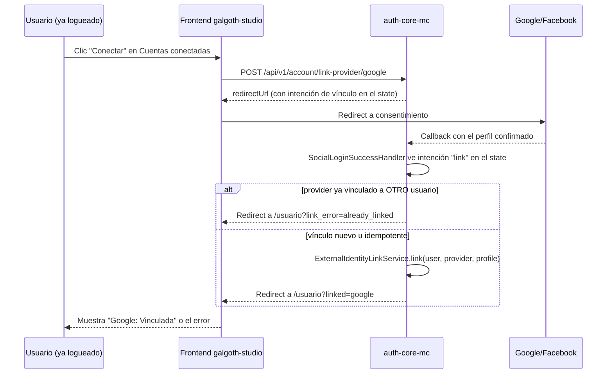
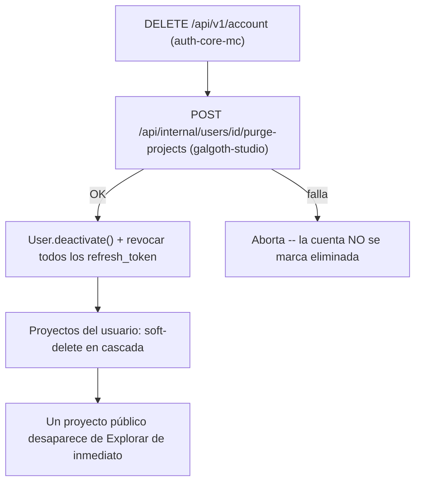

# Definición: Perfil de Usuario ("Mi Perfil")

## Resumen ejecutivo
Construir la pantalla "Usuario" de galgoth-studio (mockup completo de
Marco), hoy un placeholder deliberado en el sidebar. Casi cada sección
del mockup requiere una capacidad que no existe todavía — este documento
cubre información personal editable, foto de perfil, seguridad
(contraseña, sesiones activas), vincular cuentas sociales, preferencias,
y eliminar cuenta — repartidas entre auth-core-mc (identidad) y
galgoth-studio (datos de producto).

## Objetivo de negocio
Dar a cada usuario control real sobre su cuenta e identidad dentro de
galgoth-studio: ver y editar sus datos, entender y gestionar su
seguridad (sesiones, contraseña, cuentas vinculadas), y decidir si
quiere eliminar su cuenta — cerrando el placeholder que el ticket de
sidebar dejó documentado a propósito.

### Usuarios / roles involucrados
- **Usuario autenticado**: único rol relevante — esta pantalla es
  siempre sobre la cuenta propia, nunca la de otro.

## Alcance

### Incluye
- **Información personal**: nombre/apellidos editables (ya existen en
  `User`); correo mostrado y editable **vía el flujo de confirmación ya
  existente** (`EmailChangeController`, no una edición instantánea —
  ver Diseño técnico §1); país/región y nombre de usuario como campos
  **nuevos** en `User` (auth-core-mc).
- **Foto de perfil**: subir/reemplazar avatar, almacenado en el MinIO de
  galgoth-studio (reutiliza `AssetStorageService`, ya usado para
  imágenes de referencia/thumbnails/texturas).
- **Seguridad**:
  - Cambiar contraseña (con la contraseña actual) — endpoint nuevo,
    distinto de "olvidé mi contraseña" (`PasswordResetService`) y de
    "establecer contraseña por primera vez" (`SetPasswordService`).
  - Sesiones activas: dispositivo + navegador + última actividad
    (parseado del `User-Agent`, sin geolocalización de IP — decisión de
    Marco). Revocar una sesión individual o todas menos la actual.
  - Verificación en dos pasos: **"Próximamente"**, igual que en el
    mockup de Marco — el 2FA ya existe como capacidad (ticket 005) pero
    esta pantalla no lo gestiona todavía.
- **Cuentas conectadas**: ver el estado real de Google/Facebook
  (`external_identity`, ya existe) y **vincular una cuenta nueva** desde
  el perfil, sin cerrar sesión (flujo nuevo, ver Diseño técnico §4).
- **Preferencias**: los 3 toggles de notificaciones persisten un valor
  real por usuario; **respetarlos de verdad al enviar cada correo** (que
  el envío real consulte la preferencia) queda como ticket de
  seguimiento — este alcance solo construye el guardado, documentado
  explícitamente para no fingir que ya cambian el comportamiento.
  "Tema oscuro" se muestra **deshabilitado** — la app no tiene tema
  claro implementado, el toggle no tendría ningún efecto real.
- **Zona de peligro**: cerrar todas las sesiones (parte de "Seguridad");
  **eliminar cuenta**, con soft-delete en cascada de sus proyectos
  (decisión de Marco, ver HU-9).

### No incluye
- Gestión de 2FA desde esta pantalla (queda "Próximamente").
- Geolocalización real de sesiones activas (solo dispositivo/navegador).
- Que las preferencias de notificación cambien ya el envío real de
  correos (solo se guardan).
- Perfiles públicos de otros usuarios — esta pantalla es siempre sobre
  la cuenta propia.
- Vincular Apple (aunque `external_identity`/`tenant_identity_provider`
  ya modelan `APPLE` como proveedor, el mockup y el login social
  existente solo cubren Google/Facebook).

## Historias de Usuario

### Épica A: Información personal

#### HU-1: Editar nombre, apellidos, país/región y nombre de usuario
Como usuario, quiero editar mi información personal, para mantenerla
actualizada.

Criterios de aceptación:
- Dado un usuario autenticado, cuando guarda cambios válidos en
  nombre/apellidos/país/nombre de usuario, entonces se persisten y se
  reflejan de inmediato en la cabecera del perfil.
- Nombre de usuario es único por tenant (mismo criterio que
  `app_user_tenant_email_unique`) — un valor duplicado se rechaza con un
  mensaje claro, no un error genérico.

#### HU-2: Cambiar correo desde el perfil
Como usuario, quiero cambiar mi correo desde esta pantalla, para
mantenerlo actualizado, sabiendo que requiere confirmarlo.

Criterios de aceptación:
- Dado un usuario que edita el campo correo, cuando guarda, entonces se
  dispara el flujo YA EXISTENTE (`POST /api/v1/change-email/request`) —
  el correo actual sigue activo hasta confirmar el nuevo.
- La UI deja claro que el cambio no es instantáneo (a diferencia del
  mockup, que muestra el correo como cualquier otro campo de texto) —
  un mensaje explícito ("Revisa tu nuevo correo para confirmar el
  cambio"), nunca una edición silenciosa que parezca aplicada y no lo
  esté.

### Épica B: Foto de perfil

#### HU-3: Subir/cambiar foto de perfil
Como usuario, quiero subir una foto de perfil, para personalizar mi
cuenta.

Criterios de aceptación:
- Dado un usuario que sube una imagen válida (formato/tamaño dentro de
  los límites ya usados por `AssetStorageService`), cuando confirma,
  entonces su avatar se actualiza y se ve reflejado en el perfil (y en
  cualquier otro lugar que ya lo muestre, ver HU-4).
- Sin foto propia, se muestra un avatar por defecto (inicial del
  nombre) — nunca un ícono roto.

#### HU-4: El avatar aparece en Explorar
Como visitante de Explorar, quiero ver la foto del autor de un proyecto
público, para reconocerlo.

Criterios de aceptación:
- Dado un proyecto público cuyo dueño tiene avatar, cuando se muestra en
  Explorar (ticket 088), entonces aparece esa foto junto al nombre.
- Sin avatar, se usa el mismo avatar por defecto de HU-3.

### Épica C: Seguridad

#### HU-5: Cambiar contraseña
Como usuario con contraseña, quiero cambiarla desde el perfil
confirmando la actual, para mantener mi cuenta segura.

Criterios de aceptación:
- Dado un usuario que ingresa su contraseña actual correcta y una nueva
  que cumple la política, cuando confirma, entonces la contraseña se
  actualiza y las demás sesiones (ver HU-6) NO se revocan automáticamente
  (decisión: cambiar contraseña y cerrar sesiones son acciones
  independientes, cada una explícita).
- Una contraseña actual incorrecta se rechaza con un mensaje claro, sin
  revelar más que eso.
- Un usuario social-only (sin contraseña) no ve esta opción como
  "cambiar" — ve "Establecer contraseña" (flujo ya existente,
  `SetPasswordController`).

#### HU-6: Ver y revocar sesiones activas
Como usuario, quiero ver desde dónde tengo sesión iniciada y poder
cerrarlas, para controlar el acceso a mi cuenta.

Criterios de aceptación:
- Dado un usuario con varias sesiones (refresh tokens no revocados/no
  expirados), cuando abre "Sesiones activas", entonces ve cada una con
  navegador + sistema operativo (parseado del `User-Agent` capturado al
  emitir ese refresh token) y su última fecha de uso — la sesión desde
  la que está viendo la pantalla se marca "Actual".
- Puede revocar una sesión individual (deja de servir en el siguiente
  intento de refresh) o todas menos la actual de un solo clic.

### Épica D: Cuentas conectadas

#### HU-7: Ver el estado real de mis cuentas vinculadas
Como usuario, quiero ver si tengo Google/Facebook vinculados, para saber
con qué puedo iniciar sesión.

Criterios de aceptación:
- Dado un usuario con Google vinculado (fila real en
  `external_identity`) y Facebook no vinculado, cuando abre "Cuentas
  conectadas", entonces ve "Vinculada" en Google y "Conectar" disponible
  en Facebook.

#### HU-8: Vincular una cuenta social nueva desde el perfil
Como usuario ya autenticado (con o sin contraseña), quiero vincular
Google o Facebook sin cerrar mi sesión actual, para poder usarlo como
método de acceso alternativo.

Criterios de aceptación:
- Dado un usuario autenticado que hace clic en "Conectar" (Google o
  Facebook), cuando completa el consentimiento del proveedor y vuelve,
  entonces esa cuenta social queda vinculada A SU usuario actual —
  nunca crea una cuenta nueva ni inicia sesión como otro usuario.
- Si esa cuenta social ya está vinculada a OTRO usuario del mismo
  tenant, la vinculación se rechaza con un mensaje claro ("esta cuenta
  de Google ya está vinculada a otro usuario"), sin desvincularla del
  original ni fallar en silencio.
- Repetir "Conectar" sobre un proveedor ya vinculado al mismo usuario es
  idempotente (no error).

### Épica E: Preferencias

#### HU-9: Guardar preferencias de notificación
Como usuario, quiero configurar qué notificaciones recibo, para
controlar cuánto correo me llega.

Criterios de aceptación:
- Dado un usuario que cambia cualquiera de los 3 toggles de
  notificación, cuando guarda, entonces el valor persiste y se refleja
  al recargar la pantalla.
- El toggle "Tema oscuro" aparece deshabilitado con una indicación de
  que no hay tema claro todavía (mismo patrón "Próximamente" que 2FA) —
  nunca un toggle que finge cambiar algo que no cambia.

### Épica F: Eliminar cuenta

#### HU-10: Eliminar mi cuenta
Como usuario, quiero eliminar mi cuenta permanentemente (dentro de lo
razonable de un soft-delete), para dejar de usar la plataforma y que mi
contenido deje de ser visible.

Criterios de aceptación:
- Dado un usuario que confirma "Eliminar cuenta" (con un paso de
  confirmación explícito, no un solo clic), cuando se ejecuta, entonces
  su `User` queda desactivado (mismo patrón que `Tenant.deactivate()`,
  nuevo para `User`) y TODOS sus proyectos en galgoth-studio (públicos o
  privados) quedan soft-deleted en cascada — un proyecto público
  desaparece de Explorar de inmediato (decisión de Marco).
- Todas sus sesiones (refresh tokens) se revocan como parte de la misma
  operación — no puede seguir usando la app con un token ya emitido.
- Un usuario desactivado no puede iniciar sesión de nuevo (mismo
  criterio que `TenantDeactivatedException` para tenants).

## Diseño técnico

### 1. Correo: por qué sigue siendo un flujo de 2 pasos
El mockup muestra "Correo electrónico" como un campo de texto más, igual
que "Nombre" — pero cambiarlo de verdad ya tiene un flujo real
(`EmailChangeController`: `request` + `confirm`) que valida que el
usuario controla la bandeja nueva. Reescribir ese flujo como un PATCH
directo sería un retroceso de seguridad real. El frontend distingue
"guardar nombre" (aplica al instante) de "guardar correo" (dispara el
flujo existente y explica que hace falta confirmar).

### 2. `User` (auth-core-mc) — campos nuevos
```sql
ALTER TABLE app_user ADD COLUMN country VARCHAR(100);
ALTER TABLE app_user ADD COLUMN username VARCHAR(50);
ALTER TABLE app_user ADD CONSTRAINT app_user_tenant_username_unique UNIQUE (tenant_id, username);
```
`country`/`username` viven en auth-core-mc (no en galgoth-studio) porque
son datos de identidad de la persona, no de producto — a diferencia de
`owner_display_name` (ticket 086), que SÍ se denormalizó en
galgoth-studio porque era una copia de conveniencia, no el dato
canónico.

### 3. Foto de perfil — dónde vive
auth-core-mc no tiene almacenamiento de archivos (sin MinIO/S3);
galgoth-studio sí (`AssetStorageService`, ya wireado). Se propone una
tabla nueva en galgoth-studio, `user_profile` (clave: el `sub`/user id
de auth-core-mc, mismo patrón de "dato de producto ligado a un id
externo" que `projects.owner_ref`):
```sql
CREATE TABLE user_profile (
    user_id      VARCHAR(64) PRIMARY KEY,  -- sub del JWT de auth-core-mc
    avatar_key   TEXT,                     -- clave en MinIO, null = sin avatar
    prefs_email_notifications  BOOLEAN NOT NULL DEFAULT true,
    prefs_product_news         BOOLEAN NOT NULL DEFAULT true,
    prefs_save_reminders       BOOLEAN NOT NULL DEFAULT true,
    updated_at   TIMESTAMPTZ NOT NULL DEFAULT now()
);
```
Esta misma tabla es también el lugar natural para las preferencias de
notificación (Épica E) — mismo criterio de "dato de producto por
usuario", no de identidad compartida. `GET /api/projects/explore`
(ticket 086) y el detalle de un proyecto público (HU-4) leen
`avatar_key` de aquí para mostrar el avatar del autor.

### 4. Vincular una cuenta social nueva — el flujo real
El login social existente resuelve "¿a qué usuario pertenece este
perfil?" (`SocialLoginUserResolver.resolve`) — no sirve tal cual para
"vincula ESTE proveedor a la sesión que ya tengo abierta", porque el
callback de OAuth es una navegación de navegador normal (GET), sin
header `Authorization` — no hay forma directa de saber "quién iniciró
esto" salvo llevarlo en el propio viaje de ida y vuelta a Google/
Facebook.

**Diseño**: al hacer clic en "Conectar", el backend emite un token de
intención de corta vida (mismo `RedisTokenStore` ya usado para el código
de intercambio del login social) que codifica `{userId, provider}`, y lo
adjunta al `state` de la request de autorización OAuth (Spring Security
ya gestiona su propio `state` anti-CSRF; este es un dato adicional, no
un reemplazo). Al volver, `SocialLoginSuccessHandler` distingue: si el
`state` trae esa intención de vínculo, en vez de
`SocialLoginUserResolver.resolve(...)` llama a una ruta nueva,
`ExternalIdentityLinkService.link(user, provider, profile)`, que:
- Si el `(tenant, provider, providerUserId)` YA pertenece a OTRO
  usuario → falla explícito (HU-8, segundo criterio).
- Si ya pertenece al MISMO usuario → no-op (idempotente).
- Si no existe → inserta la fila (mismo `linkIdentity` que ya existe en
  `SocialLoginUserResolver`, extraído a un lugar compartido).

Redirige de vuelta a `/usuario` (no a `/social-callback`) con un
indicador de éxito/error — no hace falta emitir tokens nuevos, la sesión
del usuario ya era válida desde antes de salir a Google/Facebook.

### 5. Sesiones activas — extender `refresh_token`
```sql
ALTER TABLE refresh_token ADD COLUMN user_agent TEXT;
ALTER TABLE refresh_token ADD COLUMN created_at TIMESTAMPTZ NOT NULL DEFAULT now();
ALTER TABLE refresh_token ADD COLUMN last_used_at TIMESTAMPTZ NOT NULL DEFAULT now();
```
`DirectTokenService` (login, refresh) pasa a recibir el `User-Agent` del
request (nuevo parámetro `HttpServletRequest` en `AuthController`/
`TokenController`) y lo graba al emitir; cada refresh actualiza
`last_used_at`. El navegador/SO se parsean del `User-Agent` en el
momento de LEER (no se guarda ya parseado) con una librería ligera
existente en el ecosistema Java, para no acoplar el formato de
presentación al dato crudo guardado. Sin geolocalización de IP —
decisión de Marco.

### 6. Eliminar cuenta — orquestación cross-servicio
`DELETE /api/v1/account` (auth-core-mc, autenticado) hace: (a)
`User.deactivate()` (nuevo, mismo patrón que `Tenant.deactivate()`), (b)
revoca todos sus `refresh_token`. galgoth-studio necesita enterarse para
soft-deletar sus proyectos — **no hay bus de eventos entre servicios
hoy**, así que la opción realista es que auth-core-mc llame
sincrónicamente a un endpoint interno de galgoth-studio (`POST
/api/internal/users/{userId}/purge-projects`, protegido por un secreto
compartido servidor-a-servidor, no por JWT de usuario) como parte de la
misma operación, ANTES de confirmar el soft-delete del usuario — si esa
llamada falla, la eliminación completa falla (consistencia sobre
disponibilidad: no queremos un usuario "eliminado" con proyectos
públicos todavía visibles). Alternativa más simple para esta primera
pasada, evaluada y descartada: que YA no importe el orden porque
`ProjectAccessGuard`/Explorar filtren también por "el dueño sigue
activo" — se descarta porque obligaría a consultar auth-core-mc en cada
lectura de Explorar (acoplamiento fuerte, lento), contra el criterio ya
usado en todo el proyecto de que galgoth-studio no depende de
auth-core-mc para servir sus propias lecturas.

## Diagramas


Muestra la diferencia real con el login social existente: la sesión del
usuario ya es válida desde antes de salir a Google, así que el `state`
lleva la intención de vínculo en vez de emitir tokens al volver.


Muestra por qué el orden importa: galgoth-studio debe confirmar que ya
soft-deleteó los proyectos ANTES de que auth-core-mc dé la cuenta por
eliminada — nunca una cuenta "eliminada" con contenido público todavía
visible.

## Riesgos y preguntas abiertas
- **Enforcement real de las preferencias de notificación** (HU-9): esta
  pasada solo guarda el toggle; que de verdad se respete al enviar cada
  tipo de correo (verificación, reset, cambios, futuras "novedades del
  producto") es trabajo adicional en cada flujo de envío existente —
  ticket de seguimiento explícito, no incluido aquí.
- **Secreto servidor-a-servidor** para `purge-projects` (Diseño técnico
  §6): necesita generarse y configurarse en ambos proyectos — mismo tipo
  de gestión de secretos ya usado para `RESEND_API_KEY`/etc., sin
  mecanismo nuevo, pero es una pieza de infraestructura a no olvidar en
  el desglose de tickets.
- **Vincular Apple**: fuera de alcance (ver "No incluye") — si se pide
  después, el diseño de §4 ya generaliza a cualquier proveedor de
  `IdentityProviderType`.

## Impacto estimado
Tickets tentativos (auth-core-mc y galgoth-studio, se confirman al
desglosar con `nuevo-ticket`):
1. **auth-core-mc — campos de perfil**: `country`/`username` en `User`,
   endpoint `PATCH /api/v1/account/profile`.
2. **auth-core-mc — cambiar contraseña**: endpoint nuevo con
   verificación de contraseña actual.
3. **auth-core-mc — sesiones activas**: columnas nuevas en
   `refresh_token`, captura en login/refresh, endpoints listar/revocar.
4. **auth-core-mc — vincular cuenta social**: intención de vínculo en el
   `state` OAuth, `ExternalIdentityLinkService`, endpoint de lectura de
   cuentas vinculadas.
5. **auth-core-mc — eliminar cuenta**: `User.deactivate()`, revocación
   de sesiones, orquestación con galgoth-studio.
6. **galgoth-studio — perfil de producto**: tabla `user_profile`, subida
   de avatar (`AssetStorageService`), endpoints de preferencias,
   endpoint interno `purge-projects`.
7. **galgoth-studio — avatar en Explorar**: leer `avatar_key` en el
   endpoint de Explorar/detalle público (ticket 086/088).
8. **galgoth-studio — pantalla "Usuario"**: la UI completa consumiendo
   todo lo anterior, reemplazando el placeholder de `GSidebar.vue`.
