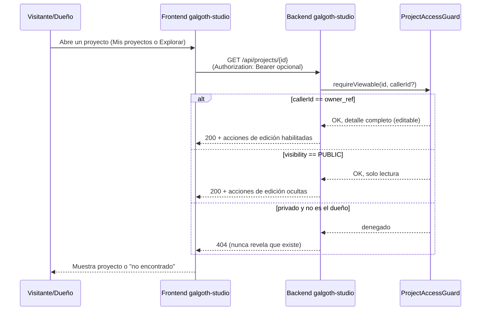
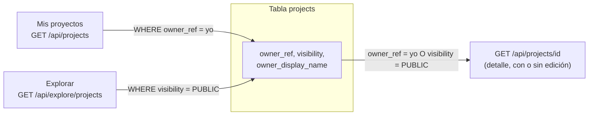

# Definición: Proyectos por usuario + sección Explorar

## Resumen ejecutivo
Hoy **cualquiera** puede ver, editar y borrar el proyecto de cualquiera —
`ProjectEntity.owner_ref` existe en el esquema desde el ticket `003` pero
nunca se llena (`ProjectService.create()` siempre lo deja en `null`), y
`ProjectService.list()` devuelve TODOS los proyectos de TODOS los
usuarios sin filtrar. El ticket `077` construyó a propósito el mecanismo
de validación de JWT sin proteger ninguna ruta, dejando escrito "queda
listo para que un ticket futuro (una vez exista un modelo de ownership)
decida qué rutas proteger". Este es ese ticket: cada proyecto queda
ligado a su dueño real, gana un estado público/privado, y los proyectos
públicos aparecen en una nueva sección "Explorar" (su entrada de sidebar
ya existe como stub, sin ruta detrás).

## Objetivo de negocio
Dar a cada usuario de galgoth-studio un espacio de trabajo realmente
propio y privado por defecto, con la opción de publicar proyectos
seleccionados para que la comunidad los descubra en Explorar — la base
para que la plataforma deje de ser un espacio compartido sin dueño y
empiece a tener valor social/de descubrimiento.

### Usuarios / roles involucrados
- **Usuario autenticado (dueño)**: crea, ve, edita, borra y publica/
  despublica sus propios proyectos.
- **Visitante** (autenticado o no): navega Explorar y ve proyectos
  públicos ajenos en modo lectura.

## Alcance

### Incluye
- `projects.owner_ref` pasa a llenarse de verdad con el `sub` (user id)
  del JWT de auth-core-mc en cada creación.
- Nueva columna `projects.visibility` (`PRIVATE`/`PUBLIC`), `PRIVATE` por
  defecto (decisión de Marco).
- "Mis proyectos" (`GET /api/projects`) filtra por el dueño autenticado —
  deja de ser una lista global.
- Endpoint para cambiar la visibilidad de un proyecto propio.
- Nueva sección **Explorar**: lista de proyectos `PUBLIC` de todos los
  usuarios, con nombre, descripción, miniaturas y autor — **sin login**
  (decisión de Marco: escaparate abierto a cualquiera).
- Ver el detalle de un proyecto público ajeno **en modo lectura**
  (ficha + lista de sus mobs) — sin poder editar/borrar/exportar/
  duplicar (decisión de Marco: "solo ver/previsualizar").
- `POST/PATCH/DELETE` de proyectos y de TODO lo anidado bajo un proyecto
  (mobs, drafts, texturas, exportación, geometría, imágenes de
  referencia) pasan a exigir login **y** ser el dueño — cierre real del
  ticket `077` (decisión de Marco: "sí, exigir login").
- Intentar acceder (ver/editar/borrar) a un proyecto privado ajeno
  responde **404**, nunca 403 — no se revela que el proyecto existe
  (mismo criterio que auth-core-mc ya aplica en otros flujos).
- `GET /api/mobs/recent` ("Continuar trabajando" en Inicio) pasa a
  filtrar por dueño autenticado — hoy es global, mismo bug de fondo.
- Guard de navegación en el frontend: `/`, `/projects`, `/projects/:id`
  (propio) exigen sesión iniciada; `/explore` no.

### No incluye
- **Visor 3D en modo lectura para un proyecto público ajeno.** El detalle
  de solo-lectura de esta primera pasada muestra la ficha del proyecto y
  la lista de sus mobs (nombre, miniatura, estado) — abrir el editor 3D
  completo en modo lectura es un ticket de seguimiento, no bloquea el
  valor principal de este épico (privacidad real + descubribilidad).
- **Duplicar un proyecto ajeno a la cuenta propia** desde Explorar
  (decisión de Marco: solo ver, no duplicar, en esta primera pasada).
- Búsqueda, filtros o algoritmo de orden/relevancia en Explorar — orden
  simple por fecha de actualización, igual que "Mis proyectos" hoy.
- Moderación de contenido público (reportar/ocultar un proyecto ajeno) —
  no existe hoy ningún mecanismo de moderación en la plataforma.
- Perfiles de usuario públicos (bio, avatar, lista de todos sus
  proyectos públicos) — Explorar es un mural de proyectos, no de
  perfiles.
- Cambiar cómo auth-core-mc emite tokens — se sigue usando el `sub`
  (user id) y ningún claim nuevo.
- Migrar el único proyecto de prueba en DEV sin dueño (`owner_ref NULL`,
  ver Riesgos) a un dueño real — se propone borrarlo por ser dato de
  prueba, no un backfill genérico (no hay proyectos así en QA).

## Historias de Usuario

### Épica A: Ownership real y privacidad

#### HU-1: Todo proyecto nuevo queda ligado a su creador
Como usuario autenticado, quiero que un proyecto que creo quede ligado a
mi cuenta automáticamente, para que sea mío y no de nadie más.

Criterios de aceptación:
- Dado un usuario autenticado con un `accessToken` válido, cuando crea un
  proyecto, entonces el proyecto se guarda con `owner_ref` = su user id y
  `visibility = PRIVATE`.
- Dado un request sin `Authorization` válido, cuando intenta crear un
  proyecto, entonces recibe `401`.

#### HU-2: "Mis proyectos" solo muestra lo mío
Como usuario autenticado, quiero ver únicamente mis propios proyectos en
el dashboard, para no ver ni confundir contenido de otras cuentas.

Criterios de aceptación:
- Dado un usuario con proyectos propios y proyectos ajenos existentes en
  la base, cuando lista "Mis proyectos", entonces solo recibe los suyos.
- Lo mismo aplica a "Continuar trabajando" / mobs recientes en Inicio.

#### HU-3: Un proyecto privado ajeno es inaccesible
Como usuario, quiero que nadie más pueda ver, editar ni borrar mis
proyectos privados aunque adivine o comparta el ID, para que mi trabajo
esté realmente protegido.

Criterios de aceptación:
- Dado un proyecto `PRIVATE` cuyo dueño no es el usuario autenticado (o
  no hay sesión), cuando intenta `GET`/`PATCH`/`DELETE` ese proyecto o
  cualquier recurso anidado (mobs, drafts, texturas, export), entonces
  recibe `404`.
- Dado el dueño real del mismo proyecto, cuando hace lo mismo, entonces
  funciona normalmente (sin regresión).

### Épica B: Visibilidad pública y Explorar

#### HU-4: Publicar o despublicar un proyecto propio
Como dueño de un proyecto, quiero marcarlo como público o volverlo a
privado cuando quiera, para controlar si aparece en Explorar.

Criterios de aceptación:
- Dado un proyecto propio `PRIVATE`, cuando el dueño lo marca como
  `PUBLIC`, entonces empieza a aparecer en Explorar de inmediato.
- Dado un proyecto propio `PUBLIC`, cuando el dueño lo vuelve a marcar
  `PRIVATE`, entonces desaparece de Explorar de inmediato.
- Dado un usuario que NO es el dueño, cuando intenta cambiar la
  visibilidad de un proyecto ajeno, entonces recibe `404` (privado) o
  `403`/`404` (público, ver Diseño técnico) — nunca lo logra.

#### HU-5: Explorar proyectos públicos, sin necesidad de cuenta
Como visitante (con o sin sesión iniciada), quiero navegar una sección
"Explorar" con los proyectos públicos de todos los usuarios, para
descubrir contenido de la comunidad antes de decidir crear una cuenta.

Criterios de aceptación:
- Dado que existen proyectos `PUBLIC`, cuando cualquier visitante
  (autenticado o no) abre `/explore`, entonces ve una galería con
  nombre, descripción, miniaturas y autor de cada uno.
- Ningún proyecto `PRIVATE` de nadie aparece jamás en esa lista, bajo
  ninguna condición.

#### HU-6: Ver el detalle de un proyecto público ajeno, en modo lectura
Como visitante, quiero abrir un proyecto público desde Explorar para ver
su ficha y sus mobs, para conocer el trabajo antes de decidir crear el
mío.

Criterios de aceptación:
- Dado un proyecto `PUBLIC` cuyo dueño no es el visitante actual, cuando
  abre su detalle desde Explorar, entonces ve nombre, descripción y la
  lista de sus mobs (nombre + miniatura + estado), sin ninguna acción de
  edición/borrado/exportación/duplicado visible ni disponible.

## Diseño técnico

### 1. Modelo de datos (`galgoth-studio`, Flyway `V5`)
```sql
ALTER TABLE projects ADD COLUMN visibility VARCHAR(10) NOT NULL DEFAULT 'PRIVATE';
ALTER TABLE projects ADD CONSTRAINT projects_visibility_check CHECK (visibility IN ('PRIVATE', 'PUBLIC'));
```
`owner_ref` ya existe (columna nullable desde `V1`) — sigue siendo
`VARCHAR`, se sigue guardando como el `sub` (UUID en texto) del JWT, sin
cambio de tipo. Limpieza de datos de prueba antes de cerrar el ticket: el
único proyecto de DEV con `owner_ref IS NULL` se borra (soft-delete) por
SQL directo — es un artefacto de prueba anterior a que existiera
ownership, no un caso real a migrar.

### 2. Identidad del llamador — reutiliza el mecanismo del ticket 077
`AuthCoreMcJwtDecoderConfig` ya valida issuer + audiencia. Cada
controlador que lo necesite recibe `@AuthenticationPrincipal Jwt jwt`
(nullable si la ruta es de acceso opcional) y usa `jwt.getSubject()` como
`ownerRef` — el mismo valor que `auth-core-mc` ya graba como `sub`
(`DirectTokenService.generateAccessToken`, `user.getId().toString()`) y
que el frontend ya conoce como `RegisteredUser.id`.

### 3. `ProjectAccessGuard` — un solo punto de autorización, no nueve
Los 9 controladores bajo `/api/projects/{projectId}/**` (mobs, drafts,
texturas, thumbnails, imágenes de referencia, export, geometría)
comparten el mismo `projectId` en la ruta. En vez de repetir la lógica de
"¿este proyecto es mío, es público, o no me pertenece?" en cada uno
(mismo tipo de duplicación que ya se corrigió en auth-core-mc con
`AdminAccessPolicy`, ticket `011` de ese repo), se introduce un
`ProjectAccessGuard` de aplicación (no un filtro HTTP genérico, porque la
regla depende del método HTTP):

- `requireOwner(projectId, callerId)` — para toda mutación
  (`POST`/`PATCH`/`DELETE`): dueño real o `ProjectNotFoundException`
  (`404`).
- `requireViewable(projectId, callerId)` — para lectura (`GET`): dueño
  real, o proyecto `PUBLIC` (cualquier `callerId`, incluido `null` =
  anónimo), o `ProjectNotFoundException`.

Cada servicio (`ProjectService`, `MobService`, `DraftPersistenceService`,
etc.) llama al guard antes de operar, igual que hoy todos llaman a
`requireProject(...)`.

### 4. `SecurityConfig` — de "todo abierto" a reglas explícitas
Sustituye el `anyRequest().permitAll()` del ticket `077` por:

| Ruta | Regla | Por qué |
|---|---|---|
| `POST/PATCH/DELETE /api/projects/**` (crear, renombrar, borrar, duplicar, cambiar visibilidad) | `authenticated()` | Toda mutación de un proyecto propio exige dueño real. |
| `POST/PATCH/DELETE /api/projects/{id}/**` (mobs, drafts, texturas, export, geometría) | `authenticated()` | Mismo criterio, recursos anidados. |
| `GET /api/projects` (Mis proyectos) | `authenticated()` | No existe "listar mis proyectos" sin saber quién eres. |
| `GET /api/projects/{id}` y sus lecturas anidadas | `permitAll()` a nivel de Spring Security, decisión real en `ProjectAccessGuard` | Un visitante anónimo debe poder leer un proyecto `PUBLIC` — `permitAll()` no desactiva el parseo del JWT, solo no lo exige: si llega un `Authorization: Bearer` válido, `@AuthenticationPrincipal Jwt` igual lo resuelve; si no llega ninguno, el guard trata al llamador como anónimo. |
| `GET /api/explore/projects` (nuevo) | `permitAll()` | Escaparate público, decisión de Marco. |
| `GET /api/mobs/recent` | `authenticated()` | Hoy es global por bug de diseño; pasa a requerir sesión y filtrar por dueño. |

CSRF se mantiene deshabilitado — sin cambios respecto al razonamiento ya
documentado en el ticket `077` (esta API nunca usa cookies de sesión).

### 5. Autor visible en Explorar — decisión pendiente de VoBo
galgoth-studio no tiene tabla de usuarios propia (identidad delegada
100% a auth-core-mc) y el JWT solo trae `sub`/`role`/`tenant_id` — nada
de nombre. Para mostrar "por Fulano Pérez" en una tarjeta de Explorar sin
construir una integración nueva contra auth-core-mc, se propone
**denormalizar** el nombre a mostrar: el frontend ya conoce
`sessionStore.user.nombre`/`apellidos` al momento de crear el proyecto, y
se guarda como `projects.owner_display_name` (columna nueva, capturada
una sola vez al crear — puede quedar desactualizada si el usuario cambia
su nombre después, tradeoff aceptado por simplicidad).
**Alternativa** (más completa, más grande): un endpoint público de
perfil en auth-core-mc que resuelva `userId → nombre público` bajo
demanda — se deja fuera de esta primera pasada, pero se documenta aquí
para que quede trazable si en el futuro se decide construirlo.

### 6. Frontend
- `router.beforeEach`: nuevo guard global — rutas `home`, `projects-dashboard`
  y las de edición (`project-detail` cuando el visitante es el dueño,
  `mob-editor`, `export-screen`, wizard IA) exigen
  `sessionStore.isAuthenticated`; si no, redirige a `/login`.
- Nuevas rutas: `/explore` (`ExploreView.vue`, galería) y
  `/explore/:id` (`ExploreProjectDetail.vue`, ficha + lista de mobs en
  modo lectura) — **distintas** de `/projects` y `/projects/:id` a
  propósito: mantiene la lógica autenticada-y-editable separada de la
  lógica pública-y-lectura, en vez de una sola vista con dos modos.
- `GSidebar`: el ítem `explore` (ya existe como stub) pasa a navegar de
  verdad a `/explore` — sin exigir sesión, coherente con HU-5.
- `ProjectDetail.vue` (proyecto propio): gana un control de
  visibilidad (toggle o menú "Hacer público"/"Hacer privado").

## Diagramas


Muestra la única decisión de seguridad real de este cambio: la misma
ruta `GET` se comporta distinto según quién pregunta, sin que el
visitante anónimo pueda distinguir "privado de otro" de "no existe".


Muestra que "Mis proyectos" y "Explorar" son dos consultas distintas
sobre la misma tabla, no dos modelos de datos separados — y que el
detalle de un proyecto es el único punto donde ambas reglas convergen.

## Riesgos y preguntas abiertas
- **Autor en Explorar (sección 5 del diseño técnico)**: la denormalización
  de `owner_display_name` es la propuesta recomendada; falta VoBo
  explícito sobre si Explorar debe mostrar autor en absoluto en esta
  primera pasada, o si es aceptable postergarlo (tarjetas sin atribución)
  para no tocar el flujo de creación de proyecto.
- **El único proyecto huérfano de DEV** (`owner_ref NULL`) se borra como
  parte del cierre de este trabajo — es dato de prueba, no hay
  equivalente en QA ni en PROD (este último ni siquiera tiene ambiente
  desplegado todavía).
- **`403` vs `404` al intentar cambiar visibilidad de un proyecto público
  ajeno** (HU-4, último criterio): como el proyecto SÍ es visible
  (`GET` = 200 por ser público) pero la mutación no le pertenece, la
  respuesta natural es `404` igual que el resto de mutaciones no
  autorizadas (consistencia > distinguir "existe pero no es tuyo") — se
  deja así salvo objeción explícita.
- Ningún límite de cantidad de proyectos por usuario ni de tamaño — fuera
  de foco de este cambio (es un problema de cuotas, no de ownership).

## Impacto estimado
Tickets tentativos (se confirman/ajustan al desglosar con `nuevo-ticket`
tras el VoBo):
1. **Backend — modelo de datos + ownership real al crear/listar**:
   migración `V5`, `ProjectEntity.visibility`, `ProjectService.create/list`
   filtrando por dueño, limpieza del proyecto huérfano de DEV.
2. **Backend — enforcement de acceso**: `ProjectAccessGuard`,
   `SecurityConfig` con reglas explícitas, aplicado a los 9 controladores
   anidados + `/api/mobs/recent`.
3. **Backend — endpoint de cambio de visibilidad + Explorar**:
   `PATCH` de visibilidad, `GET /api/explore/projects`,
   `owner_display_name` si se confirma en el VoBo.
4. **Frontend — guard de rutas + toggle de visibilidad** en
   `ProjectDetail.vue`.
5. **Frontend — sección Explorar**: `ExploreView.vue`,
   `ExploreProjectDetail.vue` (modo lectura), sidebar ya no apunta a un
   stub.
